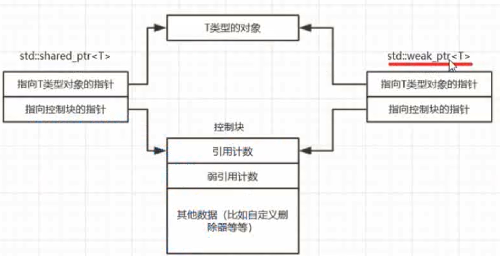

# Weak_ptr

#### 概念
* weak_ptr弱 强 shared_ptr
* 智能指针，指向由shared_ptr管理的对象
* 不控制对象的生命周期，不会改变引用计数
* 构造和析构不会增加引用计数
* shared_ptr要释放对象的时候照常释放，不管是否有weak_ptr
* weak_ptr 监视shared_ptr的生命周期，是shared_ptr的扩充
* 不是独立的智能指针。不能用来操作所指向的资源，监视对象是否存在

#### 常规操作
* weak_ptr不能直接来访问对象
* 需要lock来访问，如果存在，lock就返回一个对象的shared_ptr指针
* 如果不存在，就返回一个空的shared_ptr
* weak_ptr能够判断对象是否存在

#### 常用指针
* use_count 获取对象强引用的数量
* expired 是否过期，如果use_count=0,对象不存在，观测对象的资源是否被释放
* reset 将弱引用指针设置为空，不影响强引用，

#### 尺寸问题
* weak_ptr和shared_ptr一样大。裸指针的两倍
* 第一个指针指向智能指向对象
* 第二个指针指向shared_ptr生成的控制块
* 
* 
