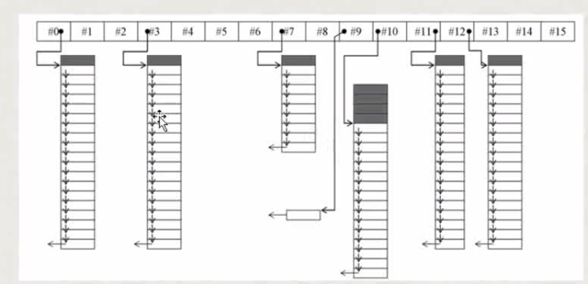
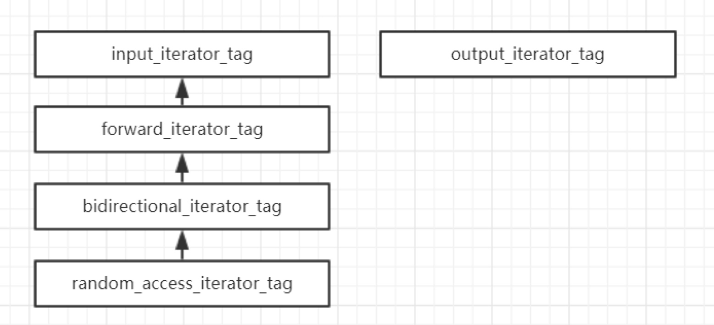
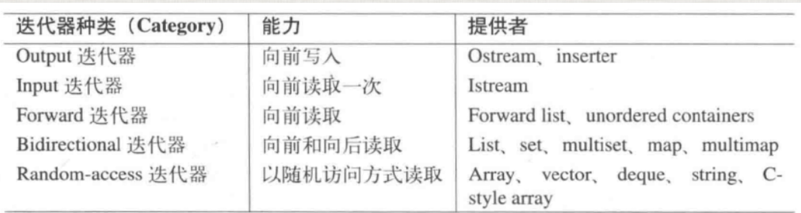
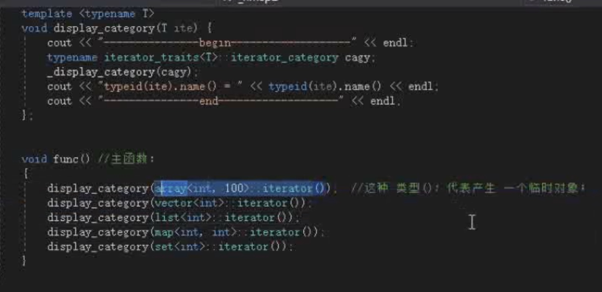

# 分配器&迭代器

#### 作用
* 内存分配器，扮演内存池的角色，通过大量较少对malloc的调用，来节省内存，分配效率有提高
* 缺省的alloactor没有使用内存池技术

#### 其他的分配器

#### 迭代器

##### 分类
* 迭代器的移动特性以及在这个迭代器的操作
* 迭代器表示一个位置，一般分类是依据他的跳跃能力
* 输出型迭代器 struct output_iterator_tag;
* 输入型迭代器 struct input_iterator_tag;
* 前向迭代器 struct forward_iterator_tag
* 双向迭代器 struct bidirectional_iterator_tag
* 随机访问迭代器 struct random_access_iterator_tag

* 并不是所有容器都有迭代器 stack queue heap

##### 迭代器

* 