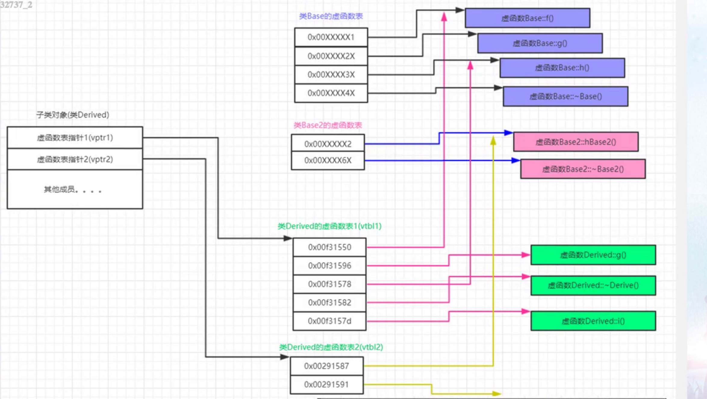
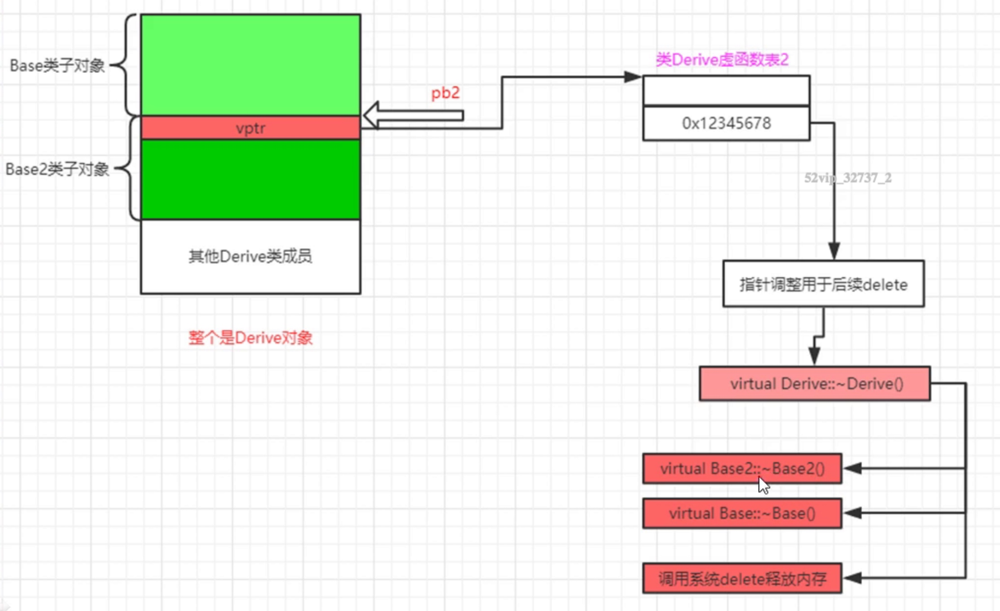
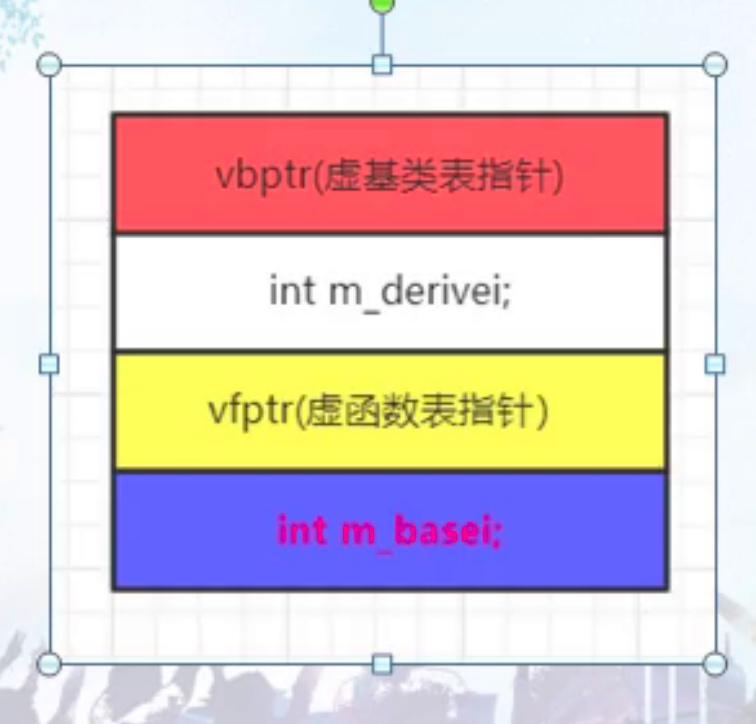
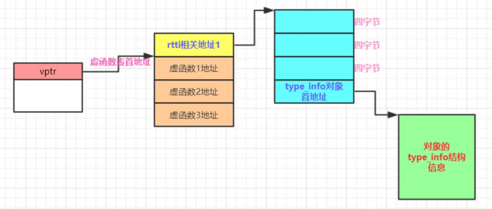

# 函数语义学

#### 成员函数的调用方式
* 成员函数的调用转换成了全局的函数
* 成员函数有独立的内存地址，跟着类走的，成员函数的地址是编译时确定好的
* 编译器额外增加了一个this形参，指向生成的对象
* 常规成员变量的存取，都通过形参来进行。比如this->m_i

#### 虚函数调用
```
  class Obj{
 public:
  int m_i;
  void func(int abc) {
    m_i += abc;
  }
  void virtual virfunc1() {
    virfunc2(); //通过虚函数表指针来寻址
    Obj::virfunc2(); //效率高, 等价于调用普通函数
  }
  void virtual virfunc2() {}
};
pmyacls->myvirfunc(); //要通过虚函数表指针查找虚函数表，通过虚函数表在好到虚函数的入口地址，完成对虚函数的调用
	//编译器视角
	//(*pmyacls->vptr[0])(pmyacls);
	//a)vptr，编译器给生成的虚函数表指针，指向虚函数表
	//b)[0] 虚函数表中第一项。代表myvirfunc()地址
	//c)传递一个参数进去，就是this，也是编译器给加的
	//d)*就得到了虚函数的地址
```

#### 静态函数
* 各种调用方式都是类名调用
* 静态函数不需要this指针

```
void func(int abc) {
    //m_i += abc;
    printf("func");
}
((Obj *)0)->func(2);可以执行
希望成员函数支持类对象之外的存取操作
//静态成员函数特性
	//a)静态成员函数没有this指针，这点最重要
	//b)无法直接存取类中普通的非静态成员变量；
	//c)静态成员函数不能在屁股后使用const，也不能设置为virtual 
	//d)可以用类对象调用，但不非一定要用类对象调用。
	//e)静态成员函数等同于非成员函数，有的需要提供回调函数的这种场合，可以将静态成员函数作为回调函数；
```

#### 继承的非虚函数坑
```
 Derive derive;
	Derive *pderive = &derive;
	pderive->myfunc(); //Derive::myfunc()子类

	Base *pbase = &derive;
	pbase->myfunc();//调用父类
```
  * 普通成员函数是静态绑定，换句话说，myfunc() 是普通成员函数。这里到底调用父类的myfunc还是子类的myfunc取决于调用者的静态类型；

#### 虚函数缺省参数的动态坑
```
class Base
{
public:
	void myfunc() //普通成员函数
	{
		cout << "Base::myfunc()" << endl;
	}
	virtual void myvirfunc(int value = 1)
	{
		cout << "Base::myvirfunc(),value = " << value << endl;
	}
};
class Derive :public Base
{
public:
	void myfunc() //普通成员函数
	{
		cout << "Derive::myfunc()" << endl;
	}
	virtual void myvirfunc(int value = 2)
	{
		cout << "Derive::myvirfunc(),value = " << value << endl;
	}
};
```
* 虚函数缺省参数是静态绑定，考虑到执行效率的问题
* 不要重新定义虚函数缺省参数的值
* 不应该在子类中重新定义一个继承来的非虚函数

#### 多态
* 调用虚函数没有查询虚函数表，不一定是多态
* 有继承关系
* 父类指针或者引用指向子类对象
* 派生类重写了子类的虚函数

#### 单继承
```
Base* pb = new Derived()
pb->g()
编译器视角
(*pb)->vptr[1](pb)
```
* 执行期间需要确定的就是哪个虚函数表来调用虚函数

#### 回顾和一些测试
* 虚函数地址，编译期间确认下来
* 顺序记录每个虚函数的地址
* vptr编译期间产生，编译器在构造函数中插入了给vptr赋值的代码。
* 纯虚函数依然会在虚函数表中占据一个表项目

#### 多继承虚函数，第二基类，虚析构
```
Base* pb2 = new Derived()
Derived* tmp = new Derived()
Base2* pb2 = (Base2*)((char*)tmp + sizeof(Base))
```
* 如何成功删除用第二基类指针new出来的继承类对象
* 非虚析构函数仍然是个普通析构函数，系统释放的是pb2开头的内存仍然异常
* Base2有个虚的析构函数则编译器实际执行~Derived(),~Base2(),Base()
* Derived没有虚析构函数，编译器会为其合成虚析构函数，虚析构函数名可以跟父类不一样
* 

#### thunk
* 汇编代码
* 在多重继承中用于this指针调整
* 调用Derived析构函数

```
0000000000000044 <non-virtual thunk to Derive::~Derive()>:
  44:   48 83 ef 08             sub    rdi,0x8 this指针指向derived对象首地址
  48:   eb b6                   jmp    0 <Derive::~Derive()>
000000000000002b <non-virtual thunk to Derive::~Derive()>:
  2b:   48 83 ef 08             sub    rdi,0x8
  2f:   eb cf                   jmp    0 <Derive::~Derive()>
```
* 

#### 多继承第二基类虚函数支持和虚继承带虚函数
通过指向第二个基类的指针调用继承类的虚函数；
Base2 *pb2 = new Derive();
delete pb2; 调用继承类的虚析构函数
一个指向派生类的指针，调用第二个基类中的虚函数
Derive *pd2 = new Derive();
pd2->hBase2();
允许虚函数的返回值类型有所变化
Base2 *pb1 = new Derive(); pb1指向的是Base2子对象的首地址
Base2 *pb2 = pb1->clone(); Derive::clone();
执行clone()时，pb1首先会调整回指向Derivce对象的首地址，这样调用的是Derive版本的clone()

#### 虚继承带虚函数
* 

#### RTTI
* RTTI实现原理 typeid返回的是一个常量对象的引用，这个常量对象的类型一般是type_info（类）
* 
* vptr vtbl rtti的 type_info信息编译之后就存在

#### 编译器优化
* 优化循环，把循环优化成1条语句；
* 在编译期间，编译器也具有运算能力，有些运算编译器在编译期间就能搞定；

#### 多重继承
* 继承关系深度增加，开销一般也会增加
* 很多情况下，随着继承深度的增加，开销或者说执行时间也会增加；
* 多重继承一般也会导致开销增加

#### 成员函数指针&&vall
* 通过成员函数指针对常规的成员函数调用的成本，和通过普通的函数指针来调用静态成员函数，成本上差不多；
* 成员函数指针里保存的是vcall = virtual call 虚调用(vcall trunk)地址
* 直接把vcall看成虚函数表vcall{0}代表的就是虚函数表里的第一个函数，vcall{4}就代表虚函数表里的第二个虚函数
* vcall地址就是虚函数在虚函数表中的偏移值，结合对象指针，就能确定具体的虚函数地址
* 成员函数地址是真正的地址

#### inline函数
* inline会导致编译器内部有一个比较复杂的测试算法来评估这个inline函数的复杂度
* 赋值次数和内部函数调用，调用次数
* 开发者写的inline只是对编译器的建议
* inline会带来额外的问题，比如函数求值，临时对象的生成和管理
* 局部变量的引入，能少用就尽量少用，能不用就不用
* 10行以内，少用循环