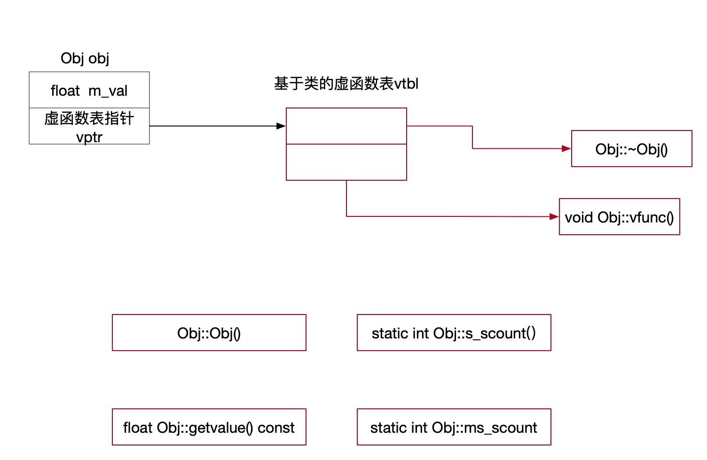
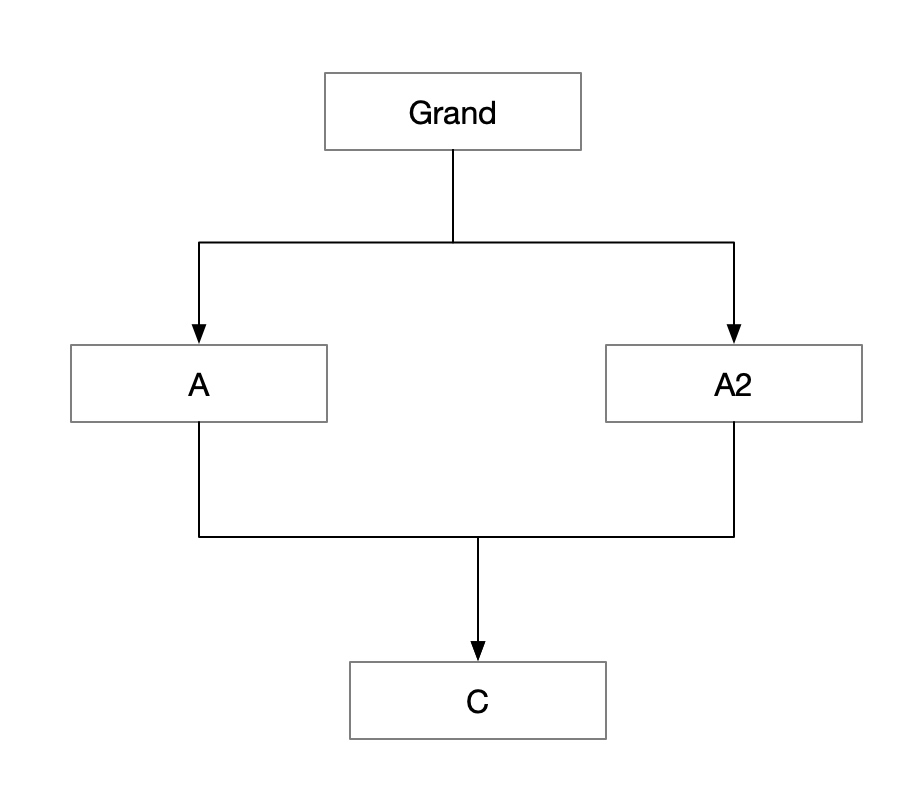

# 对象
#### 类对象空间
* 类的成员函数不占用类的空间，成员

#### 对象结构的发展和演化
* 非静态的成员变量跟着类对象走，类对象都有自己的成员变量
* 静态成员变量不保存在类中
* 虚函数会让类多8个字节，类会产生指向虚函数的指针，有两个虚函数，类会产生两个指向虚函数的指针
* 类本身指向虚函数的指针vptr，要有地方存放，存放在一个表格，虚函数表
* vptr由系统在适当的时机增加额外的代码来赋值
* 虚函数表是基于类的，跟对象没有关系
* 如果有多个数据成员，内存对齐

#### 对象模型
* 

#### this指针
* 派生类对象，它是包含基类子对象、
* 派生类同时继承多个基类，第一个基类的地址和派生类地址相同

#### 构造函数语义
* 含成的默认构造函数，只有在必要的时候，编译器オ会为我们合成出来，而不是必然或者必须为我们合成出来
* 生成预处理文件g++ -E obj3.cpp -o obj3.i

#### 编译器何时会把默认的构造函数构造出来
* 任何构造国数，但包合含一个对象类型的成员而该对象所属于的类MATX 有ー个缺省的构造函数。编译器会为MBTX合成一个默认的构造函数，并且安插代码，调用MATX的缺省构造函数
* 父类带缺省的构造函数，子类没有任何构造函数，为了调用父类的构造函数
* 一个类含有虚函数，都是没有构造函数 编译器会给我们生成一全基于该类的虚函数表 vtable，把类的虚函数表地址赋值给类对象的虚函数指针
* 一个类带有虚基类
* 
* 虚基类结构，编译器为子类和父类都产生了默认构造函数

```
 objdump  -j .text._ZN4MBTXC2Ev -x -C obj3.o 查看构造函数
 objdump -t -C obj3.o 查看函数符号表
 objdump  -x -C obj3.o 
```

#### 拷贝构造函数
* 合成的拷贝构造函数也是在必要的时候才会被合成出来
* 成员变量初始化手法，int简单类型直接按值拷贝过去，不需要拷贝构造

#### 编译器合成的拷贝构造函数
* 如果一个类没有拷贝构造函数，但是含有一个类类型CTB的成员变量，该类型CTB含有拷贝构造函数，当代码中有涉及到类A的拷贝构造函数，编译器会合成构造函数
* 如果一个类没有拷贝构造函数，但是有一个父类有拷贝构造函数，当代码中有涉及到拷贝构造时，编译器会合成拷贝构造函数
* 如果类没有拷贝构造函数，但是该类声明或者继承了虚函数，编译器会自动为其构建拷贝构造函数，为了设定类对象虚函数表指针
* 如果一个类中有虚基类时，涉及到该类的拷贝构造函数，编译器会为其生成拷贝构造
* 其他编译器合成拷贝构造函数的情况

#### 程序转化语义
* 编译器对代码进行拆分，拆分成编译器更容易理解和转化的语言
* X x100,从编译器视角来看，并没有调用构造函数
* x100.X::X(x0)

##### 返回值初始化
* linux针对返回临时对象的优化NRV和NRVO的优化
* 关闭优化g++ -o test  -fno-elide-constructors obj10.cpp
* 优化可能犯错误

#### 拷贝构造函数是否必须
* 如果只有一些简单的成员变量类型int,double,根本不需要拷贝构造函数，编译器本身就支持bitewise copy
* 复杂类型的成员变量需要拷贝构造函数
* 如果增加了自己的拷贝构造函数，导致编译器本身的bitewise的拷贝构造失败，需要自己在拷贝构造函数进行成员变量初始化

####  成员列表

##### 必须使用成员列表
* 成员是个引用
* 成员是个const
* 类继承基类，基类中有构造函数，基类构造函数有参数
* 成员变量是类类型，构造函数也是带参数的

##### 使用初始化列表的优势
* 提高程序运行效率
* 初始化列表的代码还是会到函数体中执行，初始化的列表代码会被编译器移动进函数体
* 对于类类型的成员变量的初始化放到列表效率有明显的提升
* 简单类型放在初始化列表中
* 构造函数的代码是在构造函数代码之前执行
* 列表中的初始化顺序是类中定义的顺序，编译器按定义的值来赋值
* 