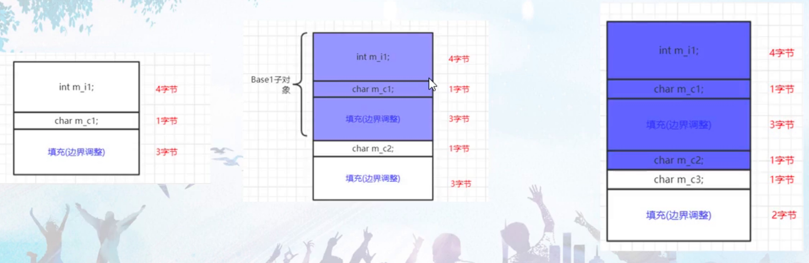
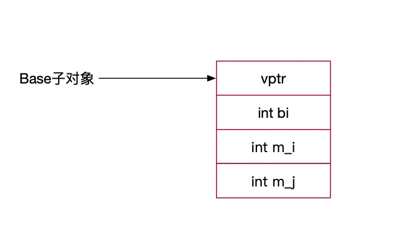
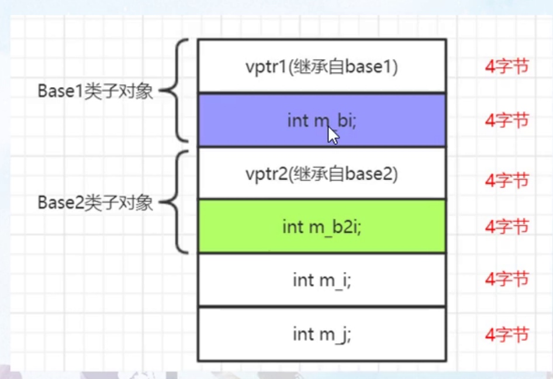
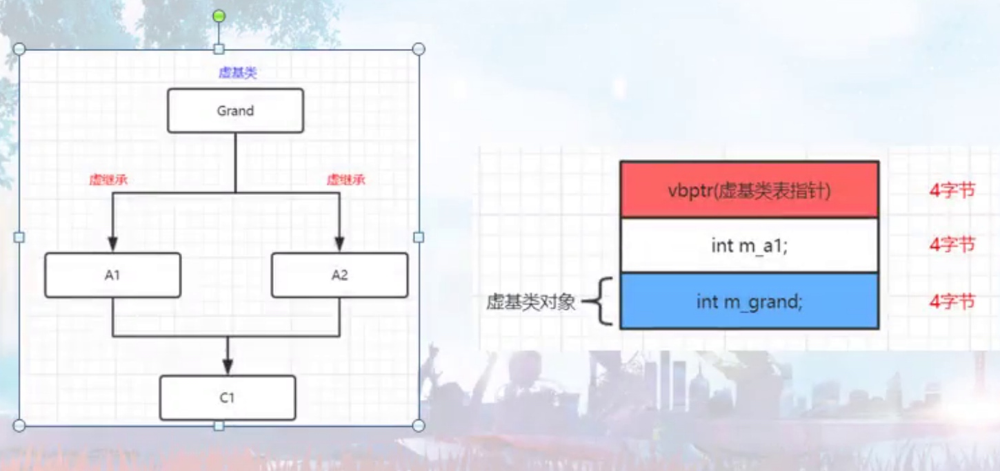
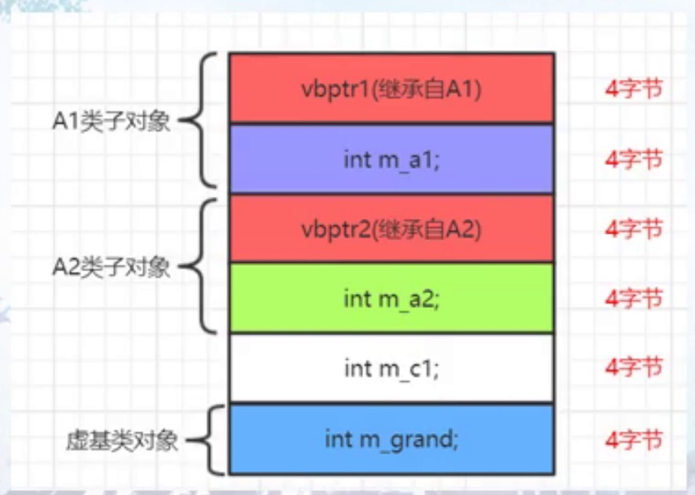
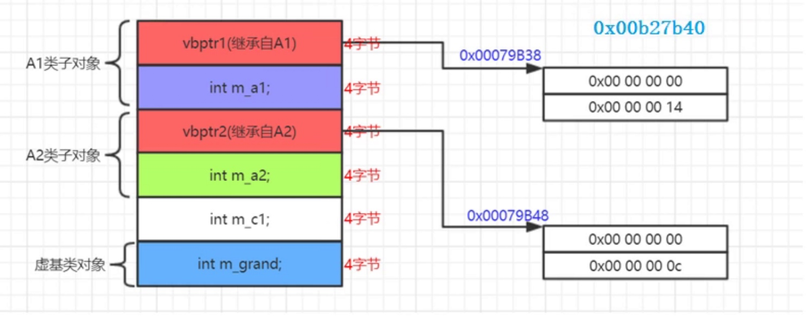

# 数据语义学

#### 变量绑定
* 编译器对成员函数的解析，是在类定义完毕以后开始，对类成员变量的解析和绑定，是在类定义完成之后发生的，只有类定义完毕后，编译器才能看到类A中的成员变量
* ::引用全局的myvar的变量

#### 成员函数
* 成员函数参数类型在编译器第一个遇到类型的时候绑定的
* 为了尽早的看到类型type，类型定义typedef一定要挪到类中的最早定义

#### 进程内存空间布局
* nm查看
* 类的静态成员变量也存在数据段

#### 字节对齐
```
#pragma pack(1) 不对齐
#pragma pack() 取消不对齐，继续对齐
```

#### 成员变量偏移值
* &class::m_val

#### 静态成员变量存取
* 静态成员变量地址始终不变，写入了可执行文件

#### 非静态成员变量
* 类对象的首地址加上成员变量的偏移值

#### 数据成员布局
* 成员边界填充
* 引入继承关系，会带来额外的内存空间的开销
* 对象中会产生虚函数表指针vptr
* 增加或者扩展构造函数，增加给虚函数表指针的vptr赋值的代码
* 多重继续，子类继续2个父类，如果子类还有自己的虚函数的话和第一个基类共用vptr


```
class Base {
 public:
  int m_bi;
  char m_b;
  char m_c;
  char m_d;
};
sizeof(Base)=8字节，填充一个字节

class Base {
 public:
  int m_bi;
  char m_b;
};

class Base2 : public Base {
 public:
  char m_c;
};

class Base3 : public Base2 {
 public:
  char m_d;
};
```

* 
* 内存拷贝要谨慎Base2拷贝到Base3，会产生内存拷贝

##### 单一继承父类不带虚函数的成员布局
* 、

```
(gdb) p  obj
$1 = (Base3) {
  <Base> = {
    m_bi = 1
  },
  members of Base3:
  _vptr.Base3 = 0x400a80 <vtable for Base3+16>,
  m_i = 2,
  m_j = 3
}
(gdb) x/12x  &obj
0x7fffffffdee0: 0x00400a80      0x00000000      0x00000001      0x00000002
0x7fffffffdef0: 0x00000003      0x00000000      0x00400740      0x00000000
0x7fffffffdf00: 0xffffdff0      0x00007fff      0x00000000      0x00000000
```
* 依靠偏移值不能绘制真正的数据布局
* vptr一直置顶

#### 多重继承
* 
* 访问Base1不用跳，访问Base2变量this指针要偏移
* 先继承就顶格
* this指针的调整都是编译器自动调整和偏移

```
(gdb) x/20d bs2
0x7fffffffdee0: 4197896 0       12      3
0x7fffffffdef0: 6       0       -8480   32767
0x7fffffffdf00: -8208   32767   0       0
0x7fffffffdf10: 0       0       -148827179      32767
0x7fffffffdf20: 0       32      -8200   32767
(gdb) x/20d &obj
0x7fffffffded0: 4197864 0       9       0
0x7fffffffdee0: 4197896 0       12      3
0x7fffffffdef0: 6       0       -8480   32767
0x7fffffffdf00: -8208   32767   0       0
0x7fffffffdf10: 0       0       -148827179      32767
Derived obj;
Base2* bs2 = &obj;
Base2* bs2 = (Base2*)(((char*)&obj) + sizeof(Base1))
Base1* bs1 = &obj;
bs1和bs2的地址并不相同
bs2指向的是bs2子对象的指针
```
#### 虚基类中
* 传统多重继承，空间问题，效率问题，二义性
* 让grand只被继承一次，在孙子类中只有一份

#### 虚基类
* 虚基类表
* 虚基类表指针
* 虚继承后，A1,A2会被插入一个虚基类表指针，C1会继承两个表指针
* 
* 
* 虚基类表记录偏移来找到虚基类子对象
* 虚基类表指针成员变量的首地址 + 偏移量 = 虚基类对象首地址

#### 观察各种继承
* 虚基类表的偏移值
* 虚基类表中的偏移量按照继承顺序来存放
* 虚基类子对象一直放在最下面

#### 虚基类1-4字节分析
* 虚基类表指针成员变量的首地址，和本对象A1首地址的偏移量，也就是虚基类表指针 - A1的对象的首地址
* 只有对虚基类成员进行赋值的时候，才会用到虚基类

#### 三层结构虚基类表内容分析
* 
* 虚基类在编译的时候已经固定了
* vptr2基本没用到只用到vptr1
* 访问虚基类的成员变量要比普通成员变量慢

#### 成员变量地址，偏移和指针

#### 成员变量偏移值和偏移指针
* 和具体对象没有关系
* 成员变量指针保存的是一个偏移值，不是实际内存地址
* 没有指向任何数据成员的指针

```
int main() {
  Obj obj;
  obj.m_i = obj.m_j = obj.m_k = 0;
  printf("mi = %p \n", &obj.m_i);

  Obj* p = &obj;
  printf("mi = %p \n", p->m_i);
  printf("mj = %p \n", p->m_j);

  int* p1 = &obj.m_i;
  int* p2 = &obj.m_j;

  *p1 = 15;
  *p2 = 30;
  printf("p1 = %p  p1 val %d \n", p1, *p1);
  printf("p2 = %p  p2 val %d \n", p2, *p2);

  printf("m_i offset %d \n", &Obj::m_i);
  printf("m_j offset %d \n", &Obj::m_j);
  printf("m_k offset %d \n", &Obj::m_k);


  int Obj::*ptr = &Obj::m_i;
  printf("m_k offset %d \n", ptr);
  obj.*ptr = 13;
  p->*ptr = 20;
  ptr = nullptr; 编译器会把ptr设置为-1
  ptr += 1//不允许
}
```
* 