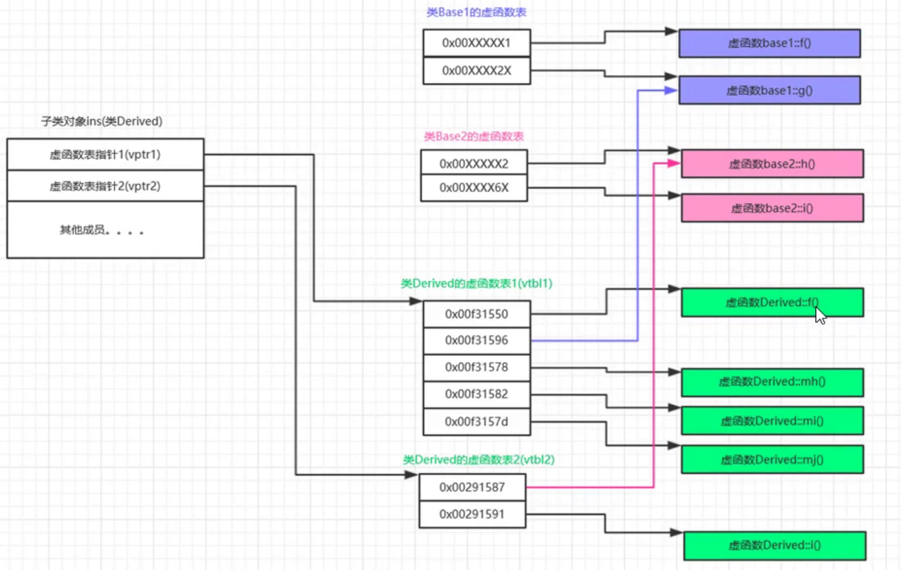

# 虚函数

#### 虚表指针位置
* 位于对象内存的开头

#### 总结
* 一个类只有包含虚函数才会存在虚函数表，同属于一个类的对象共享虚函数表，但是有各种的vptr，所指向的虚函数表是一样的
* 父类中有虚函数，就等于子类中有虚函数
* 只要在父类中是虚函数，在子类中不写virtual，依旧是虚函数
* 不管是父类还是子类，只会有一个虚函数表
* 子类中是否有多个虚函数表呢？//todo
* 如果子类中完全没有新的虚函数，则我们认为子类的虚函数表内容和父类完全相同，在内存中不同位置
* 虚函数表的每一项保存着一个虚函数的首地址，但是如果子类的虚函数表项和父类的表项目代表同一个函数，
* Base base = derive,编译器并没有把子类的虚函数表指针覆盖base对象的虚函数表指针
* 面向对象和基于对象概念
* OB执行速度很快，因为函数调用不需要运行时决定

#### 多继承
* 类中有多个基类，则有多个虚函数表指针，对应各个基类的vptr按继承顺序依次放在类的内存空间中，且子类与第一个基类共用第一个vptr，第二个基类有自己的vptr
* 
* 子类对象ins有两个虚函数表指针，vptr1, vptr2
* 子类中的虚函数覆盖了父类中的同名虚函数，

#### vptr工具
* g++ -fdump-class-hierarchy -fsyntax-only obj15.cpp

```
Vtable for Derived
Derived::_ZTV7Derived: 12u entries
0     (int (*)(...))0
8     (int (*)(...))(& _ZTI7Derived)
16    (int (*)(...))Derived::f
24    (int (*)(...))Base1::g
32    (int (*)(...))Derived::i
40    (int (*)(...))Derived::mh
48    (int (*)(...))Derived::mi
56    (int (*)(...))Derived::mj
64    (int (*)(...))-8
72    (int (*)(...))(& _ZTI7Derived)
80    (int (*)(...))Base2::h
88    (int (*)(...))Derived::_ZThn8_N7Derived1iEv

Class Derived
   size=16 align=8
   base size=16 base align=8
Derived (0x0x7fd61ba60380) 0
    vptr=((& Derived::_ZTV7Derived) + 16u)
  Base1 (0x0x7fd61b9a1780) 0 nearly-empty
      primary-for Derived (0x0x7fd61ba60380)
  Base2 (0x0x7fd61b9a17e0) 8 nearly-empty
      vptr=((& Derived::_ZTV7Derived) + 80u
```

#### vptr创建
* vptr跟着对象，对象创建出来就创建了
* 构造函数中有给vptr赋值信息

#### 虚函数表
* 虚函数表是编译器在编译期间生成的目标文件，为每一个类确定的虚函数表的vtbl的内容
* 在编译期间添加给vptr赋值的代码信息
* 

#### 单纯的类
* 编译器向类内部增加一些不可见但是真实存在的成员变量
* 有这种变量的类，就不单纯了
* 隐藏的成员变量增加或者使用的时机在构造函数之前执行
* 普通函数地址和虚函数地址在编译的时候就确定好的
* 静态联合编译和动态联合编译
* 