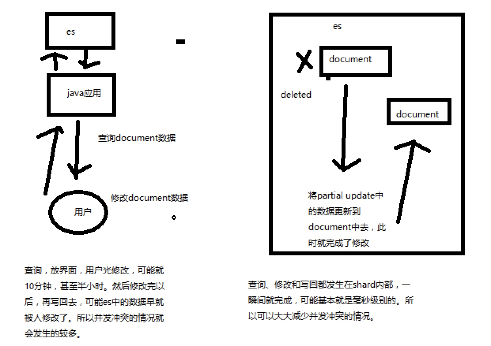

# PatialUpdate

#### 部分替换
* （1）应用程序先发起一个get请求，获取到document，展示到前台界面，供用户查看和修改
* （2）用户在前台界面修改数据，发送到后台
* （3）后台代码，会将用户修改的数据在内存中进行执行，然后封装好修改后的全量数据
* （4）然后发送PUT请求，到es中，进行全量替换
* （5）es将老的document标记为deleted，然后重新创建一个新的document

#### 全量替换和部分替换

