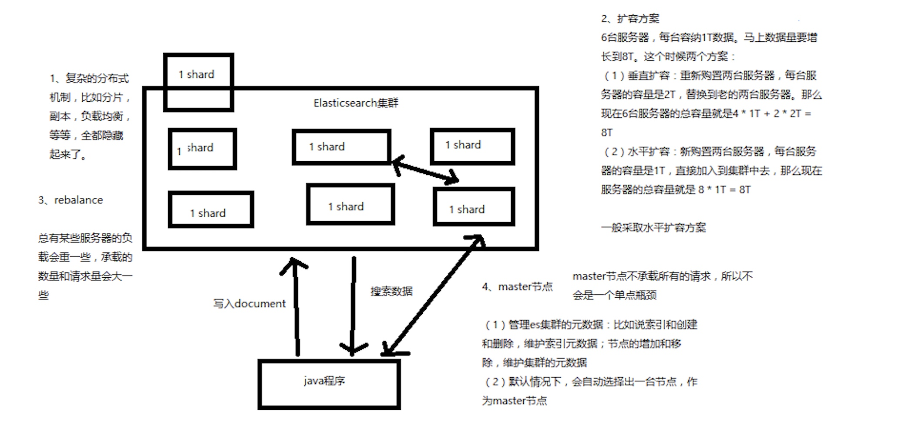
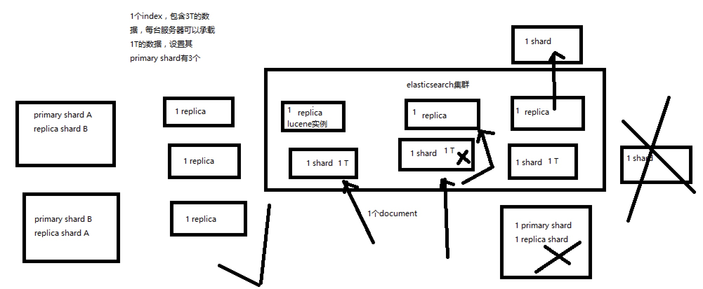
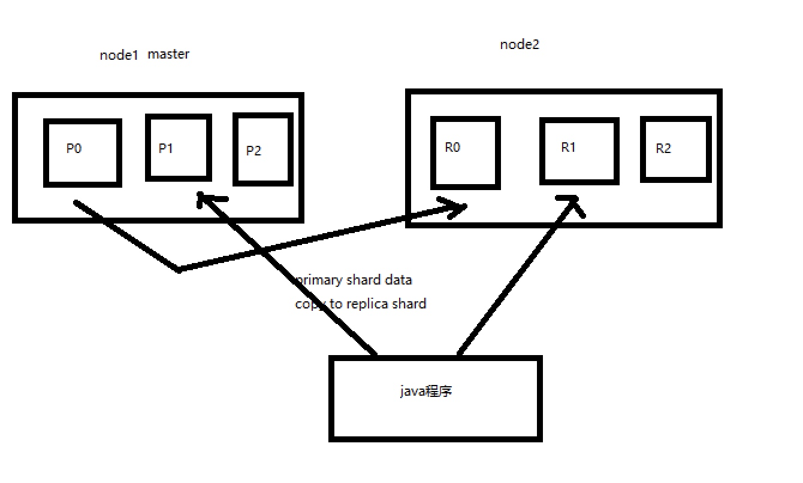

# 基础架构图

#### 分布式架构图
* 分片机制
* cluster discovery（集群发现机制）
* shard负载均衡
* shard副本，请求路由，集群扩容，shard重分配

* 增减或减少节点时的数据rebalance

#### master节点
* （1）创建或删除索引
* （2）增加或删除节点

#### 节点平等的分布式架构
* （1）节点对等，每个节点都能接收所有的请求
* （2）自动请求路由
* （3）响应收集

#### shard&replica

*  (1) index包含多个shard
* （2）每个shard都是一个最小工作单元，承载部分数据，lucene实例，完整的建立索引和处理请求的能力
* （3）增减节点时，shard会自动在nodes中负载均衡
* （4）primary shard和replica shard，每个document肯定只存在于某一个primary shard以及其对应的replica shard中，不可能存在于多个primary shard
* （5）replica shard是primary shard的副本，负责容错，以及承担读请求负载
* （6）primary shard的数量在创建索引的时候就固定了，replica shard的数量可以随时修改
* （7）primary shard的默认数量是5，replica默认是1，默认有10个shard，5个primary shard，5个replica shard
* （8）primary shard不能和自己的replica shard放在同一个节点上（否则节点宕机，primary shard和副本都丢失，起不到容错的作用），但是可以和其他primary shard的replica shard放在同一个节点上

#### 单节点创建index
* （1）单node环境下，创建一个index，有3个primary shard，3个replica shard
* （2）集群status是yellow
* （3）这个时候，只会将3个primary shard分配到仅有的一个node上去，另外3个replica shard是无法分配的
* （4）集群可以正常工作，但是一旦出现节点宕机，数据全部丢失，而且集群不可用，无法承接任何请求

#### 双节点创建
* 

#### 横向扩展和扩容
* primary shard数量不可改变。只能修改repli shard
* （1）primary&replica自动负载均衡，6个shard，3 primary，3 replica
* （2）每个node有更少的shard，IO/CPU/Memory资源给每个shard分配更多，每个shard性能更好
* （3）扩容的极限，6个shard（3 primary，3 replica），最多扩容到6台机器，每个shard可以占用单台服务器的所有资源，性能最好
* （4）超出扩容极限，动态修改replica数量，9个shard（3primary，6 replica），扩容到9台机器，比3台机器时，拥有3倍的读吞吐量
* （5）3台机器下，9个shard（3 primary，6 replica），资源更少，但是容错性更好，最多容纳2台机器宕机，6个shard只能容纳1台机器宕机
* 

