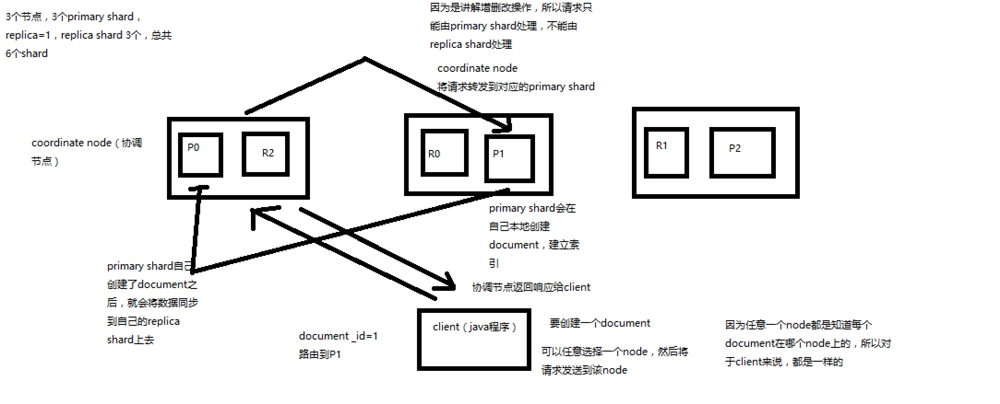
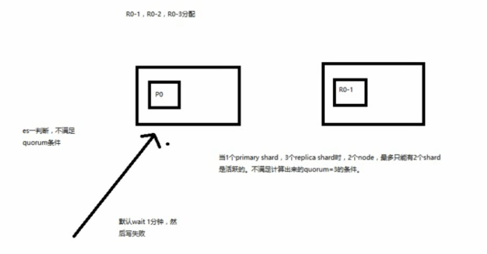

# 增删查改原理

#### 原理
* （1）客户端选择一个node发送请求过去，这个node就是coordinating node（协调节点）
* （2）coordinating node，对document进行路由，将请求转发给对应的node（有primary shard）
* （3）实际的node上的primary shard处理请求，然后将数据同步到replica node
* （4）coordinating node，如果发现primary node和所有replica node都搞定之后，收到primary node和replica node就返回响应结果给客户端

#### quorum机制
* quorum机制，写之前必须确保大多数shard都可用，int( (primary + number_of_replicas) / 2 ) + 1，当number_of_replicas>1时才生效
* quorum不齐全时，wait，默认1分钟，timeout，100，30s
* 等待期间，期望活跃的shard数量可以增加，最后实在不行，就会timeout
我们其实可以在写操作的时候，加一个timeout参数，比如说put /index/type/id?timeout=30，这个就是说自己去设定quorum不齐全的时候，es的timeout时长，可以缩短，也可以增长

##### 条件不满足时
* 

#### 请求转发的时候
* 特殊情况：document如果还在建立索引过程中，可能只有primary shard有，任何一个replica shard都没有，此时可能会导致无法读取到document，但是document完成索引建立之后，primary shard和replica shard就都有了
