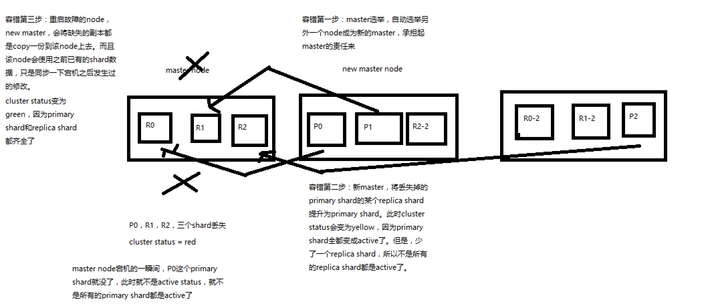

# 容错机制&选举和数据恢复

#### 容错
* 
* （1）9 shard，3 node
* （2）master node宕机，自动master选举，red
* （3）replica容错：新master将replica提升为primary shard，yellow
* （4）重启宕机node，master copy replica到该node，使用原有的shard并同步宕机后的修改，green