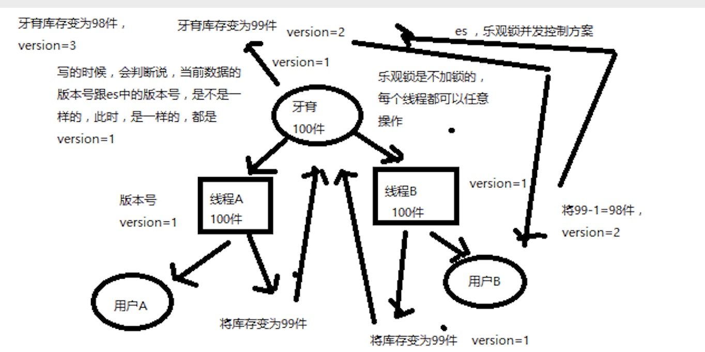
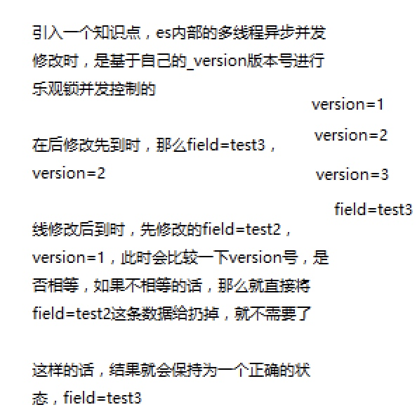

# 并发冲突&悲观锁和乐观锁

#### 悲观锁
* 各种情况下，都上锁

#### 对比
* 1、悲观筑的优点是：方便，直接加加锁，对应用程序来说，运明，不需要做额外的操作；缺点，并发能力很低，同一时间只能有一条线程操作效据
* 2、乐观锁的优点是：并发能力很高，不给数据加锁，大是线程并发操作；缺点，麻颅，每次跟新的时候，都要先比对版本号，然后可能需要重新加載数据，再次修改，再写；这个过程，可能要重复好几
* 


#### es乐观锁机制
* 

```go
PUT /test_index/test_type/1?version=2
GET /test_index/test_type/1
```

#### external version
* PUT /test_index/test_type/8?version=2&version_type=external
* PUT /test_index/test_type/8?version=3&version_type=external
* 