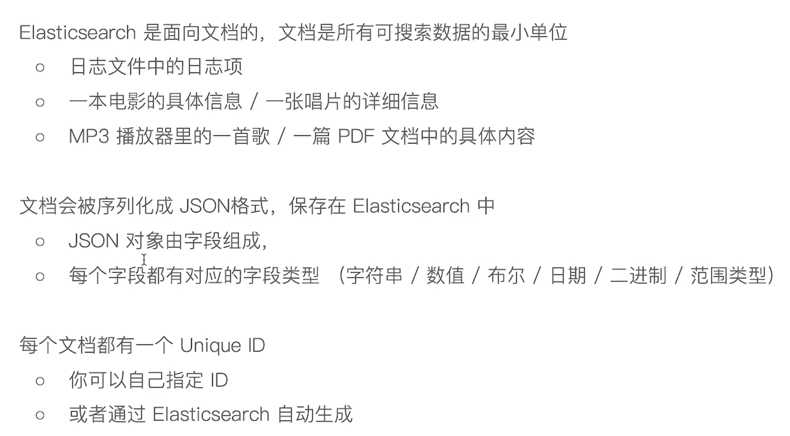
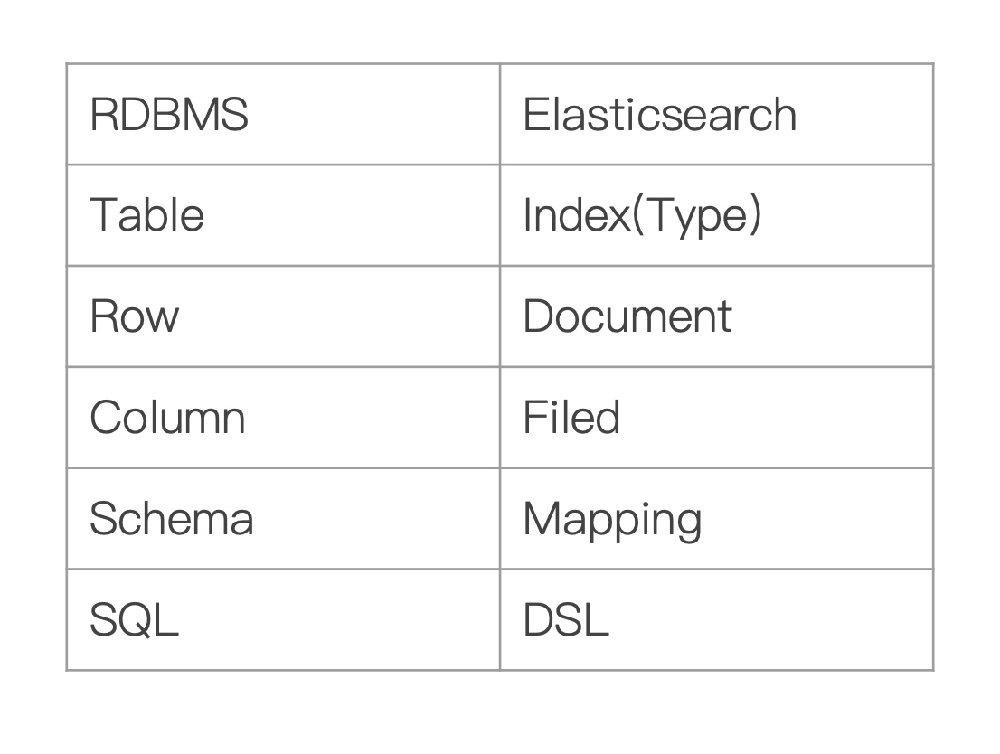

# 核心概念

#### 功能
* 1）分布式的文档存储引擎
* 2）分布式的搜索引擎和分析引擎
* 3）分布式，支持PB级数据

#### 核心概念
* Near Realtime（NRT）：近实时，两个意思，从写入数据到数据可以被搜索到有一个小延迟（大概1秒）；基于es执行搜索和分析可以达到秒级
* Cluster：集群，包含多个节点，每个节点属于哪个集群是通过一个配置（集群名称，默认是elasticsearch）来决定的，对于中小型应用来说，刚开始一个集群就一个节点很正常
* Node：节点，集群中的一个节点，节点也有一个名称（默认是随机分配的），节点名称很重要（在执行运维管理操作的时候），默认节点会去加入一个名称为“elasticsearch”的集群，如果直接启动一堆节点，那么它们会自动组成一个elasticsearch集群，当然一个节点也可以组成一个elasticsearch集群
* Document&field：文档，es中的最小数据单元，一个document可以是一条客户数据，一条商品分类数据，一条订单数据，通常用JSON数据结构表示，每个index下的type中，都可以去存储多个document。一个document里面有多个field，每个field就是一个数据字段。
* Index：索引，包含一堆有相似结构的文档数据，比如可以有一个客户索引，商品分类索引，订单索引，索引有一个名称。一个index包含很多document，一个index就代表了一类类似的或者相同的document。比如说建立一个product index，商品索引，里面可能就存放了所有的商品数据，所有的商品document。
* Type：类型，每个索引里都可以有一个或多个type，type是index中的一个逻辑数据分类，一个type下的document，都有相同的field，比如博客系统，有一个索引，可以定义用户数据type，博客数据type，评论数据type。
* 现在只能创建为_doc


```C++
商品index，里面存放了所有的商品数据，商品document

但是商品分很多种类，每个种类的document的field可能不太一样，比如说电器商品，可能还包含一些诸如售后时间范围这样的特殊field；生鲜商品，还包含一些诸如生鲜保质期之类的特殊field

type，日化商品type，电器商品type，生鲜商品type

日化商品type：product_id，product_name，product_desc，category_id，category_name
电器商品type：product_id，product_name，product_desc，category_id，category_name，service_period
生鲜商品type：product_id，product_name，product_desc，category_id，category_name，eat_period
```
* shard：单台机器无法存储大量数据，es可以将一个索引中的数据切分为多个shard，分布在多台服务器上存储。有了shard就可以横向扩展，存储更多数据，让搜索和分析等操作分布到多台服务器上去执行，提升吞吐量和性能。每个shard都是一个lucene index。
* replica：任何一个服务器随时可能故障或宕机，此时shard可能就会丢失，因此可以为每个shard创建多个replica副本。可以读

#### ES对比数据库

|  ES |  Mysql |
|---|---|
|  Doucument |  行 |
|  Type |  表 |
|  Index |  库 |


#### es文档


#### 基本概念
* Ndex-索引是文档的容器，是一类文档的结合index 体现了逻辑空间的概念：每个索引都有
* 自己的 Mapping 定义，用于定义包含的文档的字段名和字段类型
* Shard 体现了物理空间的概念：索引中的数据
* 分散在 Shard 上索引的 Mapping 与 Settings o Mapping 定义文档字段的类型 Setting 定义不同的数据分布


􏱂􏵲􏲓 􏳣