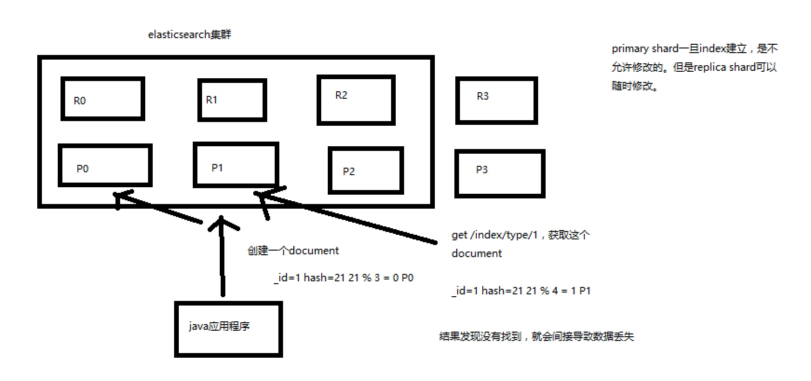

# 路由协议

#### 路由算法
* 路由算法：shard = hash(routing) % number_of_primary_shards
* 每次增删改查一个document的时候，都会带过来一个routing number，默认就是这个document的_id（可能是手动指定，也可能是自动生成）

#### primary shard不允许修改
* primary index一旦建立，不允许修改，否则查询的时候，重新hash导致之前的数据无法查询到，会导致数据丢失
* 

#### 数据存储
* 一个index 的数据会被分为多片，每片都在一个 shard 中。所以说，一个 document，只能存在于一个 shard 中。
当客户端创建 document：的时候，es 比就需要决定说，这个 document 是放在这个 ndex 的哪个 shard 上
这个过程，就称之为 document routing，数据路由。
* 