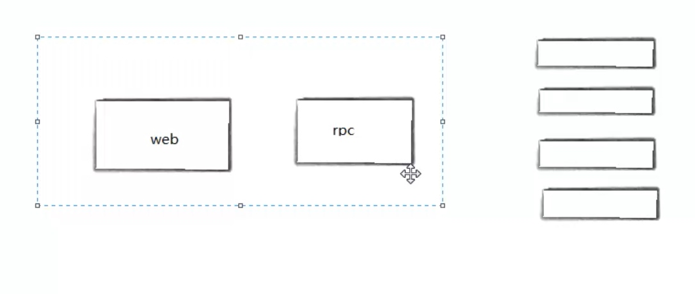

# Golang入门

#### 环境搭建和调试工具
* dlv调式 //TODO
* 基于CSP模型实现
* 通过创建物理线程，在物理线程中调度携程

#### channel
* 管道
* 多个goroute通过channel进行通信
* 支持多个类型
* 包内变量全局可访问，大小写控制 //TODO
* 管道满了会阻塞

```
  var pipe chan int
  pipe = make(chan int, 3)
  pipe := make(chan int, 3)
```

#### 包的概念
* 不用考虑编码
* 函数名要大写才能被其他包引用
* go build -o ../../bin/main main.go 编译输出到指定路径

#### 自动运行
* 每个源代码文件都可以包含init函数，这个init函数自动被go运行框架调用
* 先初始化全局变量-->init函数-->main
* 不使用只初始化

#### 常量
* const c = getValue() 错误
* const 只能修辞boolean, number(int相关类型,浮点型)和string

#### 值类型和引用类型
* 值类型 变量直接存储值，内存在栈中分配
* 引用类型 变量存储的是一个地址，内存在堆上分配
* 值类型 int, float, bool, string,数据和 struct
* 引用类型  指针, slice, map, chan 都是引用类型
* go语言栈只有几k
* 堆内存分配没有栈性能高
* 堆分配算法//TODO

#### 变量周期
* 大写的变量局部变量模块结束，变量也就释放了
* 全局区域:=不能通过，只能声明,不能执行代码

#### 随机数
* 应用场景
* 
* rpc和web节点绑定在一起
* *_rpc调用库实现负载均衡和健康检查_*

#### 字符串类型
* 双引号
* 反引号 `` 中间的内容不做任何转换，可以任意换行
* %v打印原来的类型
* %T 打印Go语言语法类型
* len的时间复杂度是O(1)长度储存的
