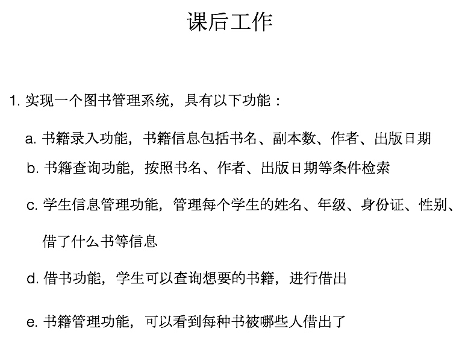
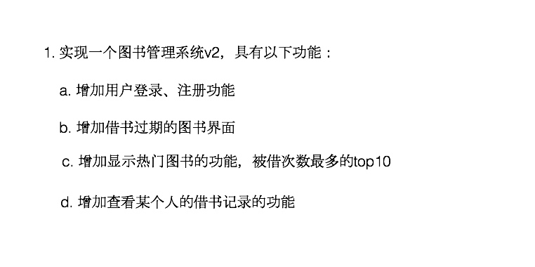

# Struct类型和interface

#### 内存布局
* go的内存布局是连续的
* 结构体成员小写是包内访问
* 没有构造函数，使用工厂模式解决这个问题

#### tag
* tag可以通过反射的机制获取，常用的就是json序列化和反序列化,方便打包

```
 type Student struct {
    Name  string `json:"name"` //打包压缩的字段
    Age   int    `json:"age"`
    Score int    `json:"score"`
  }
```

#### interface
* interface类型默认是指针

#### 作业




#### Sort
* Sort(Inteface interface){}
* 排序本质上是针对具体的数组或者切片实现一个具体化的排序算法

#### 接口断言

```
  func classifier(items ...interface{}) {
  for _, v := range items {
    switch v.(type) {
    case bool:
      fmt.Println("bool type")
    case int, int64, int32:
      fmt.Println("int")
    case float32, float64:
      fmt.Println("float32")
    case string:
      fmt.Println("string")
    }
  }
}

func main() {
  classifier(2, 8.2, "ok string", false)
}
```