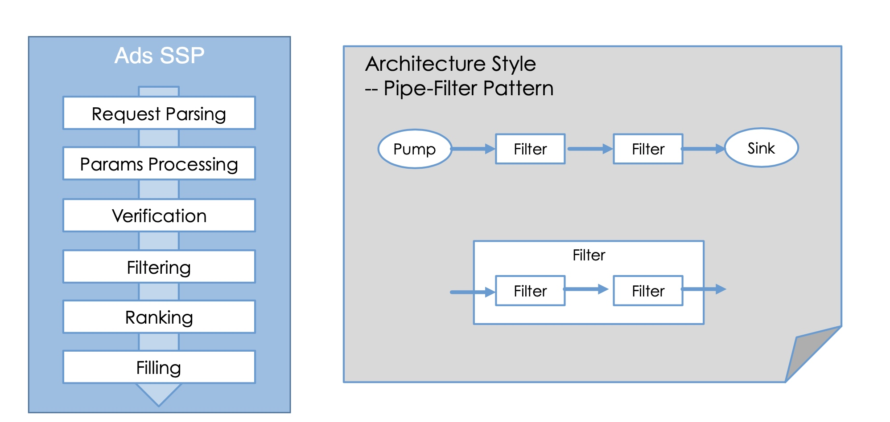
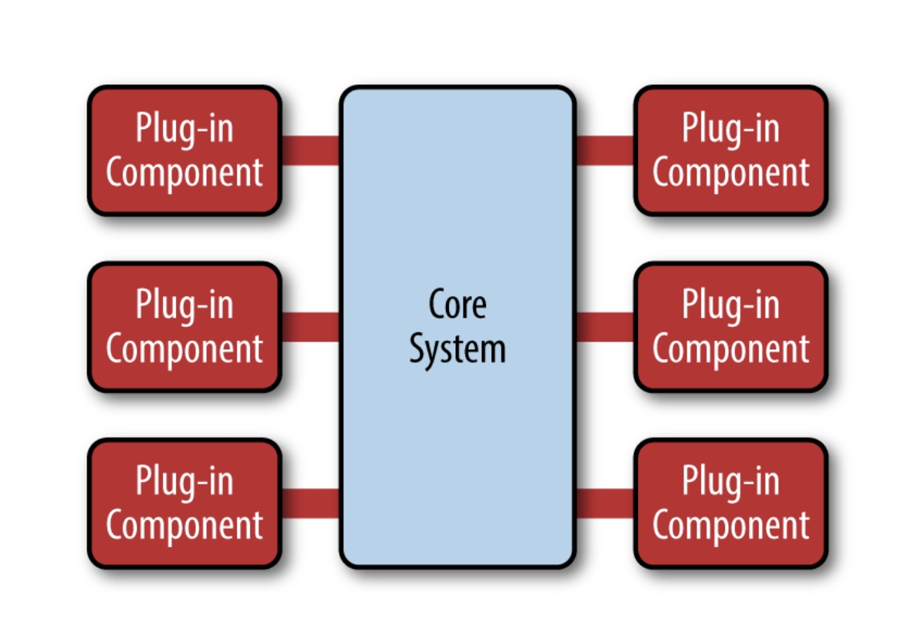

# pipe-filter

#### 架构
* 
* ⾮非常适合与数据处理理及数据分析系统
* Filter封装数据处理理的功能
* Pipe⽤用于连接Filter传递数据或者在异步处理理过程中缓冲数据 流
* 进程内同步调⽤用时，pipe演变为数据在⽅方法调⽤用间传递 松耦合:Filter只跟数据(格式)耦合

#### micro kernel
* 
* 易易于扩展
* 错误隔离
* 保持架构⼀一致性
* 要点
* 内核包含公共流程或通⽤用逻辑 将可变或可扩展部分规划为扩展点 抽象扩展点⾏行行为，定义接⼝口 利利⽤用插件进⾏行行扩展