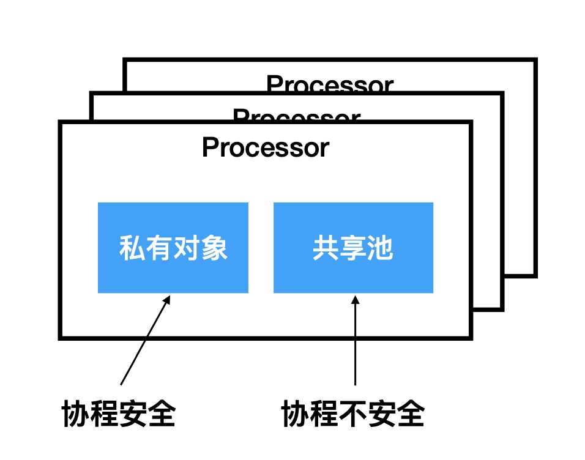

# 对象池

#### object_pool
```go
func (p *ObjPool) GetObj(timeout time.Duration) (*ReusableObj, error) {
	select {
	case ret := <-p.bufChan:
		return ret, nil
	case <-time.After(timeout): //超时控制
		return nil, errors.New("time out")
	}
}
```
* 对象是否简单易于创建，会不会影响性能

#### sync.Pool
* 对象的缓存
* 

##### 获取
* 尝试从私有对象获取
* 私有对象不不存在，尝试从当前 Processor 的共享池获取
* 如果当前 Processor 共享池也是空的，那么就尝试去其他 Processor 的共享池获取
* 如果所有⼦子池都是空的，最后就⽤用⽤用户指定的 New 函数 产⽣生⼀一个新的对象返回

##### 放回
* 如果私有对象不不存在则保存为私有对象
* 如果私有对象存在，放⼊入当前 Processor ⼦子池的共享池中

#### 生命周期
* GC 会清除 sync.pool 缓存的对象 
* 对象的缓存有效期为下⼀一次GC 之前

#### 总结
* 适合于通过复⽤用，降低复杂对象的创建和 GC 代价
* 协程安全，会有锁的开销，每次获取对象都会有锁机制
* ⽣生命周期受 GC 影响，不不适合于做连接池等，需⾃自⼰己管理理⽣生命周期的资源的池化

#### 案例
```go
func TestSyncPool(t *testing.T) {
	pool := &sync.Pool{
		New: func() interface{} {
			fmt.Println("Create a new object.")
			return 100
		},
	}

	v := pool.Get().(int)
	fmt.Println(v)
	pool.Put(3)
	runtime.GC() //GC 会清除sync.pool中缓存的对象
	v1, _ := pool.Get().(int)
	fmt.Println(v1)
}

func TestSyncPoolInMultiGroutine(t *testing.T) {
	pool := &sync.Pool{
		New: func() interface{} {
			fmt.Println("Create a new object.")
			return 10
		},
	}

	pool.Put(100)
	pool.Put(100)
	pool.Put(100)

	var wg sync.WaitGroup
	for i := 0; i < 10; i++ {
		wg.Add(1)
		go func(id int) {
			fmt.Println(pool.Get())
			wg.Done()
		}(i)
	}
	wg.Wait()
}
```