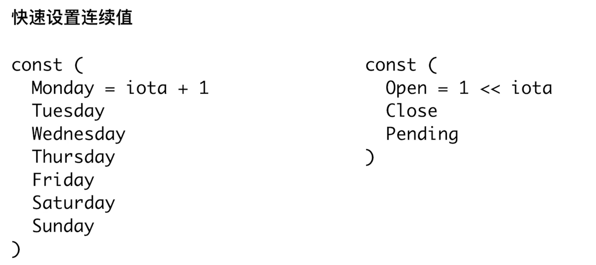
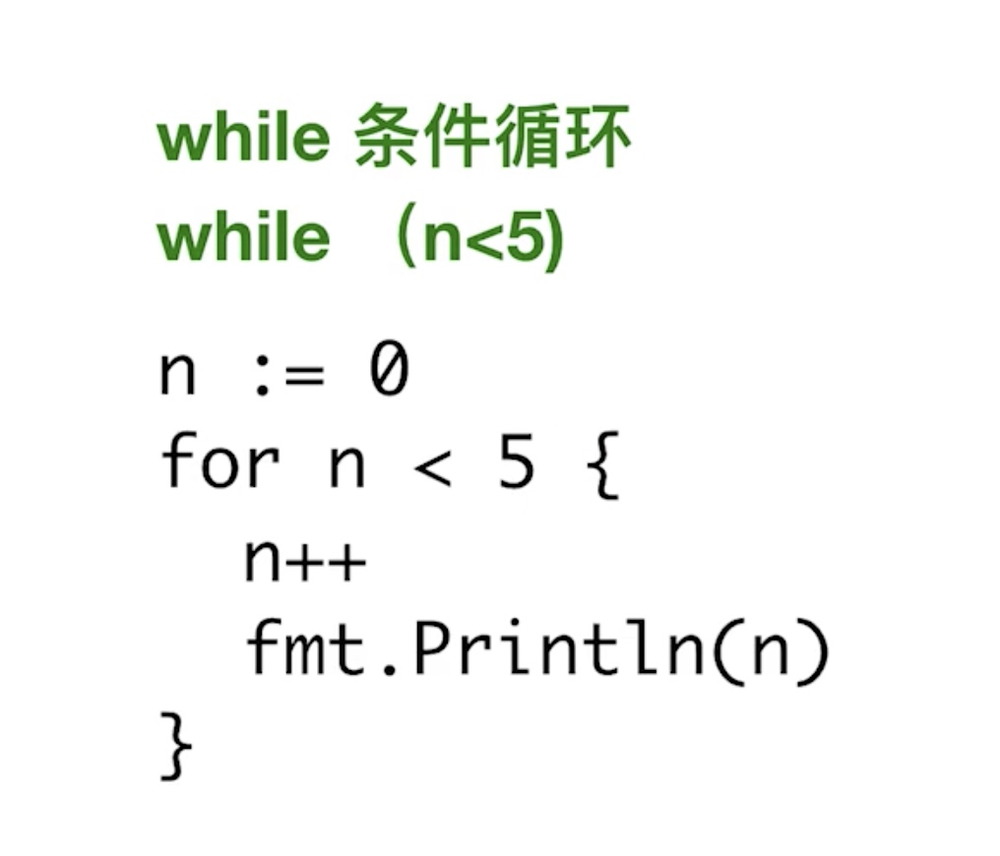
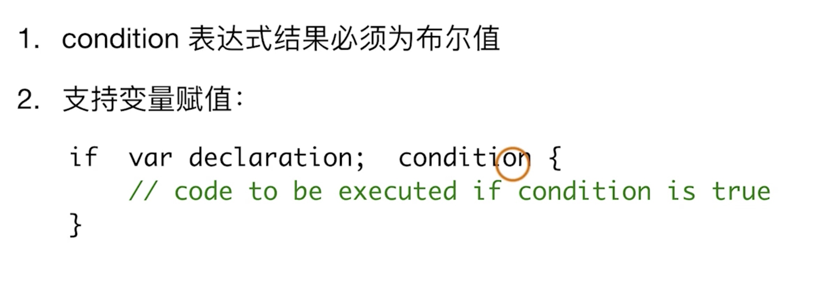

# 常量&数据类型

#### 常量

* 位操作

```go
const (
  Readable = 1 << iota
  Writable
  Executable
)
```

#### 禁止类型转换
* 别名都不可以

#### 类型预定义的值
* math.MaxInt64
* math.MaxFloat64

#### 字符串string
* string == 0 来判断

#### 数组
```go
a := [...]int{1,2,3,4}
b := [...]int{1,2,3,4}
```
* 要求数组长度，顺序，和类型一致

#### 位操作
```go
1 &^ 0  -- 1
1 &^ 1  -- 0
0 &^ 1  -- 0
0 &^ 0  -- 0
```

#### 循环


#### if条件


#### switch
```go
func TestSwitchCaseCondition(t *testing.T) {
	for i := 0; i < 5; i++ {
		switch {
		case i%2 == 0:
			t.Log("Even")
		case i%2 == 1:
			t.Log("Odd")
		default:
			t.Log("unknow")
		}
	}
}
```

#### 