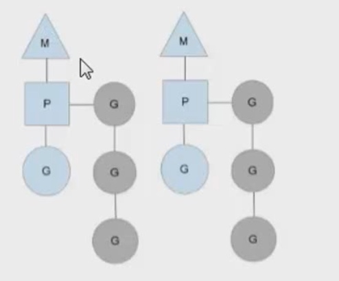

# 指针和Go语句执行规则
#### 指针不可寻址
* 不可变的值不可寻址
* 临时结果的值不可寻址
* 拿到某值的指针可能会破坏程序的一致性，不安全
* 基本类型的值上调用指针方法，Go语言会自动转译

#### 调度器
* G goroutine
* P Processor
* M machine

#### Goroutine机制
* 从空闲的存放的G队列中获取一个G，用G包装当前的go函数，然后再把G追加到某个可允许的G队列中
* go函数的执行时间总是明显滞后于所属的go语句的执行时间

#### 限制gorutine的启动数量
```
func handle(i int, ch chan struct{}) {
  _ = i
  <-ch
}

func main() {
  var maxRoutine = 10
  ch := make(chan struct{}, maxRoutine)
  total := 100

  for i := 0; i < total; i++ {
    ch <- struct{}{}
    go handle(i, ch)
  }
}
```

#### 顺序串行执行goroutine
```
func main() {
  var count uint32 = 0
  trigger := func(i uint32, fn func()) {
    for {
      if n := atomic.LoadUint32(&count); n == i {
        fn()
        atomic.AddUint32(&count, 1)
        break
      }
      time.Sleep(time.Nanosecond)
    }
  }
  for i := uint32(0); i < 10; i++ {
    go func(i uint32) {
      fn := func() {
        fmt.Println(i)
      }
      trigger(i, fn)
    }(i)
  }
  trigger(10, func() {})
}

func TestGroutine(t *testing.T) {
 var w sync.WaitGroup
 w.Add(10)
 for i := 0; i < 10; i++ {
  go func(i int) {
   //time.Sleep(time.Second * 1)
   fmt.Println(i)
   w.Done()
  }(i) //值传递
 }
 w.Wait()//等待
 time.Sleep(time.Millisecond * 50)
}
```

#### 并发和并行
* 多线程程序在一个核的cpu上运行就是并发
* 多线程程序在多个核的cpu运行就是并行

#### 协程和线程
* 独立的栈空间，共享堆空间，调度由用户自己控制，本质有点类似于用户级线程，这些用户级线程的调度也是自己实现的
* 一个线程上可以跑多个协程，协程是轻量级的线程

#### GPM调度模型


#### 不同goroutine之间如何通讯
* 全局变量和锁同步
* Channel
* go build -race 可以查看程序是否有线程竞争