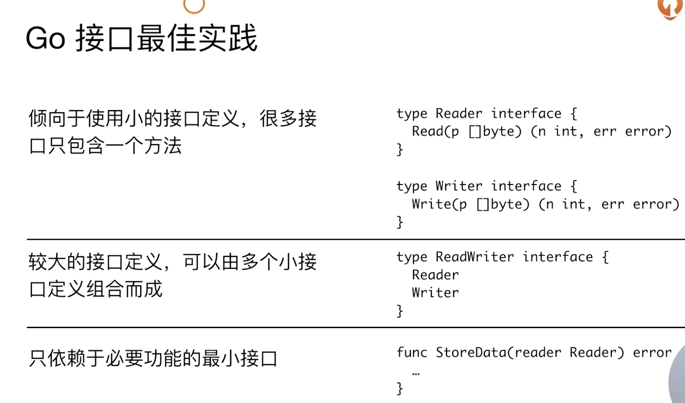

# 相关接口

#### 接口差异
* 接口为非入侵性，实现不依赖于接口定义
* 所以接口的定义可以包含在接口使用者包内

```go
type IntConv func(op int) int

func timeSpent(inner IntConv) IntConv {
	return func(n int) int {
		start := time.Now()
		ret := inner(n)
		fmt.Println("time spent:", time.Since(start).Seconds())
		return ret
	}
}

func slowFun(op int) int {
	time.Sleep(time.Second * 1)
	return op
}

func TestFn(t *testing.T) {
	tsSF := timeSpent(slowFun)
	t.Log(tsSF(10))
}
```
#### 扩展和复用
```go
func TestDog(t *testing.T) {
	var dog *Dog = new(Dog)
	var p = *Pet(dog)
	p.SpeakTo("CHao")
	dog := new(Dog)

	dog.SpeakTo("Chao")
}
```

#### go多态
```go
func writeFirstProgram(p Programmer) {
  fmt.Printf("%T %v\n", p, p.WriteHelloWorld())
}
p必须传指针才能实现多态
```

#### 空接口断言
```go
func DoSomething(p interface{}) {
	if i, ok := p.(int); ok {
	  fmt.Println("Integer", i)
	  return
	}
	// if s, ok := p.(string); ok {
	// 	fmt.Println("stirng", s)
	// 	return
	// }
	// fmt.Println("Unknow Type")
	switch v := p.(type) {
	case int:
		fmt.Println("Integer", v)
	case string:
		fmt.Println("String", v)
	default:
		fmt.Println("Unknow Type")
	}
}
```

#### 接口实践

