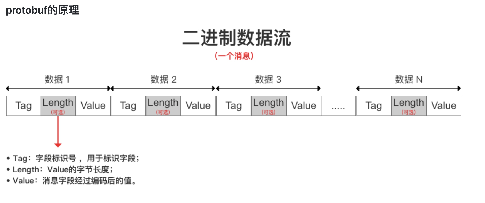

# 负载均衡

#### 好处
* 服务水平可扩展
* 稳定性大大提升

#### 注册中心
* 服务的IP节点维护在客户端
* 结合注册中心，实现节点动态增删
* 流量调度，请求均衡的分配到服务器

#### MsgPack
* 代码自动生成
* msgp自动生成代码

#### protobuf
* 
* value如果高位为0，就表示内容已经结束，后面的字节内容不属于这个value，如果是1，则继续按着len的字节数来读，直到读到高位为0或者长度结束为止
* packed=true存放数组TLVLVLV 数组开始和结束start group end group
* fixed表示字节要占满
* L不一定传