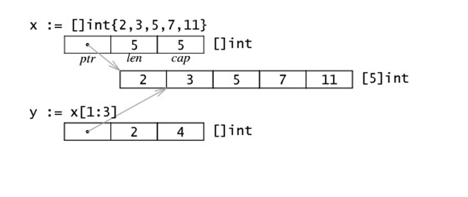
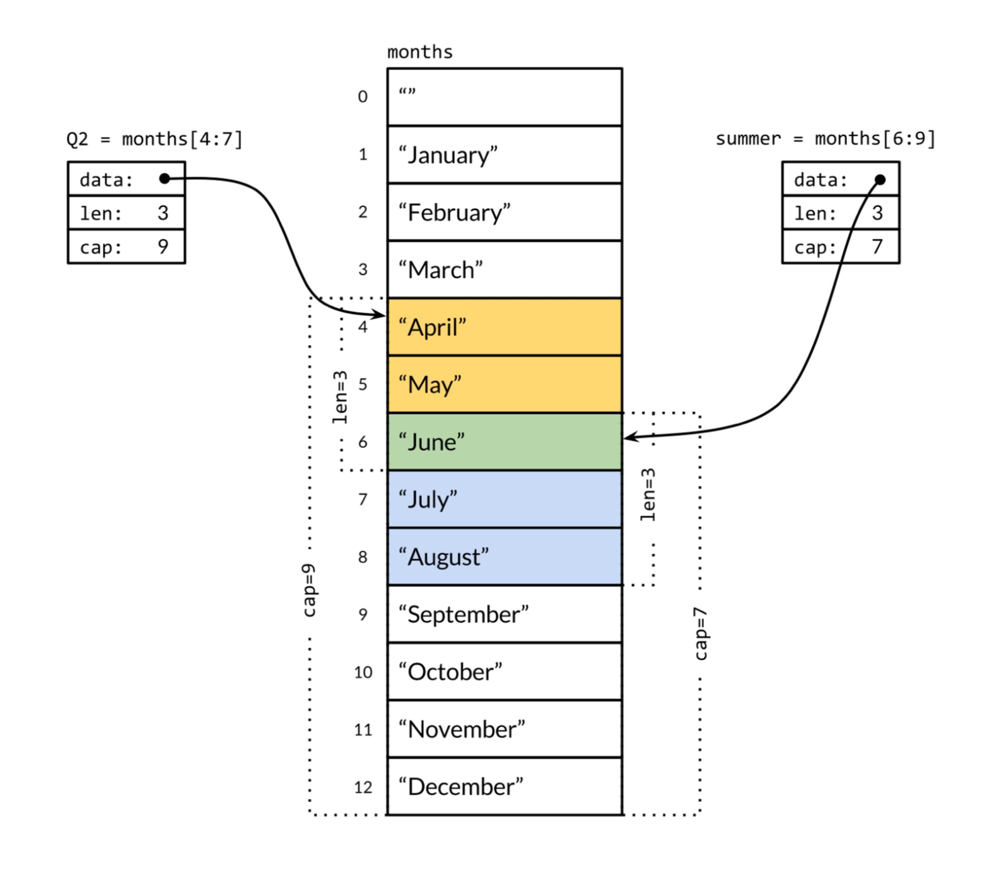
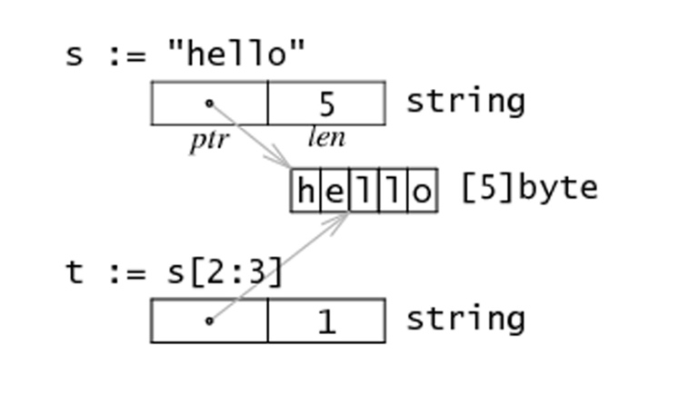
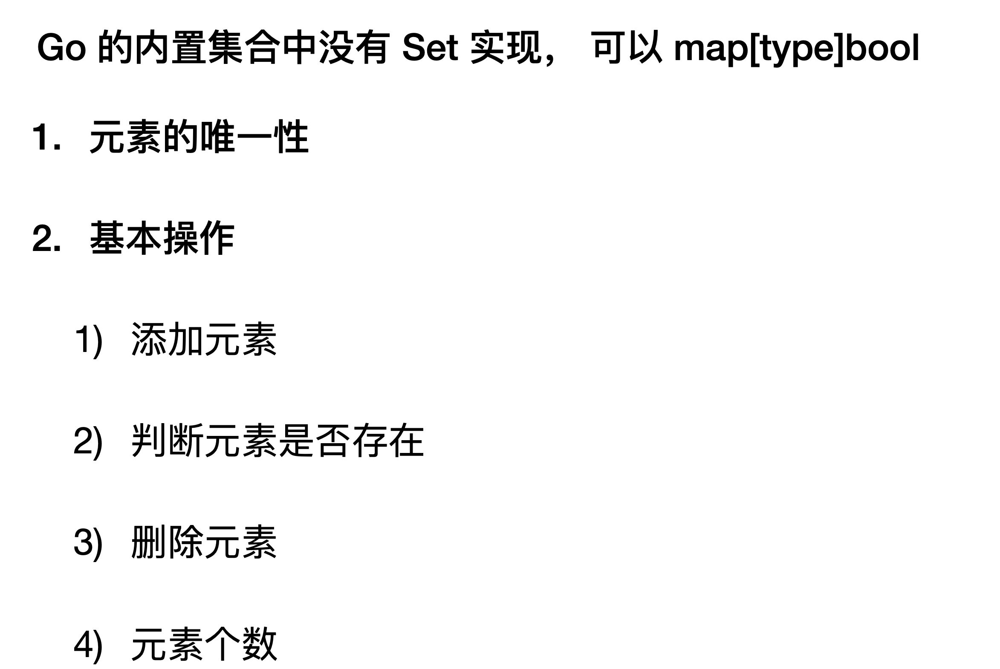

# 递归&闭包&数组切片&map&锁
#### 内置函数
* new 用来分配值类型内存
* make 用来分配引用类型内存
* ... 可以用来展开数据或者切片 

```
  a = append(a, a...)
```
* 打印堆栈//TODO

> ... 两个用途 1 可变参数 2 展开数组或者切片

#### 错误处理
* panic,revocer

#### new,make
* new出来的指针必须要用make来分配内存

```
  s1 := new([]int)
  *s1 = make([]int, 5)
  (*s1)[0] = 100
```
#### 闭包
* 一个函数和其相关的引用的环境组合而成的实体

```
func Adder() func(int) int {
  var x int
  return func(delta int) int {
    x += delta
    return x
  }
}

func makeSuffixFunc(suffix string) func(string) string {
  return func(name string) string {
    if !strings.HasSuffix(name, suffix) {
      return name + suffix
    }
    return name
  }
}
```
* x 相当于类中的成员变量
* 闭包可以实现代码的重用//TODO

#### 数组
* 长度是数组类型的一部分
* 长度固定

#### 切片
* 切片是数组的一个引用
* 切片的长度可以改变
* cap可以求出slice最大的容量
* 切片的内存布局和数据结构
* len代表可访问的元素
* cap代表容量


```
  type slice struct {
    ptr *[5]int
    cap int 
    len int
  }
```

* 切片的测试

```
func makeSlice(s slice, cap int) slice {
  s.ptr = new([100]int)
  s.cap = cap
  s.len = 0
  return s
 }

func modify(s slice) {
  s.ptr[1] = 1000
}

func testSlice2() {
  var s1 slice
  s1 = makeSlice(s1, 10)
  s1.ptr[0] = 100
  modify(s1)
  fmt.Println(s1.ptr)
}
```

* 通过make创建 var slice []type = make([]type, len)
* 切片拷贝 copy(s2, s1）



#### string
* string底层布局，string是[]byte的切片


* string是不可变的

```
func changeString() {
  s := "我  hello world"
  s1 := []rune(s)
  s1[1] = '0'
  str := string(s1)
  fmt.Println(str)
}
```

#### Map
* 删除一个元素delete
* 清空需要重新make
* 判断一个maps是否为空
* map排序

#### golang中的包
* golang有150个标准的包

#### 线程同步
* import sync
* 互斥锁 var mu sync.Mutex
* 读写锁 var mu sync.RWMutex

#### go中Set


```go
func TestMapForSet(t *testing.T) {
	mySet := map[int]bool{}
	mySet[1] = true
	n := 3
	if mySet[n] {
		t.Logf("%d is existing", n)
	} else {
		t.Logf("%d is not existing", n)
	}
	mySet[3] = true
	t.Log(len(mySet))
	delete(mySet, 1)
	n = 1
	if mySet[n] {
		t.Logf("%d is existing", n)
	} else {
		t.Logf("%d is not existing", n)
	}
}
```