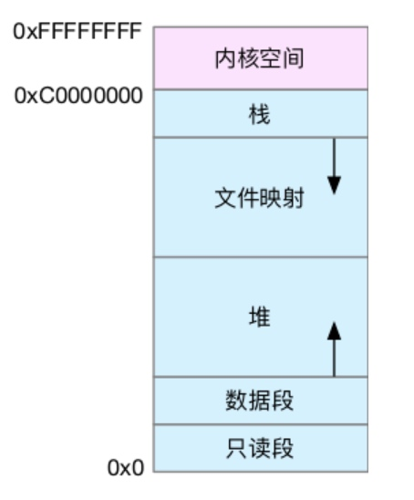

# Linux内存工作机制
#### 内存映射
* 每个进程都有很大的地址空间
* 并不是所有的虚拟内存都会分配物理内存，只有那些实际使用的虚拟内存才分配物理内存，并且分配后的物理内存，是通过内存映射来管理的。
* 将虚拟内存地址映射到物理内存地址。为了完成内存映射，内核为每个进程都维护了一张页表，记录虚拟地址与物理地址的映射关系

#### 缺页异常
*  进程访问的虚拟地址在页表中查不到时，系统会产生一个缺页异常，进入内核空间分配物理内存、更新进程页表，最后再返回用户空间，恢复进程的运行

#### 解决页表过多
* 多级页表
* 大页面

#### 虚拟内存空间

* 文件映射包括动态库，共享内存

#### malloc内存
* >128K 使用mmap mmap() 方式分配的内存，会在释放时直接归还系统，所以每次 mmap 都会发生缺页异常。在内存工作繁忙时，频繁的内存分配会导致大量的缺页异常，使内核的管理负担增大。这也是 malloc 只对大块内存使用 mmap 的原因。
* <128K 使用brk brk() 方式的缓存，可以减少缺页异常的发生，提高内存访问效率。不过，由于这些内存没有归还系统，在内存工作繁忙时，频繁的内存分配和释放会造成内存碎片。
* slab是内核空间的，只用来管理内核中的小块内存

#### 管理小内存
* slab管理器管理小内存

#### 系统回收机制
* 回收缓存，比如使用 LRU（Least Recently Used）算法，回收最近使用最少的内存页面；
* 回收不常访问的内存，把不常用的内存通过交换分区直接写到磁盘中；
* 杀死进程，内存紧张时系统还会通过 OOM（Out of Memory），直接杀掉占用大量内存的进程。oom_adj的范围-17~15

#### top
* VIRT 进程虚拟内存的大小，只要是进程申请过的内存，即便还没有真正分配物理内存，也会计算在内。
* RES 是常驻内存的大小，也就是进程实际使用的物理内存大小
* SHR 是共享内存的大小，比如与其他进程共同使用的共享内存、加载的动态链接库以及程序的代码段等。
* 共享内存 SHR 并不一定是共享的，比方说，程序的代码段、非共享的动态链接库，也都算在 SHR 里。当然，SHR 也包括了进程间真正共享的内存。所以在计算多个进程的内存使用时，不要把所有进程的 SHR 直接相加得出结果

#### 查看系统内存情况
* cat /proc/[pid]/status和pmap -x pid

#### 拓展阅读
* https://blog.holbertonschool.com/hack-the-virtual-memory-malloc-the-heap-the-program-break/

#### 内存分配
* 调用c标准库的都是用户空间的调用，用户空间的内存分配都是基于buddy算法（伙伴算法），并不涉及slab
* brk()方式之所以会产生内存碎片，是由于brk分配的内存是推_edata指针，从堆的低地址向高地址推进。这种情况下，如果高地址的内存不释放，低地址的内存是得不到释放的
* mmap()方式分配的内存，是在堆与栈之间的空闲区域分配虚拟内存，直接拿到的是内存地址，可以直接操作内存的释放
* 上述的都是在用户空间发生的行为，只有在内核空间，内核调用kmalloc去分配内存的时候，才会涉及到slab

#### 缺页异常
* 缺页异常是内存分配必要步骤：陷入内核态分配内存并完成内存映射的过程
* 可以直接从物理内存中分配时，被称为次缺页异常。
* 需要磁盘 I/O 介入（比如 Swap）时，被称为主缺页异常。

#### oom_score
* 一个进程消耗的内存越大，oom_score 就越大；
* 一个进程运行占用的 CPU 越多，oom_score 就越小。
* 通过oom_adj来调整大小

#### 缓存
* cachestat 系统缓存和缓冲区的命中率
* cachetop 进程缓存和缓冲区的命中率

#### 内存选项
* RSS (Resident set size），使用 top 命令可以查询到，是最常用的内存指标，表示进程占用的物理内存大小。但是，将各进程的 RSS 值相加，通常会超出整个系统的内存消耗，这是因为 RSS 中包含了各进程间共享的内存。
* PSS (Proportional set size）所有使用某共享库的程序均分该共享库占用的内存时。显然所有进程的 PSS 之和就是系统的内存使用量。它会更准确一些，它将共享内存的大小进行平均后，再分推到各进程上去。
* USS (Unique set size）进程独自占用的内存，它只计算了进程独自占用的内存大小，
* smem -k  -s uss

