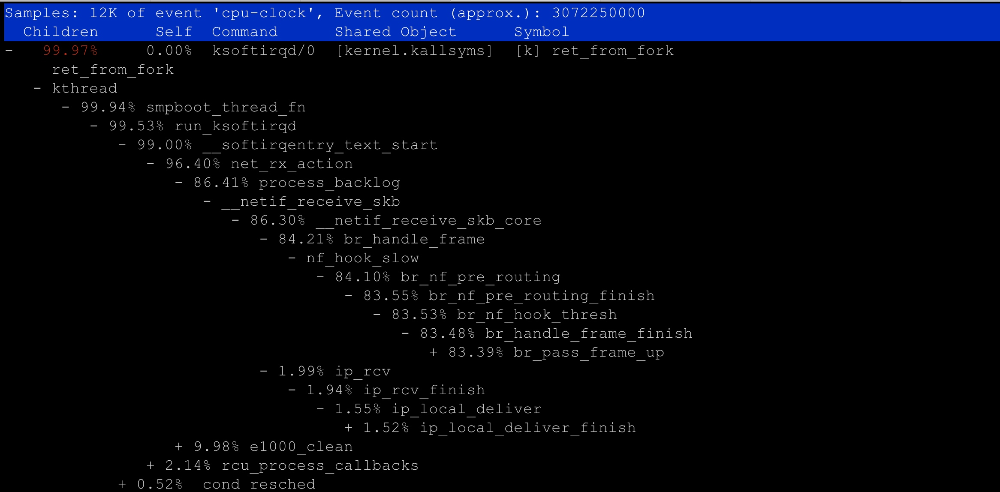

# Linux内核线程
#### 特殊进程
* 0 号进程为 idle 进程，这也是系统创建的第一个进程，它在初始化 1 号和 2 号进程后，演变为空闲任务。当 CPU 上没有其他任务执行时，就会运行它。
* 1 号进程为 init 进程，通常是 systemd 进程，在用户态运行，用来管理其他用户态进程。
* 2 号进程为 kthreadd 进程，在内核态运行，用来管理内核线程。

#### 内核线程
* kswapd0：用于内存回收。在 Swap 变高 案例中，我曾介绍过它的工作原理。
* kworker：用于执行内核工作队列，分为绑定 CPU （名称格式为 kworker/CPU86330）和未绑定 CPU（名称格式为 kworker/uPOOL86330）两类。
* migration：在负载均衡过程中，把进程迁移到 CPU 上。每个 CPU 都有一个 migration 内核线程。
* jbd2/sda1-8：jbd 是 Journaling Block Device 的缩写，用来为文件系统提供日志功能，以保证数据的完整性；名称中的 sda1-8，表示磁盘分区名称和设备号。每个使用了 ext4 文件系统的磁盘分区，都会有一个 jbd2 内核线程。
* pdflush：用于将内存中的脏页（被修改过，但还未写入磁盘的文件页）写入磁盘（已经在 3.10 中合并入了 kworker 中）

#### 实验
* perf record -a -g -p 9 -- sleep 30

#### ksoftirqd调用流程
* net_rx_action 和 netif_receive_skb，表明这是接收网络包（rx 表示 receive）。
* br_handle_frame ，表明网络包经过了网桥（br 表示 bridge）。
* br_nf_pre_routing ，表明在网桥上执行了 netfilter 的 PREROUTING（nf 表示 netfilter）。而我们已经知道 PREROUTING 主要用来执行 DNAT，所以可以猜测这里有 DNAT 发生。
* br_pass_frame_up，表明网桥处理后，再交给桥接的其他桥接网卡进一步处理。比如，在新的网卡上接收网络包、执行 netfilter 过滤规则等等。

#### 生成火焰图
* perf script -i /root/perf.data | ./stackcollapse-perf.pl --all |  ./flamegraph.pl > ksoftirqd.svg
