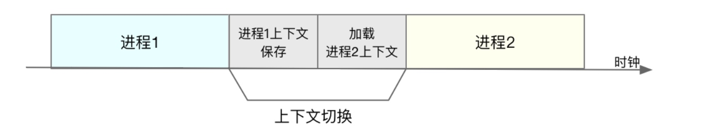

# 上下文切换-CPU使用率
#### cpu上下文
* cpu寄存器和程序计数器叫上下文
* CPU 寄存器，是 CPU 内置的容量小、但速度极快的内存。而程序计数器，则是用来存储 CPU 正在执行的指令位置、或者即将执行的下一条指令位置。

#### 上下文切换场景
* 进程上下文切换 包括了虚拟内存、栈、全局变量等用户空间的资源，还包括了内核堆栈、寄存器等内核空间的状态
* 线程上下文切换
* 中断上下文切换
* 系统调用发生了两次上下文切换 并不会涉及到虚拟内存等进程用户态的资源，也不会切换进程。这跟我们通常所说的进程上下文切换是不一样的
* 

#### 系统调用
* 系统调用过程通常称为特权模式切换，而不是上下文切换。但实际上，系统调用过程中，CPU 的上下文切换还是无法避免的。
* 一次系统调用的过程，其实是发生了两次 CPU 上下文切换

#### TLB作用
* TLB（Translation Lookaside Buffer）来管理虚拟内存到物理内存的映射关系。当虚拟内存更新后，TLB 也需要刷新，内存的访问也会随之变慢。特别是在多处理器系统上，缓存是被多个处理器共享的，刷新缓存不仅会影响当前处理器的进程，还会影响共享缓存的其他处理器的进程。

#### 进程上下文切换
* 进程的上下文切换就比系统调用时多了一步：在保存当前进程的内核状态和 CPU 寄存器之前，（需要先把该进程的虚拟内存、栈等保存下来；而加载了下一进程的内核态后，还需要刷新进程的虚拟内存和用户栈）。***这个系统调用并没有***
* 
* 线程也有自己的私有数据，比如栈和寄存器等，这些在上下文切换时也是需要保存的。
* 两个线程属于同一个进程。此时，因为虚拟内存是共享的，所以在切换时，虚拟内存这些资源就保持不动，只需要切换线程的私有数据、寄存器等不共享的数据。

#### 中断上下文切换
* 线程是调度的基本单位，进程是资源拥有的基本单位，同属一个进程的线程，发生上下文切换，只切换线程的私有数据，共享数据不变，速度很快。

#### 怎么查看系统的上下文情况
* vmstat
* 自愿上下文切换 是指进程无法获取所需资源导致的上下文切换，比如IO,内存
* 非自愿上下文切换， 进程由于时间片已到等时间，被系统强制调度，进而发生的上下文呢切换

#### 有哪些减少上下文切换的技术用例？
数据库连接池（复用连接）、合理设置应用的最大进程，线程数、直接内存访问DMA、零拷贝技术

#### 压力测试
* sysbench --threads=10 --max-time=300 threads run
* 线程切换 sysbench --num-threads=10 --max-time=300 --test=threads run
* 我们可以知道，系统的就绪队列过长，也就是正在运行和等待 CPU 的进程数过多，导致了大量的上下文切换，而上下文切换又导致了系统 CPU 的占用率升高。
* 查看中断变化watch -d cat /proc/interrupts
* 查看进程中线程变化的数据 pidstat -wt 1
* Rescheduling interrupts多处理器系统（SMP）中，调度器用来分散任务到不同 CPU 的机制，通常也被称为处理器间中断（Inter-Processor Interrupts，IPI）

#### 上下文切换类型
* 自愿上下文切换变多了，说明进程都在等待资源，有可能发生了 I/O 等其他问题；
* 非自愿上下文切换变多了，说明进程都在被强制调度，也就是都在争抢 CPU，说明 CPU 的确成了瓶颈；
* 中断次数变多了，说明 CPU 被中断处理程序占用，还需要通过查看 /proc/interrupts 文件来分析具体的中断类型。

#### 