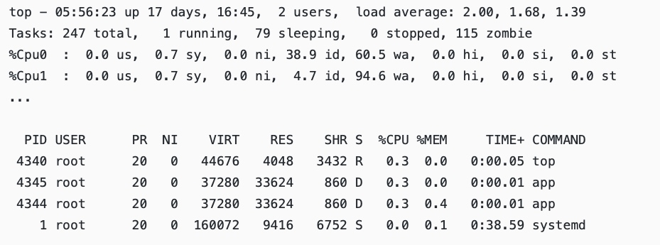
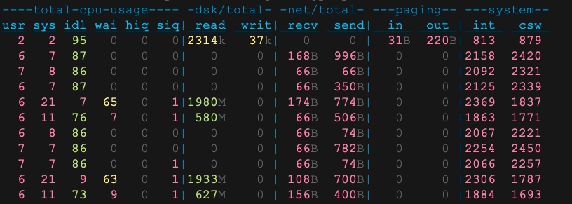
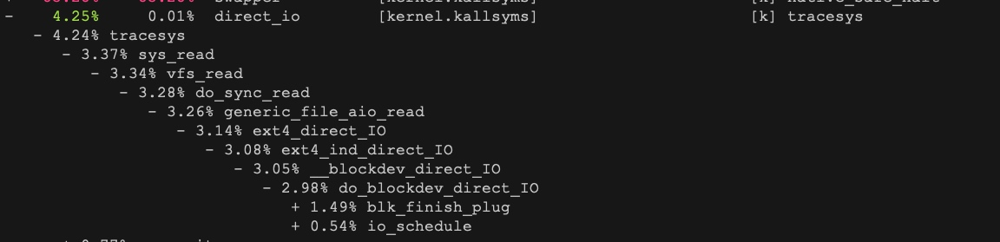

# 不可中断进程和僵尸进程
#### 概念
* 不可中断状态，一般表示进程正在跟硬件交互，为了保护进程数据与硬件一致，系统不允许其他进程或中断打断该进程。
* 僵尸进程表示进程已经退出，但它的父进程没有回收该进程所占用的资源

#### 进程状态
* R 是 Running 或 Runnable 的缩写，表示进程在 CPU 的就绪队列中，正在运行或者正在等待运行。
* D 是 Disk Sleep 的缩写，也就是不可中断状态睡眠（Uninterruptible Sleep），一般表示进程正在跟硬件交互，并且交互过程不允许被其他进程或中断打断。
* Z 是 Zombie 的缩写，如果你玩过“植物大战僵尸”这款游戏，应该知道它的意思。它表示僵尸进程，也就是进程实际上已经结束了，但是父进程还没有回收它的资源（比如进程的描述符、PID 等）。
* S 是 Interruptible Sleep 的缩写，也就是可中断状态睡眠，表示进程因为等待某个事件而被系统挂起。当进程等待的事件发生时，它会被唤醒并进入 R 状态。
* I 是 Idle 的缩写，也就是空闲状态，用在不可中断睡眠的内核线程上。前面说了，硬件交互导致的不可中断进程用 D 表示，但对某些内核线程来说，它们有可能实际上并没有任何负载，用 Idle 正是为了区分这种情况。要注意，D 状态的进程会导致平均负载升高， I 状态的进程却不会。

#### 下面问题分析

* iowait太高，导致系统的平均负载升高，甚至达到了系统CPU的个数
* 僵尸进程正在不断增多，说明程序没能正确清理进程的资源

* dstat 1 10

*  iowait 升高（wai）时，磁盘的读请求（read）都会很大。这说明 iowait 的升高跟磁盘的读请求有关，很可能就是磁盘读导致的。
* 查看一个进程的资源使用情况pidstat
* 利用perf record -g & perf report 来查看结果


#### 僵尸进程太多
```
ps -A -o stat,ppid,pid,cmd | grep -e '^[Zz]'
```
* 通过上述命令找到僵尸进程，然后执行pstree -aps zombine-id找出父进程
* 僵尸进程主要是找父进程
