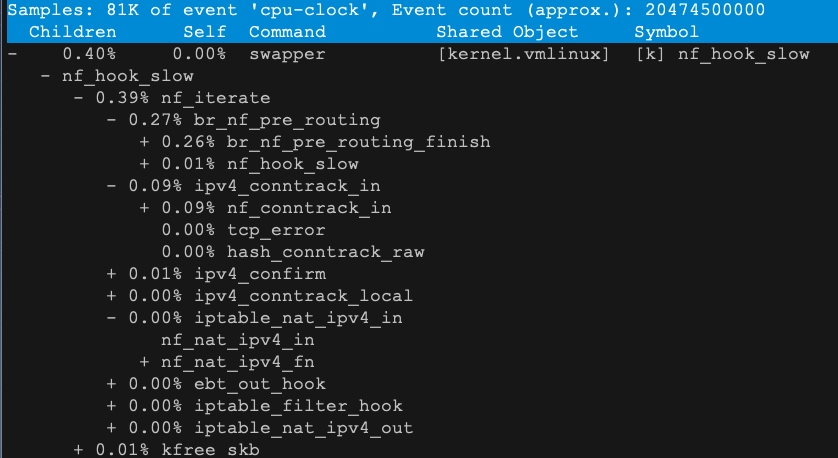

# 优化NAT性能
#### 原理
* NAT 技术可以重写 IP 数据包的源 IP 或者目的 IP，被普遍地用来解决公网 IP 地址短缺的问题。它的主要原理就是，网络中的多台主机，通过共享同一个公网 IP 地址，来访问外网资源

#### NAT类型
* 静态 NAT，即内网 IP 与公网 IP 是一对一的永久映射关系；
* 动态 NAT，即内网 IP 从公网 IP 池中，动态选择一个进行映射；
* 网络地址端口转换 NAPT（Network Address and Port Translation），即把内网 IP 映射到公网 IP 的不同端口上，让多个内网 IP 可以共享同一个公网 IP 地址。

#### NAPT类型
* 原地址转换SNAT
* 目的地址转换DNAT
* 双向地址转换SNAT和DNAT

#### NAT表内置的三个链
* PREROUTING，用于路由判断前所执行的规则，比如，对接收到的数据包进行 DNAT。
* POSTROUTING，用于路由判断后所执行的规则，比如，对发送或转发的数据包进行 SNAT 或 MASQUERADE。
* OUTPUT，类似于 PREROUTING，但只处理从本机发送出去的包

#### SNAT
* 是为一个子网统一配置 SNAT，并由 Linux 选择默认的出口 IP。这实际上就是经常说的 MASQUERADE
* iptables -t nat -A POSTROUTING -s 192.168.0.0/16 -j MASQUERADE
* 是为具体的 IP 地址配置 SNAT，并指定转换后的源地址
* iptables -t nat -A POSTROUTING -s 192.168.0.2 -j SNAT --to-source 100.100.100.100

#### DNAT
* DNAT 需要在 nat 表的 PREROUTING 或者 OUTPUT 链中配置，其中， PREROUTING 链更常用一些

#### 双向地址转换
* 同时添加 SNAT 和 DNAT 规则，为公网 IP 和内网 IP 实现一对一的映射关系
* iptables -t nat -A POSTROUTING -s 192.168.0.2 -j SNAT --to-source 100.100.100.100
* iptables -t nat -A PREROUTING -d 100.100.100.100 -j DNAT --to-destination 192.168.0.2
* 开启转发功能
* net.ipv4.ip_forward = 1

#### 问题
* 假设现在有一台 Linux 服务器，使用了 MASQUERADE 的方式，为内网的所有 IP 提供出口访问功能。那么，
  当多个内网 IP 地址的端口号相同时，MASQUERADE 还可以正常工作吗？
  如果内网 IP 地址数量或请求数比较多，这种方式有没有什么隐患呢？

#### 安装systemtap
* wget  http://debuginfo.centos.org/7/x86_64/kernel-debuginfo-3.10.0-957.5.1.el7.x86_64.rpm  && wget http://debuginfo.centos.org/7/x86_64/kernel-debuginfo-common-x86_64-3.10.0-957.5.1.el7.x86_64.rpm
*  yum -y install systemtap-devel
* 测试
* stap -v -e 'probe vfs.read {printf("read performed\n"); exit()}'
* ab安装yum -y install httpd-tools
* 启动内核追踪模块 stap --all-modules dropwatch.stp

#### 测试镜像
* docker run --name nginx_nat --privileged -p 8080:8080 -itd feisky/nginx:nat
* docker run --name nginx-hostnet --privileged --network=host -itd feisky/nginx:80

#### 抓内核分析
* 

#### nf_hook_slow
* 第一，接收网络包时，在连接跟踪表中查找连接，并为新的连接分配跟踪对象（Bucket）。
* 第二，在 Linux 网桥中转发包。这是因为案例 Nginx 是一个 Docker 容器，而容器的网络通过网桥来实现；
* 第三，接收网络包时，执行 DNAT，即把 8080 端口收到的包转发给容器。
* net.netfilter.nf_conntrack_count，表示当前连接跟踪数；
* net.netfilter.nf_conntrack_max，表示最大连接跟踪数；
* net.netfilter.nf_conntrack_buckets，表示连接跟踪表的大小。

#### 统计数据
* 统计总的连接追踪数
* conntrack -L -o extended | wc -l
* 统计 TCP 协议各个状态的连接跟踪数
* conntrack -L -o extended | awk '/^.*tcp.*$/ {sum[$6]++} END {for(i in sum) print i, sum[i]}'
* 统计各个源 IP 的连接跟踪数
* conntrack -L -o extended | awk '{print $7}' | cut -d "=" -f 2 | sort | uniq -c | sort -nr | head -n 10

####优化
* sysctl -w net.netfilter.nf_conntrack_max=131072
* echo 65536 > /sys/module/nf_conntrack/parameters/hashsize
* 使用无状态NAT比如tc或者DPDK开发

####NAT扩展阅读
* https://mp.weixin.qq.com/s/VYBs8iqf0HsNg9WAxktzYQ

