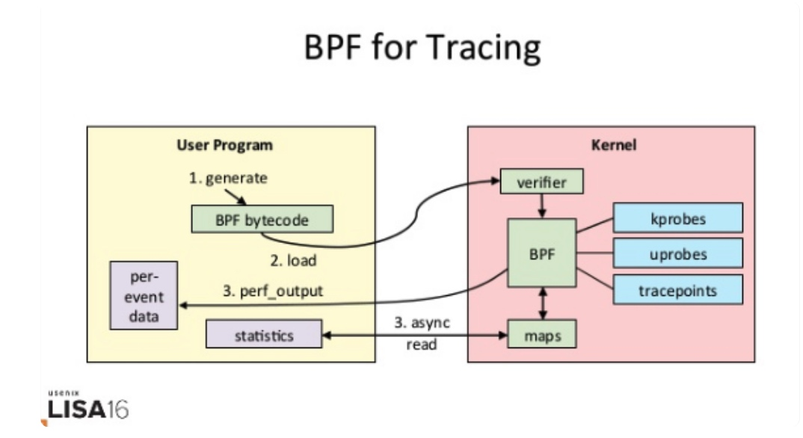

# 内核动态追踪
####动态追踪技术
* 动态追踪技术，通过探针机制，来采集内核或者应用程序的运行信息，从而可以不用修改内核和应用程序的代码，就获得丰富的信息，帮你分析、定位想要排查的问题。

####DTrace工作原理
* 它的运行常驻在内核中，用户可以通过 dtrace 命令，把 D 语言编写的追踪脚本，提交到内核中的运行时来执行。

####动态追踪的机制
* Dtrace 和 SystemTap 都会把用户传入的追踪处理函数（一般称为 Action），关联到被称为探针的检测点上。这些探针，实际上也就是各种动态追踪技术所依赖的事件源

####事件源
* 硬件事件通常由性能监控计数器 PMC（Performance Monitoring Counter）产生，包括了各种硬件的性能情况，比如 CPU 的缓存、指令周期、分支预测等等
* 静态探针，是指事先在代码中定义好，并编译到应用程序或者内核中的探针，静态探针包括内核中的跟踪点（tracepoints）和 USDT（Userland Statically Defined Tracing）探针。
* 动态探针 则是指没有事先在代码中定义，但却可以在运行时动态添加的探针 
 * kprobes 用来跟踪内核态的函数，包括用于函数调用的 kprobe 和用于函数返回的 kretprobe。
 * uprobes 用来跟踪用户态的函数，包括用于函数调用的 uprobe 和用于函数返回的 uretprobe。
 
####Linux追踪机制
 * ftrace
 * perf
 * eBPF(Berkeley Packet Filter)
 * 容器分析 sysdig
 * SystemTap和BCC(BPF Compiler Collection)
 
####strace的缺点
* 由于 ptrace 是系统调用，就需要在内核态和用户态切换。当事件数量比较多时，繁忙的切换必然会影响原有服务的性能；
* ptrace 需要借助 SIGSTOP 信号挂起目标进程。这种信号控制和进程挂起，会影响目标进程的行为。

####ftrace
 * function 表示跟踪函数的执行，function_graph 则是跟踪函数的调用关系，追踪函数的执行过程
 *  trace-cmd record -p function_graph -g do_sys_open -O funcgraph-proc ls
 *  trace-cmd report
 
####拓展阅读
* https://leezhenghui.github.io/linux/2019/03/05/exploring-usdt-on-linux.html
 
####perf添加探针

```
perf probe --add do_sys_open
perf record -e probe:do_sys_open -aR sleep 10
perf script
```
* 追踪用户空间的库函数

```
# 为 /bin/bash 添加 readline 探针
$ perf probe -x /bin/bash 'readline%return +0($retval):string’
# 采样记录
$ perf record -e probe_bash:readline__return -aR sleep 5
# 查看结果
$ perf script
# 跟踪完成后删除探针
$ perf probe --del probe_bash:readline__return
```

####eBPF和BCC
* eBPF工作原理

* 从用户跟踪程序生成 BPF 字节码；
* 加载到内核中运行；
* 向用户空间输出结果。

####SystemTap和sysdig
*  sysdig = strace + tcpdump + htop + iftop + lsof + docker inspect。

####使用方法
* 在不需要很高灵活性的场景中，使用 perf 对性能事件进行采样，然后再配合火焰图辅助分析，就是最常用的一种方法；
* 而需要对事件或函数调用进行统计分析（比如观察不同大小的 I/O 分布）时，就要用 SystemTap 或者 eBPF，通过一些自定义的脚本来进行数据处理。

####sysdig监控容器
* 容器

```
查看机器上运行的容器列表及其资源使用情况
sudo csysdig -vcontainers 
查看容器上下文的进程列表 sudo csysdig -pc 
查看运行在wordpress1容器里CPU的使用率
sudo sysdig -pc -c topprocs_cpu container.name=wordpress1
查看运行在wordpress1容器里网络带宽的使用率
sudo sysdig -pc -c topprocs_net container.name=wordpress1
查看在wordpress1容器里使用网络带宽最多的进程
 sudo sysdig -pc -c topprocs_net container.name=wordpress1
查看在wordpress1 容器里占用 I/O 字节最多的文件
sudo sysdig -pc -c topfiles_bytes container.name=wordpress1
查看在wordpress1 容器里网络连接的排名情况
sudo sysdig -pc -c topconns container.name=wordpress1
显示wordpress1容器里所有命令执行的情况
sudo sysdig -pc -c spy_users container.name=wordpress1
```