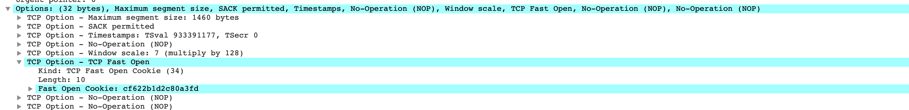

# 应对DDos攻击和TFO

#### DDos参数配置
* /proc/sys/net/ipv4/tcp_syncookies
* /proc/sys/net/ipv4/tcp_max_syn_backlog
* /proc/sys/net/ipv4/tcp_synack_retries
* 当 SYN 队列满后，新的 SYN 不进入队列，计算出 cookie 再以 SYN+ACK 中的序列号返回客户端，正常客户端发报文时，服务器根据报文中携带的 cookie 重新恢复连接
* 当 SYN 队列满后，新的 SYN 不进入队列，计算出 cookie 再以 SYN+ACK 中的序列号返回客户端，正常客户端发报文时，服务器根据报文中携带的 cookie 重新恢复连接
* 由于cookies 占用序列号空间，导致此时所有 TCP 可选功能失效，例如扩充窗口、时间戳等
* tcp_syncookies只有在队列满了之后才使用，防止ddos攻击
* SYN-Cookie避免了内存空间被爆掉，但是却引来了CPU时间被爆掉的机会，这又是一种时间-空间之间的权衡！如果攻击者发送大量的ACK包过来，那么被攻击机器将会花费大量的CPU时间在计算Cookie上，造成正常的逻辑无法被执行，同时即便是大量的SYN包也可以将CPU爆满

#### Tcp Fast Open

##### 开启
```
服务器配置 echo 3 > /proc/sys/net/ipv4/tcp_fastopen系统开启TFO功能
```
* 0: 关闭
* 1: 作为客户端时可以使用 TFO
* 2: 作为服务器时可以使用 TFO
* 3: 无论作为客户端还是服务器，都可以使用 TFO
* ip tcp_metrics show | grep "fo_cookie" 查看cookie

##### 截图
* 
* 为防止带数据的 SYN 攻击，限制最大长度，指定 TFO 连接队列的最大长度
* 减少Cpu消耗
* 客户端的TFOcookie多长时间后删除，谁来维护和删除？
* nginx的TFO队列具体是什么意思？队列满了会怎样？数值设定多少合适？ 

#####  TFO原理
* 客户端发送SYN包，包尾加一个FOC请求，只有4个字节。
* 服务端受到FOC请求，验证后根据来源ip地址声称cookie(8个字节)，将这个COOKIE加载SYN+ACK包的末尾发送回去。
* 客户端缓存住获取到的Cookie 可以给下一次使用。
* 下一次请求开始，客户端发送SYN包，这时候后面带上缓存的COOKIE，然后就是正式发送的数据。
* 服务器端验证COOKIE正确，将数据交给上层应用处理得到相应结果，然后在发送SYN+ACK时，不再等待客户端的ACK确认，即开始发送相应数据。
