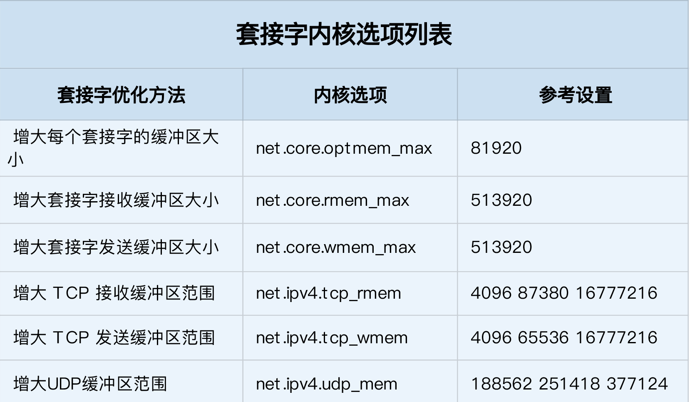
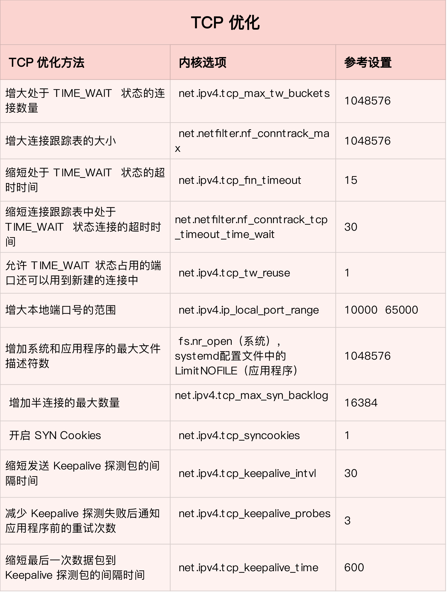

# 网络性能优化套路
#### 优化性能指标
* 整体目标，是降低网络延迟（如 RTT）和提高吞吐量BPS和PPS
* NAT网关需要接近线性转发，PPS是最主要性能目标
* 数据库和缓存系统,低延迟是主要目标
* Web服务要兼顾吞吐量和延迟

#### 网络协议栈各层级目标
* 网络接口层和网络层，PPS是主要性能指标， 使用pkten来测试PPS
* 测试教程 http://khalily.github.io/2015/05/03/pktgen/
* TCP UDP 吞吐量和连接数以及延迟 iperf和netperf
* ICMP hping3 ping
* 应用层 吞吐量，每秒请求数和延迟wrk,ab

#### 工具和性能指标的对应
* 
* 

#### 网络收发流程
* 

#### 应用层网络协议优化
* 使用长连接取代短连接，可以显著降低 TCP 建立连接的成本。在每秒请求次数较多时，这样做的效果非常明显。
* 使用内存等方式，来缓存不常变化的数据，可以降低网络 I/O 次数，同时加快应用程序的响应速度。
* 使用 Protocol Buffer 等序列化的方式，压缩网络 I/O 的数据量，可以提高应用程序的吞吐。
* 使用 DNS 缓存、预取、HTTPDNS 等方式，减少 DNS 解析的延迟，也可以提升网络 I/O 的整体速度。

#### 套接字内核选项
* 
* TCP优化
* 为 TCP 连接设置 TCP_NODELAY 后，就可以禁用 Nagle 算法；
* 为 TCP 连接开启 TCP_CORK 后，可以让小包聚合成大包后再发送（注意会阻塞小包的发送）；
* 使用 SO_SNDBUF 和 SO_RCVBUF ，可以分别调整套接字发送缓冲区和接收缓冲区的大小。

#### 传输层优化
* 配置参数在/etc/sysctl.conf

##### 处理TIME_WAIT
* 增大处于 TIME_WAIT 状态的连接数量 net.ipv4.tcp_max_tw_buckets ，并增大连接跟踪表的大小 net.netfilter.nf_conntrack_max。
* 减小 net.ipv4.tcp_fin_timeout 和 net.netfilter.nf_conntrack_tcp_timeout_time_wait ，让系统尽快释放它们所占用的资源。
* 开启端口复用 net.ipv4.tcp_tw_reuse。这样，被 TIME_WAIT 状态占用的端口，还能用到新建的连接中。
* 增大本地端口的范围 net.ipv4.ip_local_port_range 。这样就可以支持更多连接，提高整体的并发能力。
* 增加最大文件描述符的数量。你可以使用 fs.nr_open ，设置系统的最大文件描述符数；或在应用程序的 systemd 配置文件中，配置 LimitNOFILE ，设置应用程序的最大文件描述符数。

##### SYN状态优化
* 增大 TCP 半连接的最大数量 net.ipv4.tcp_max_syn_backlog ，或者开启 TCP SYN Cookies net.ipv4.tcp_syncookies ，来绕开半连接数量限制的问题（注意，这两个选项不可同时使用）。
* 减少 SYN_RECV 状态的连接重传 SYN+ACK 包的次数 net.ipv4.tcp_synack_retries。

#### 配置与Keepalive选项
* 缩短最后一次数据包到 Keepalive 探测包的间隔时间 net.ipv4.tcp_keepalive_time；
* 缩短发送 Keepalive 探测包的间隔时间 net.ipv4.tcp_keepalive_intvl；
* 减少 Keepalive 探测失败后，一直到通知应用程序前的重试次数 net.ipv4.tcp_keepalive_probes。

##### tcp优化总结
* 

#### UDP优化
* 跟上篇套接字部分提到的一样，增大套接字缓冲区大小以及 UDP 缓冲区范围。
* 跟前面 TCP 部分提到的一样，增大本地端口号的范围；
* 根据 MTU 大小，调整 UDP 数据包的大小，减少或者避免分片的发生。

#### 网络层
##### 路由转发
* 开启ip转发  net.ipv4.ip_forward = 1
* 调整数据包的生存周期 TTL，比如设置 net.ipv4.ip_default_ttl = 64
* 开启数据包的反向地址校验，比如设置 net.ipv4.conf.eth0.rp_filter = 1。这样可以防止 IP 欺骗，并减少伪造 IP 带来的 DDoS 问题

###### 分片
* 从分片的角度出发，最主要的是调整 MTU（Maximum Transmission Unit）的大小。

##### 限制ICMP的行为
* 禁止 ICMP 协议，即设置 net.ipv4.icmp_echo_ignore_all = 1。这样，外部主机就无法通过 ICMP 来探测主机
* 禁止广播 ICMP，即设置 net.ipv4.icmp_echo_ignore_broadcasts = 1

#### 链路层
* 网卡硬中断配置 CPU 亲和性（smp_affinity），或者开启 irqbalance 服务。
* 开启 RPS（Receive Packet Steering）和 RFS（Receive Flow Steering），将应用程序和软中断的处理，调度到相同 CPU 上，这样就可以增加 CPU 缓存命中率，减少网络延迟
* TSO和UFO让TCP包的分段和UDP的分片由网卡来完成
* GSO将分包分片延迟到进入网卡前
* LRO接收TCP分段包时由网卡进行组装合并后交给上层处理
* GRO支持TCP和UDP组装的
* RSS多队列接收，基于硬件的多个队列接收，分配网络接收进程，让多CPU处理接收到的包
* VXLALN卸载，让网卡来完成VXLAN的组包功能

#### 网络接口
* 开启网络接口的多队列功能
* 增大网络接口的缓冲区大小
* 使用TC为不同网络流量配置Qos
* 