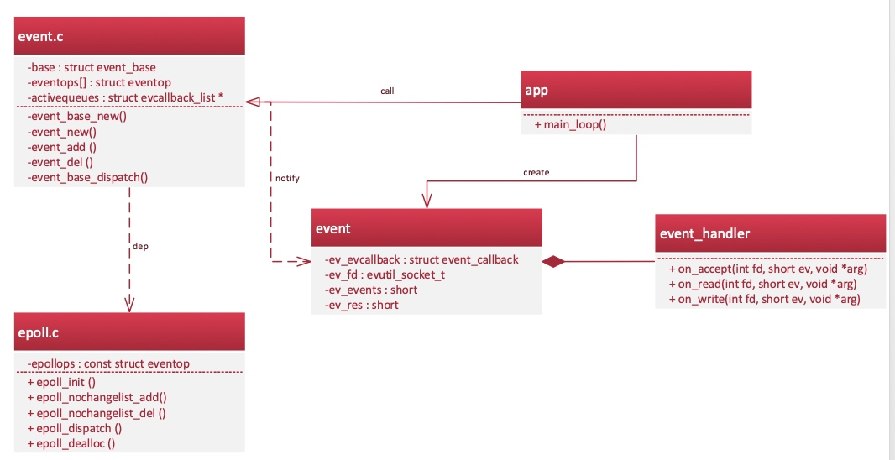
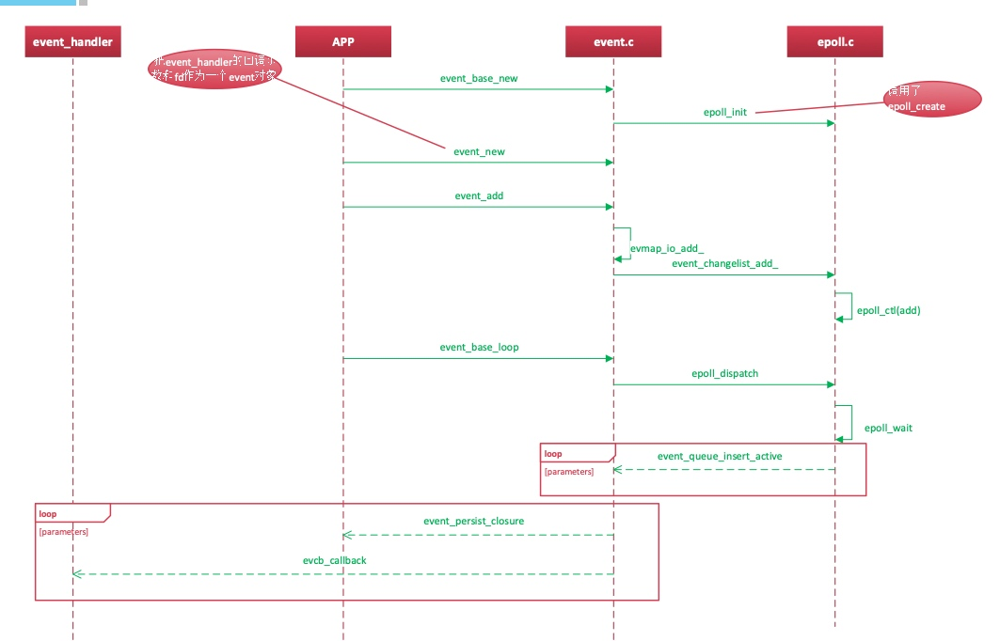

# Libevent
#### 优点
* 事件驱动
* 专注于网络
* 支持I/O，定时器和信号

#### 函数解析
* event_new(struct event_base *base, evutil_socket_t fd, short events, void (*cb)(evutil_socket_t, short, void *), void *arg)
* arg的参数通过回调用函数的第三个参数传进来
* buffer io event是带缓冲的event
* 尽量不要使用bufferevent
* epoll_create和epoll_create1的区别
* persistent event被激活了一次是不会被删掉的

#### libevent结构
* 
* 

#### thrift
* IO线程是和客户端绑定
* 监听的socket所在的线程会调用registerEvents，创建2个event：serverEvent用于服务监听，notificationEvent是一个socketpair，用于线程池里线程间的通信；
* 当serverEvent变成可读时，调用到handleEvent，接受该请求，并且调用createConnection创建TConnection对象，然后再把tconnectionevent时间添加到libevent；
* 当TConnection对象被libevent调用到有事件发生时，读取对端发送过来的内容（workSocket），并且调用transition，把读取到的内容封装成一个task
添加到ThreadManager，之后由ThreadManager::Worker（具体的线程）主动去任务池里获取任务并调用任务的run方法。
* 此时IO线程中的TConnection等待Worker执行完通知，在被通知之前会把事件从libevent中删除，等收到通知后，再重新添加事件到libevent中。

#### thrift不足
* Worker主动从任务队列中获取任务，需要加锁和解锁，这并不是一种优良的处理方法；
* IO Thread在处理客户端同一次连接的多个调用的时序性上，依赖把event从libevent中删掉，等处理完单个调用后再添加进去，影响IO的执行效率。
* debug-->design
* 
