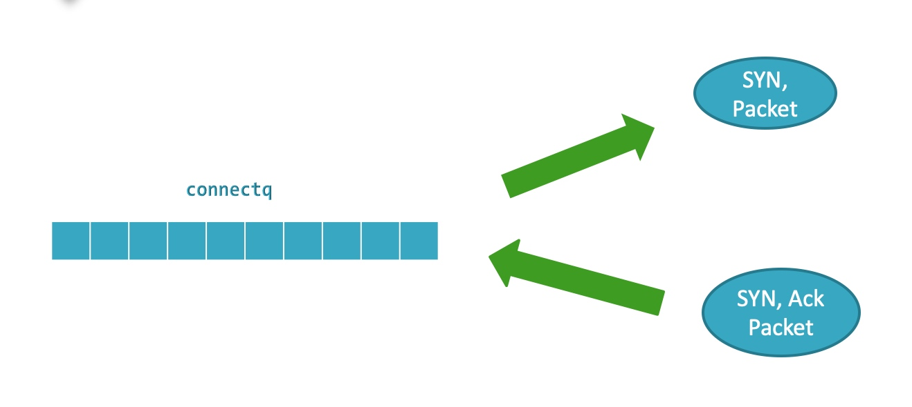

# TCP可靠传输
#### 思考题
* TCP函数详解
* NtyTCP详解
* 为什么要用Nagle算法
* closewait
* timewait
* keeplive是用应用程序还是协议栈
* tcp_deplay设置后，为什么send不是一次发送一个包
* tcp拥塞算法
* 流式套接字和数据包的区别
* 客户端难度比服务端难度大

#### accept
* accept实现
* accept的工作
* syn队列是服务器回完ACK后加入的
* Accept队列是服务器收到客户端的ACK的包后从SYN队列中取出一个加入ACCEPT队列
* accept功能就是从ACCEPT队列中取出一个完成三次握手的连接
* 跟listen的fd是一一绑定的
* 

#### connect
* 
* 发出去syn加入队列，收到服务器ack，函数返回，并发送给服务器ACK
* 定时器由内核维护，定时轮询socket的状态

#### socket和文件系统
* socket-->sock_map_fd-->sock_alloc_file
* alloc socket sndbuf/rcvbuf
* find unused fdtable_id
* return unused id
* set fdtable_id

#### 四次挥手
* TimeWait保证对端收到最后一次ACK
* 
* close_wait
* 