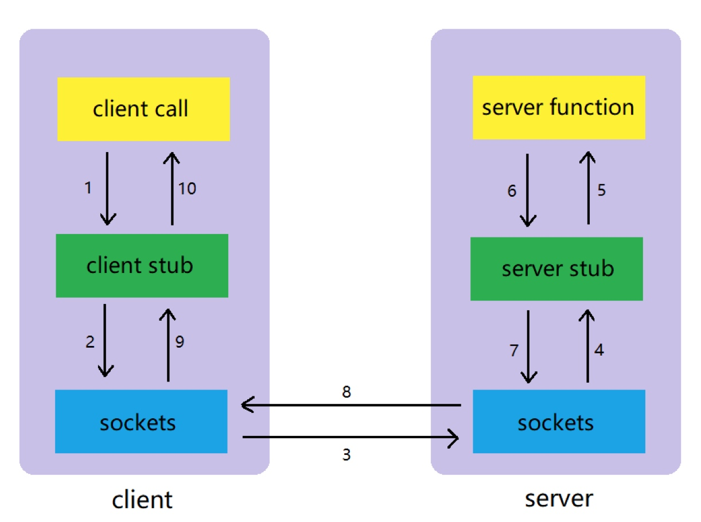
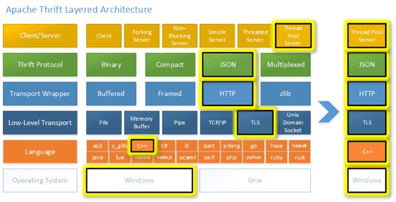
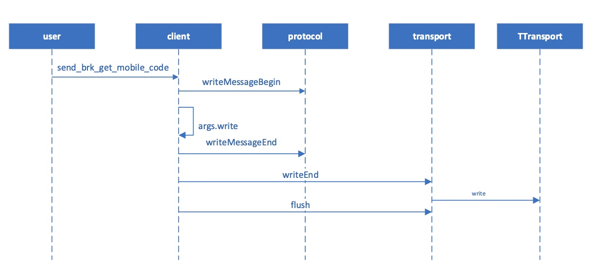
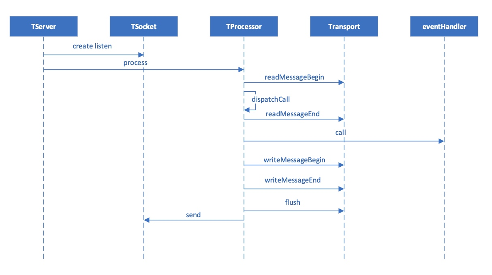
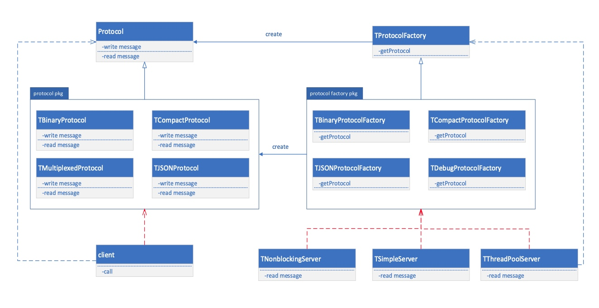
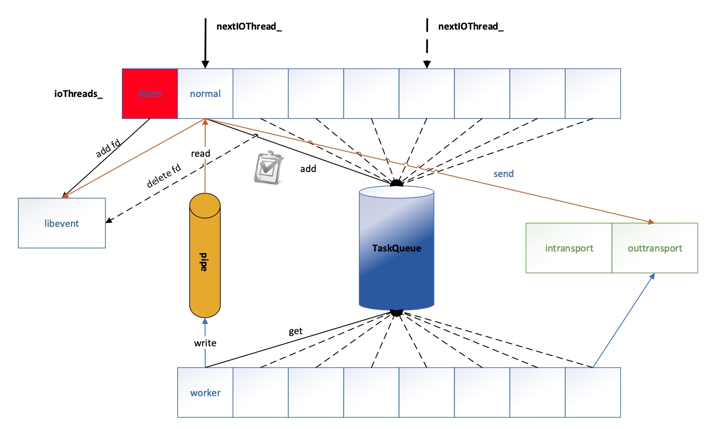

# Thrift
#### rpc
* 

#### 框架图
* 

#### 如何控制调用的串行化
* call1+ret1/call2+ret2/call3+ret3是串行化的

#### 客户端
* 

#### 服务端
* 

##### 代码流程
* TNonblockingServer-->server()-->init()-->registerEvents()-->handleEvent
* connection发生事件时workSocket-->transition-->createTask-->Task::run
* TDispatchProcessor::process-->TDispatchProcessor::dispathCall-->MsgService.cpp::dispathCall-->interfaceCall
* TNonblockingServer::notifyHandler-->
* eventSocketPair是在工作线程和IO线程启动的时候创建的，用于事件通知
* Tconnection的状态机
* APP_INIT
* IOThread数组

#### 工厂方法
* 

#### 串行执行
* 
