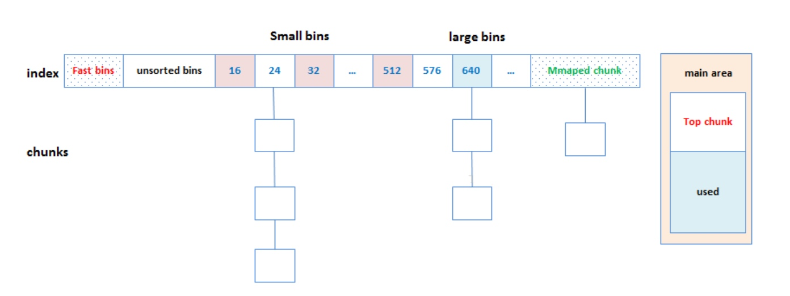
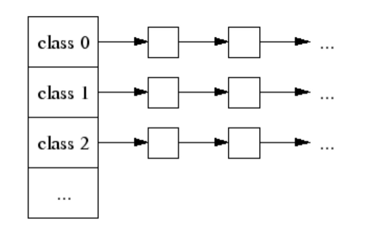
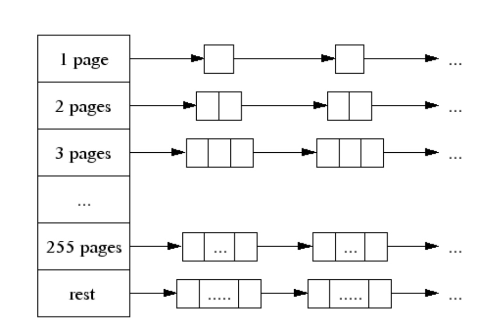

# ptmalloc和tcmalloc

#### ptmallic

##### 主分配区和非主分配区
* ptmalloc的内存分配器中，为了解决多线程锁争夺问题，分为主分配main_area和非主分配区no_main_area。
1. 每个进程有一个主分配区，也可以允许有多个非主分配区。
2. 主分配区可以使用brk和mmap来分配，而非主分配区只能使用mmap来映射内存块
3. 非主分配区的数量一旦增加，则不会减少。
4. 主分配区和非主分配区形成一个环形链表进行管理。

##### bins

* fast bins是bins的高速缓冲区，大约有10个定长队列。当用户释放一块不大于max_fast（默认值64 byte）的chunk（一般小内存）的时候，会默认会被放到fast bins上。当用户下次需要申请内存的时候首先会到fast bins上寻找是否有合适的chunk，然后才会到bins上空闲的chunk。ptmalloc会遍历fast bin，看是否有合适的chunk需要合并到bins上。
* unsorted bin。是bins的一个缓冲区。当用户释放的内存大于max_fast或者fast bins合并后的chunk都会进入unsorted bin上。当用户malloc的时候，先会到unsorted bin上查找是否有合适的bin，如果没有合适的bin，ptmalloc会将unsorted bin上的chunk放入bins上，然后到bins上查找合适的空闲chunk。
* small bins和large bins。small bins和large bins是真正用来放置chunk双向链表的。每个bin之间相差8个字节，并且通过上面的这个列表，可以快速定位到合适大小的空闲chunk。前64个为small bins，定长；后64个为large bins，非定长。
* Top chunk。并不是所有的chunk都会被放到bins上。top chunk相当于分配区的顶部空闲内存，当bins上都不能满足内存分配要求的时候，就会来top chunk上分配。
* mmaped chunk。当分配的内存非常大（大于分配阀值，默认128K）的时候，需要被mmap映射，则会放到mmaped chunk上，当释放mmaped chunk上的内存的时候会直接交还给操作系统。

#### 分配流程

1. 获取分配区的锁，防止多线程冲突。
2. 计算出需要分配的内存的chunk实际大小。
3. 判断chunk的大小，如果小于max_fast（64b），则取fast bins上去查询是否有适合的chunk，如果有则分配结束。
4. chunk大小是否小于512B，如果是，则从small bins上去查找chunk，如果有合适的，则分配结束。
5. 继续从 unsorted bins上查找。如果unsorted bins上只有一个chunk并且大于待分配的chunk，则进行切割，并且剩余的chunk继续扔回unsorted bins；如果unsorted bins上有大小和待分配chunk相等的，则返回，并从unsorted bins删除；如果unsorted bins中的某一chunk大小 属于small bins的范围，则放入small bins的头部；如果unsorted bins中的某一chunk大小 属于large bins的范围，则找到合适的位置放入。
6. 从large bins中查找，找到链表头后，反向遍历此链表，直到找到第一个大小 大于待分配的chunk，然后进行切割，如果有余下的，则放入unsorted bin中去，分配则结束。
7. 如果搜索fast bins和bins都没有找到合适的chunk，那么就需要操作top chunk来进行分配了（top chunk相当于分配区的剩余内存空间）。判断top chunk大小是否满足所需chunk的大小，如果是，则从top chunk中分出一块来。
8. 如果top chunk也不能满足需求，则需要扩大top chunk。主分区上，如果分配的内存小于分配阀值（默认128k），则直接使用brk()分配一块内存；如果分配的内存大于分配阀值，则需要mmap来分配；非主分区上，则直接使用mmap来分配一块内存。通过mmap分配的内存，就会放入mmap chunk上，mmap chunk上的内存会直接回收给操作系统。

##### 释放流程
1. 获取分配区的锁，保证线程安全。
2. 如果free的是空指针，则返回，什么都不做。
3. 判断当前chunk是否是mmap映射区域映射的内存，如果是，则直接munmap()释放这块内存。前面的已使用chunk的数据结构中，我们可以看到有M来标识是否是mmap映射的内存。
4. 判断chunk是否与top chunk相邻，如果相邻，则直接和top chunk合并（和top chunk相邻相当于和分配区中的空闲内存块相邻）。转到步骤8
5. 如果chunk的大小大于max_fast（64b），则放入unsorted bin，并且检查是否有合并，有合并情况并且和top chunk相邻，则转到步骤8；没有合并情况则free。
6. 如果chunk的大小小于 max_fast（64b），则直接放入fast bin，fast bin并没有改变chunk的状态。没有合并情况，则free；有合并情况，转到步骤7
7. 在fast bin，如果当前chunk的下一个chunk也是空闲的，则将这两个chunk合并，放入unsorted bin上面。合并后的大小如果大于64KB，会触发进行fast bins的合并操作，fast bins中的chunk将被遍历，并与相邻的空闲chunk进行合并，合并后的chunk会被放到unsorted bin中，fast bin会变为空。合并后的chunk和topchunk相邻，则会合并到topchunk中。转到步骤8
8. 判断top chunk的大小是否大于mmap收缩阈值（默认为128KB），如果是的话，对于主分配区，则会试图归还top chunk中的一部分给操作系统。free结束。

#### 缺陷
1. 后分配的内存先释放,因为 ptmalloc 收缩内存是从 top chunk 开始,如果与 top chunk 相邻的 chunk 不能释放, top chunk 以下的 chunk 都无法释放。
2. 多线程锁开销大， 需要避免多线程频繁分配释放。
3. 内存从thread的分配区中分配， 内存不能从一个分配区移动到另一个分配区， 就是说如果多线程使用内存不均衡，容易导致内存的浪费。 比如说线程1使用了300M内存，完成任务后glibc没有释放给操作系统，线程2开始创建了一个新的arena， 但是线程1的300M却不能用了。
4. 每个chunk至少8字节的开销很大

#### tcmalloc

##### 小对象分配
* tcmalloc为每个线程分配了一个线程本地ThreadCache，小内存从ThreadCache分配，此外还有个中央堆（CentralCache），ThreadCache不够用的时候，会从CentralCache中获取空间放到ThreadCache中。
* 小对象（<=32K）从ThreadCache分配，大对象从CentralCache分配。大对象分配的空间都是4k页面对齐的，多个pages也能切割成多个小对象划分到ThreadCache中。
* 小对象有将近170个不同的大小分类(class)，每个class有个该大小内存块的FreeList单链表，分配的时候先找到best fit的class，然后无锁的获取该链表首元素返回。如果链表中无空间了，则到CentralCache中划分几个页面并切割成该class的大小，放入链表中。

##### CentralCache分配管理
* 大对象(>32K)先4k对齐后，从CentralCache中分配。 CentralCache的结构如下图所示， 数组中第256个元素是所有大于255个页面都挂到该链表中。

##### PageHeap
* 在32位系统中，使用一个中央数组(central array)映射了页面和span对应关系， 数组索引号是页面号，数组元素是页面所在的span。 在64位系统中，使用一个3-level radix tree记录了该映射关系。
* 如果是小对象，span会告诉我们他的size class，然后把该对象插入当前线程的ThreadCache中。如果此时ThreadCache超过一个预算的值（默认2MB），则会使用垃圾回收机制把未使用的object从ThreadCache移动到CentralCache的central free lists中。
* 如果是大对象，span会告诉我们对象所在的页面号范围。 假设这个范围是[p,q]， 先查找页面p-1和q+1所在的span，如果这些临近的span也是free的，则合并到[p,q]所在的span， 然后把这个span回收到PageHeap中。
* CentralCache的central free lists类似ThreadCache的FreeList，不过它增加了一级结构，先根据size-class关联到spans的集合， 然后是对应span的object链表。如果span的链表中所有object已经free， 则span回收到PageHeap中。

##### 改进
1. ThreadCache会阶段性的回收内存到CentralCache里。 解决了ptmalloc2中arena之间不能迁移的问题。
2. Tcmalloc占用更少的额外空间。例如，分配N个8字节对象可能要使用大约8N * 1.01字节的空间。即，多用百分之一的空间。Ptmalloc2使用最少8字节描述一个chunk。
3. 更快，小对象几乎无锁， 大于32KB的对象从CentralCache中分配使用自旋锁。 并且>32KB对象都是页面对齐分配，多线程的时候应尽量避免频繁分配，否则也会造成自旋锁的竞争和页面对齐造成的浪费。