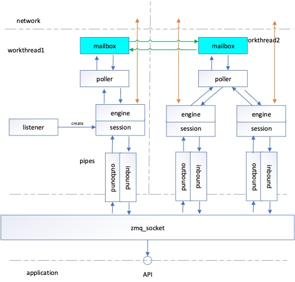
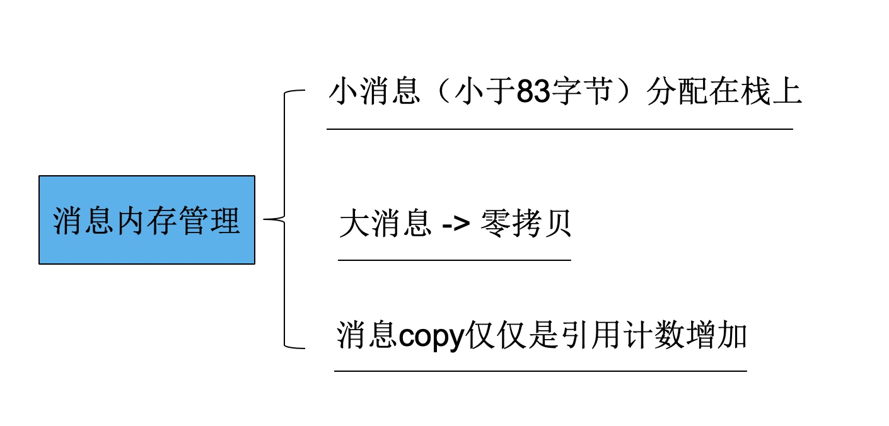
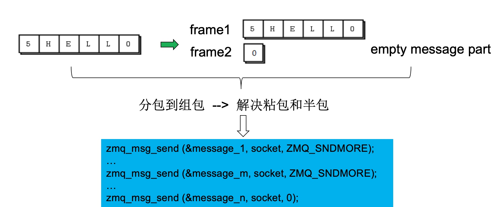
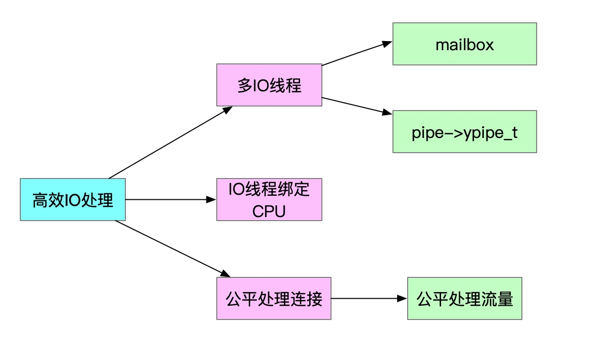
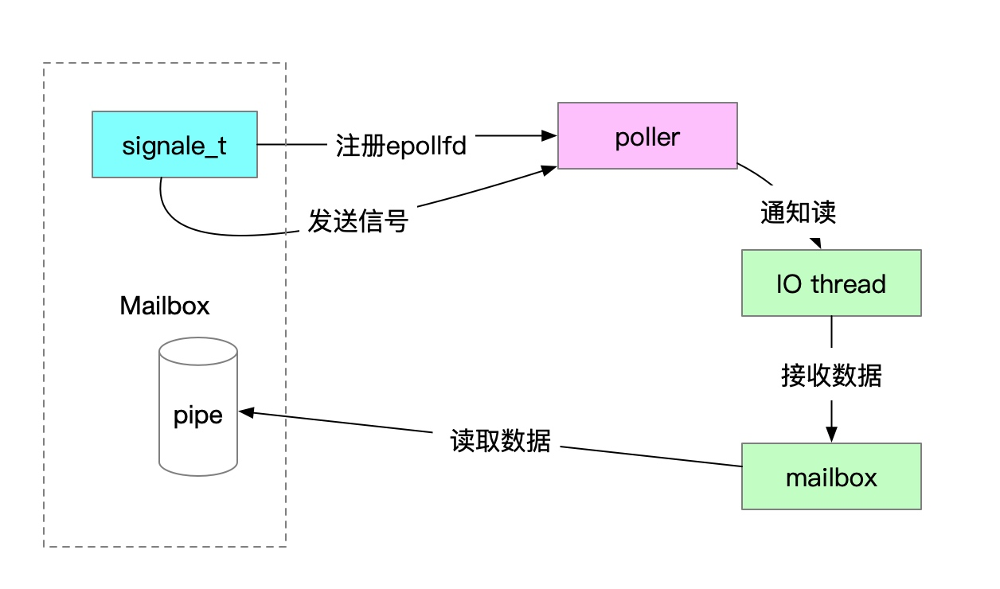

# zmq为什么高效

#### 性能
* RTT
* TPS
* 关闭Nagle算法，关闭网卡中断汇聚在一个cpu，提高IO吞吐能力上，开启网络接口的多队列功能，这样，每个队列就可以用不同的中断号，调度到不同 CPU 上执行
* 区别大小消息，零拷贝 92字节为临界点
* 批量发送和接收消息
* 非同步零数据CPU迁移的并发编程 通过管道
* 无锁算法

#### 线程间共享数据
* send(cmd)
* socket
* socketpair
* 信号 pipe
* eventfd

##### 架构
* 
* engine负责对底层事件发送和接收解码和内核打交道，依赖poller
* poller 对epoll进行封装
* pipes inbound 和 outbound 读写两个管道
* mailbox就是对pipe的封装，两个线程之间发送数据
* session 管理每个连接，管理客户端连接
* session和engine绑定到每个io thread
* zmq_socket可以对应多个客户端，通过算法将session和engine绑定到io_thread
* poller监听到数据会把socketfd发给listener处理，listener会创建engine和session
* 读事件发生poller->engine->内核拷贝数据->session->inbound->api接口读取数据
* 写事件是engine从session中读取消息

#### 消息内存管理
* 短消息vsm直接初始化在栈上
* zmq_msg_t->msg_t
* move 就是删除引用计数
* 

```
   union {
    struct {
      metadata_t *metadata;
      unsigned char unused [msg_t_size - (8 + sizeof (metadata_t *) + 2)];
      unsigned char type;
      unsigned char flags;
    } base;
    struct {
      metadata_t *metadata;
      unsigned char data [max_vsm_size];
      unsigned char size;
      unsigned char type;
      unsigned char flags;
    } vsm;
    struct {
      metadata_t *metadata;
      content_t *content;
      unsigned char unused [msg_t_size - (8 + sizeof (metadata_t *) + sizeof (content_t*) + 2)];
      unsigned char type;
      unsigned char flags;
    } lmsg;
    struct {
      metadata_t *metadata;
      void* data;
      size_t size;
      unsigned char unused
          [msg_t_size - (8 + sizeof (metadata_t *) + sizeof (void*) + sizeof (size_t) + 2)];
      unsigned char type;
      unsigned char flags;
    } cmsg;
    struct {
      metadata_t *metadata;
      unsigned char unused [msg_t_size - (8 + sizeof (metadata_t *) + 2)];
      unsigned char type;
      unsigned char flags;
    } delimiter;
  } u;
``` 

* zmq_msg_move 做了一个引用计数

#### multipart message
* 小消息第一个字节是长度
* 大消息分多帧发送，最后一个帧发送空
* 超过一个字节的长度，帧第一个字节是0xffff，然后扩充到8个字节
* ZMQ_SNDMORE
* 
* 

#### 动态调整批量发送
* outbound和inbound是收发队列
* out_batch_size = 8192 bytes
* 有多条消息就合并，没有也立即发送
* 8192让tcp尽量有数据发送
* stream_engine

#### 高效线程的IO
* IO密集型一般线程数目是CPU数目的两倍
* 计算密集型跟cpu数目一样

* 统计流量的事情丢给用户

```
zmq::io_thread_t *zmq::ctx_t::choose_io_thread (uint64_t affinity_)
{
  if (_io_threads.empty ())
    return NULL;

  //  Find the I/O thread with minimum load.
  int min_load = -1;
  io_thread_t *selected_io_thread = NULL;
  for (io_threads_t::size_type i = 0; i != _io_threads.size (); i++) {
    if (!affinity_ || (affinity_ & (uint64_t (1) << i))) {
      int load = _io_threads[i]->get_load ();
      if (selected_io_thread == NULL || load < min_load) {
        min_load = load;
        selected_io_thread = _io_threads[i];
      }
    }
  }
  return selected_io_thread;
}
```

#### Mailbox
* eventfd 事件fd效果等同于socketpair,可以添加到epoll中来
* slot(mailbox)->io_thread对应数组某个位置
* socket线程和io_thread交换数据
* 通过mailbox命令让io_thread绑定poller,session,engine
* signaler_t make_fdpair -> eventfdj
* socket的mailbox和iothread中一一对应
* mailbox第一次send 1激活邮箱
* io_thread中的poller有处理mailbox中的signaler_t信号
* 然后poller中收到1后从管道中读数据
* signaler封装一个socketpair对

#### Mailbox发送消息流程
* 
* 

#### 高效IO编程
* 高低水位HWM过载落盘 低水位从磁盘载入
* 大师级的线程池的设计
* 