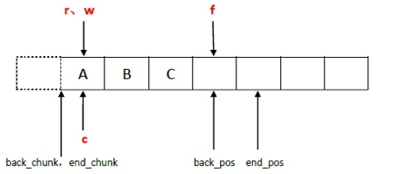
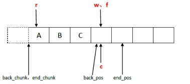
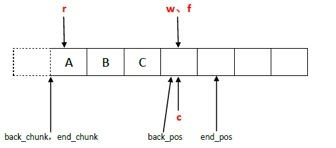
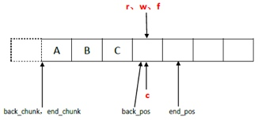

# 内存池
#### 考虑方面
* 减少内存碎片
* 提高效率
* 避免内存泄漏

#### 内存池考虑
* 线程安全
* 尺寸固定

#### kfifo的内存池
* ringbuffer_from_dev

#### 应用层协议
* TLV

#### boost pool
* pfirst管理空闲内存，使用内存踢出去
* 重栽运算符

#### zmq的内存池
*  传输层和应用层更简单的接口
*  尽量少的申请内存，尽量使用即将释放的内存
*  一个读线程，一个写线程，读写之间使用无锁解决互斥
*  批量写入，预取机制，提高效率

#### chunk_t
* begin_chunk 读取的块 begin_pos 读取的位置
* back_chunk 写入的块 back_pos 写入的位置
* end_chunk 指向新申请的内存块 
* push()只是申请了空间
* chunk_t *sc = spare_chunk.xchg (NULL); 拿取一个值，然后用NULL去填充
* back()是存储了数据
* begin_pos 正在读取的位置 begin_pos = N 时说明已经全部释放了，所以直接使用物理释放
* back_pos 写的位置

```
inline void pop ()
    {
        if (++_begin_pos == N) {
            chunk_t *o = _begin_chunk;
            _begin_chunk = _begin_chunk->next;
            _begin_chunk->prev = NULL;
            _begin_pos = 0;

            //将内存块和空闲内存块进行置换，同时将置换出来的内存块释放掉
            chunk_t *cs = _spare_chunk.xchg (o);
            free (cs);
        }
    }

```

#### ypipe_t
 
##### flush

```
  inline bool flush ()
  {
    //  If there are no un-flushed items, do nothing.
    if (_w == _f)
      return true;

    //  Try to set 'c' to 'f'.
    if (_c.cas (_w, _f) != _w) {
      //  Compare-and-swap was unseccessful because 'c' is NULL.
      //  This means that the reader is asleep. Therefore we don't
      //  care about thread-safeness and update c in non-atomic
      //  manner. We'll return false to let the caller know
      //  that reader is sleeping.
      _c.set (_f);
      _w = _f;
      return false;
    }

    //  Reader is alive. Nothing special to do now. Just move
    //  the 'first un-flushed item' pointer to 'f'.
    _w = _f;
    return true;
  }
   inline void write (const T &value_, bool incomplete_)
        {
            //  Place the value to the queue, add new terminator element.
            queue.back () = value_;
            queue.push ();

            //  Move the "flush up to here" poiter.
            if (!incomplete_)
                f = &queue.back ();
        }
```



##### read

```
r指针没有指向begin_pos说明已经预读好了
 inline bool read (T *value_)
    {
        //  Try to prefetch a value.
        if (!check_read ())
            return false;

        //  There was at least one value prefetched.
        //  Return it to the caller.
        *value_ = _queue.front ();
        _queue.pop ();
        return true;
    }
    
    inline bool check_read ()
    {
      //  Was the value prefetched already? If so, return.
      if (&_queue.front () != _r && _r)
        return true;

      _r = _c.cas (&_queue.front (), NULL);
      //_c=NULL, _r->_c的位置

      //  If there are no elements prefetched, exit.
      //  During pipe's lifetime r should never be NULL, however,
      //  it can happen during pipe shutdown when items
      //  are being deallocated.
      if (&_queue.front () == _r || !_r)
        return false;

      //  There was at least one value prefetched.
      return true;
    }
```


* f刷新指针
* 
