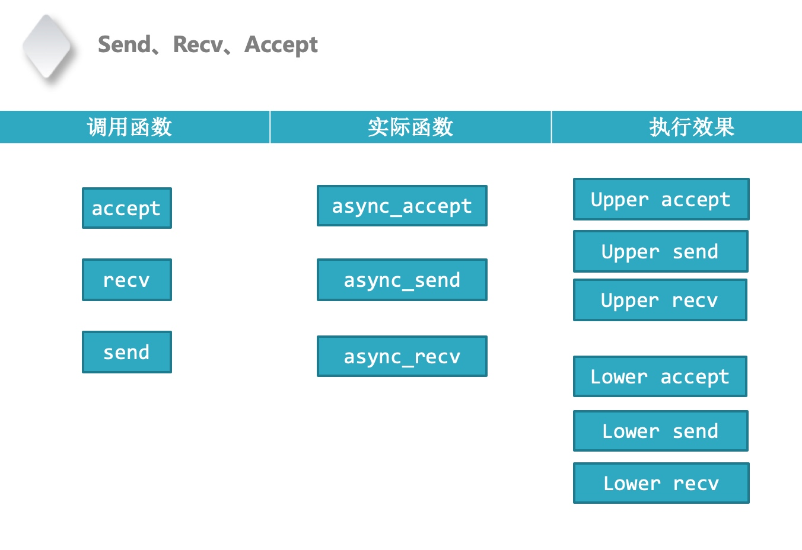

# 协程调度器
#### 协程调度器
* libevent维护fd状态
* 每个线程需要维护epollfd的状态

#### 惊群
* accept
* epoll_wait惊群

#### 流程
* create
* free
* yield
* resume

#### Poll_inner实现
* 将Pollfd添加到Epoll中
* 让出CPU，切换上下文-->upper 切换给schduel来统一执行
* 将Epoll删除Pollfd-->lower

```C++
Int nSend(int sockfd, char *buffer, int length) {

	int result = poll(&pfd, 1, 1);
	if (pfd.revents & POLLRDHUP) {
		return idx;
	}
	
	return send(sockfd, buffer, length, 0);
}

Int nRecv(int sockfd, char *buffer, int length) {

	int result = poll(&pfd, 1, 1);
	if (pfd.revents & POLLRDHUP) {
		return idx;
	}
	
	return recv(sockfd, buffer, length, 0);
}
```


#### 调度器
```C++
Int nSend(int sockfd, char *buffer, int length) {

	int result = poll(&pfd, 1, 1);
	if (pfd.revents & POLLRDHUP) {
		return idx;
	}
	
	return send(sockfd, buffer, length, 0);
}

Int nSend(int sockfd, char *buffer, int length) {

	int result = poll_inner(&pfd, 1, 1);
	if (pfd.revents & POLLRDHUP) {
		return idx;
	}
	
	return send(sockfd, buffer, length, 0);
}

```

