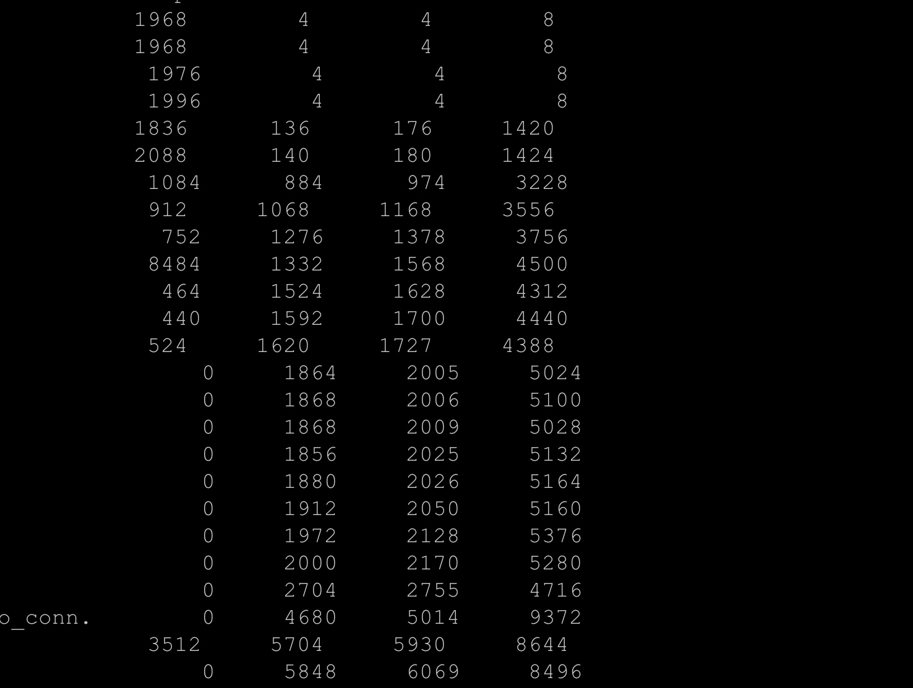

# 消息队列

#### 概念
* 消息队列提供了分布式集群系统架构中各个服务模块之间的消息通信，主要解决应用解耦，异步消息，流量削锋等问题，实现高性能，高可用，可伸缩和最终一致性架构

#### 时机
* RPC
* MQ

#### 可靠投递
* 事务机制 txSelect,txCommit,txRollback
* 确认机制waitForConfirms,ACK 普通确认 批量确认 异步确认

#### 可靠消费
* 最大努力投递机制

#### 消息队列高可用
* topic和tag对应的队列放入nameserver
* config_server

#### 消息的顺序性
* 有顺序依赖的消息经过同一个路由，由broker推送到consumer

#### 消息去重
* 幂等性
* 去重表
* rocketmq没有实现

#### 消息的一致性
* 两段式提交需要事务管理器和事务协调者
* 最终一致性
* MQ定时器定时扫描prepare消息，发送询问消息给上游业务
* 6 7 8失败了人工处理，否则系统处理的非常复杂，就有强依赖了

#### 削峰填谷

