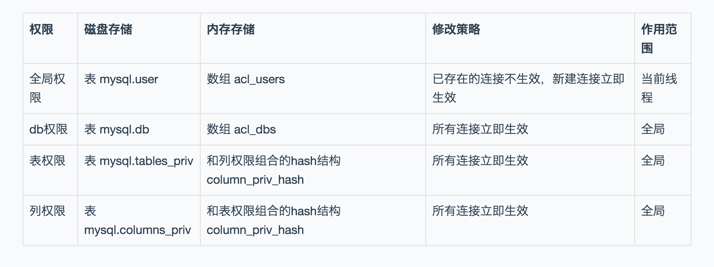

# Mysql权限
#### 全局权限
* 磁盘上，将 mysql.user 表里，用户’ua’@’%'这一行的所有表示权限的字段的值都修改为‘Y’；
* 内存里，从数组 acl_users 中找到这个用户对应的对象，将 access 值（权限位）修改为二进制的“全 1”

#### db权限
* 磁盘上，往 mysql.db 表中插入了一行记录，所有权限位字段设置为“Y”；
* 内存里，增加一个对象到数组 acl_dbs 中，这个对象的权限位为“全 1”。

#### flush privileges原理
* flush privileges 命令会清空 acl_users 数组，然后从 mysql.user 表中读取数据重新加载，重新构造一个 acl_users 数组。也就是说，以数据表中的数据为准，会将全局权限内存数组重新加载一遍。
* flush privileges 命令会清空 acl_users 数组，然后从 mysql.user 表中读取数据重新加载，重新构造一个 acl_users 数组。也就是说，以数据表中的数据为准，会将全局权限内存数组重新加载一遍

#### flush privileges使用场景
* 当数据表中的权限数据跟内存中的权限数据不一致的时候，flush privileges 语句可以用来重建内存数据，达到一致状态。
* 直接操作系统表是不规范的操作

#### 权限范围和修改策略总结
* 
