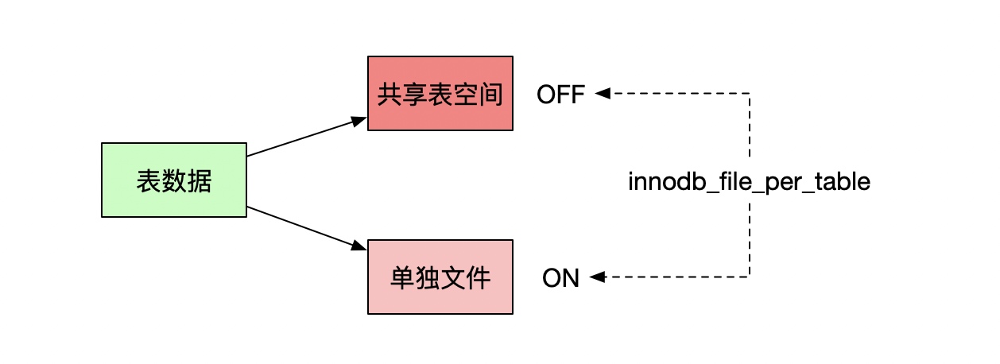
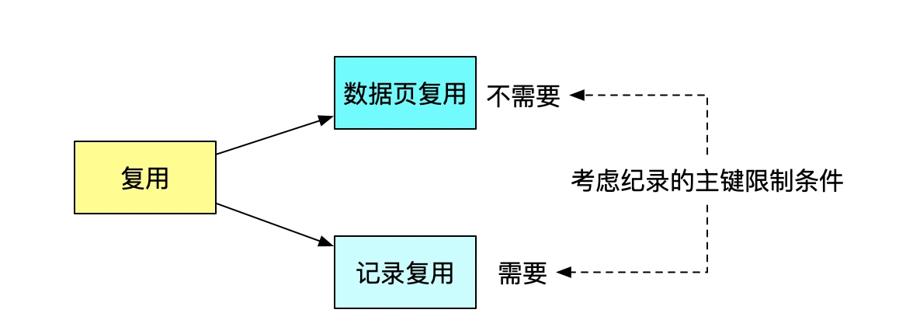
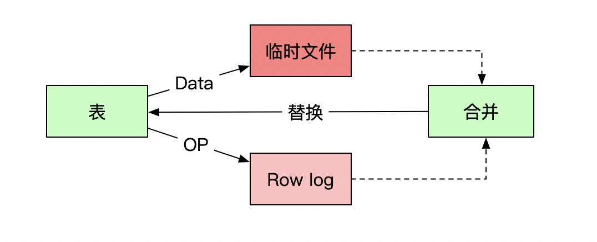
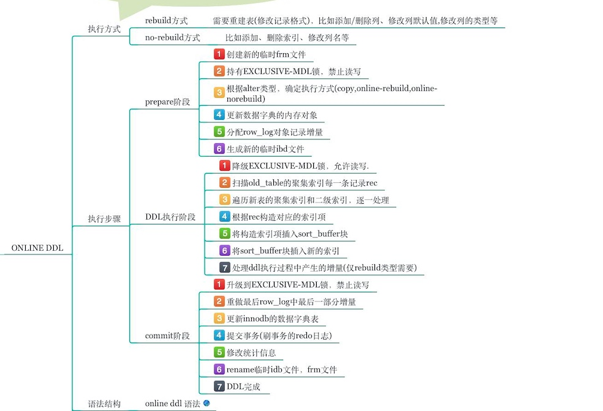
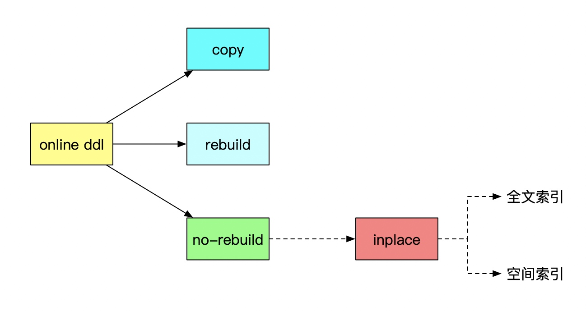

# Mysql表数据删除
#### 为什么表数据删掉一半，表文件大小不变
* innodb_file_per_table ON
* 表数据既可以存在共享表空间里，也可以是单独的文件
* innodb_file_per_table off 放在共享表空间中，即使表删掉了空间也是不会回收的
* innodb_file_per_table ON 一个表单独存储为一个文件, drop table就可以删除

#### 复用
* 数据页复用和记录的复用
* 记录复用的条件是插入的新纪录必须满足之前的纪录的主键限制条件
* 数据页复用则没有条件限制
* delete命令只是把纪录的位置或者数据页标记了可复用
* 没有使用的空间叫空洞

#### 数据空洞
* 不止是删除数据会造成空洞，插入数据也会。
* 如果数据是按照索引递增顺序插入的，那么索引是紧凑的。但如果数据是随机插入的，就可能造成索引的数据页分裂。

#### 重建表
* 重建表可以去除数据空洞
* 建立一个临时文件，扫描表 A 主键的所有数据页；
* 用数据页中表 A 的记录生成 B+ 树，存储到临时文件中；
* 生成临时文件的过程中，将所有对 A 的操作记录在一个日志文件（row log）中，对应的是图中 state2 的状态；
* 临时文件生成后，将日志文件中的操作应用到临时文件，得到一个逻辑数据上与表 A 相同的数据文件，对应的就是图中 state3 的状态；
* 用临时文件替换表 A 的数据文件。
* MDL读锁可以限制DDL修改表结构

#### Online和inplace本质区别
* inplace表示在 innodb引擎完成所有操作,对 server层是透明的。 inplace操作不一定是online的,如MsQL8.0的添加全文索引和空间索引。而 online的一定是 inplace的。
* copy 对于不支持online的ddl操作采用copy方式，比如修改列类型，删除主键，修改字符集等，这些操作都会导致记录格式发生变化

#### Online DDL

#### 若干问题
* Online Add Index是否支持Unique索引？
确切的答案是：支持，InnoDB支持Online创建Unique索引。
既然支持，就会面临Check Duplicate Key的问题。Row Log中如果存在与索引中相同的键值怎么处理？怎么检测是否存在相同键值？
InnoDB解决此问题的方案也比较简介易懂。其维护了一个row_merge_dup_t的数据结构，存储了在Row log重放过程中遇到的违反唯一性冲突的Row Log。应用完Row Log之后，外部判断是否存在Unique冲突(有多少Unique冲突，均会记录)，Online创建Unique索引失败。
* Online与数据一致性如何兼得？
实际上，online ddl并非整个过程都是online，在prepare阶段和commit阶段都会持有MDL-Exclusive锁，禁止读写；而在整个ddl执行阶段，允许读写。由于prepare和commit阶段相对于ddl执行阶段时间特别短，因此基本可以认为是全程online的。Prepare阶段和commit阶段的禁止读写，主要是为了保证数据一致性。Prepare阶段需要生成row_log对象和修改内存的字典；Commit阶段，禁止读写后，重做最后一部分增量，然后提交，保证数据一致。
* 如何实现server层和innodb层一致性？
在prepare阶段，server层会生成一个临时的frm文件，里面包含了新表的格式；innodb层生成了临时的ibd文件(rebuild方式)；在ddl执行阶段，将数据从原表拷贝到临时ibd文件，并且将row_log增量应用到临时ibd文件；在commit阶段，innodb层修改表的数据字典，然后提交；最后innodb层和mysql层面分别重命名frm和idb文件。
* Row Log是什么样的结构，如何组织的？
在Online Add Index过程中，并发DML产生的修改，被记录在Row Log中。首先，Row Log不是InnoDB的Redo Log，而是每个正在被Online创建的索引的独占结构。
Online创建索引，遵循的是先创建索引数据字典，后填充数据的方式。因此，当索引数据字典创建成功之后，新的DML操作就可以读取此索引，尝试进行更新。但是，由于索引结构上的status状态为ONLINE_INDEX_CREATION，因此这些更新不能直接应用到新索引上，而是放入Row Log之中，等待被重放到索引之上。
Row Log中，以Block的方式管理DML操作内容的存放。一个Block的大小为由参数innodb_sort_buffer_size控制，默认大小为1M (1048576)。初始化阶段，Row Log申请两个这样的Block。

#### 三种重建表的方式区别
* optimize table（alter table + alter table）
* alter table  其实不是重建表，只是对表的索引信息做重新统计，没有修改数据，这个过程中加了 MDL 读锁
* alter table 重建表

#### 参考资料
* https://blog.51cto.com/fengfeng688/1956827
* 