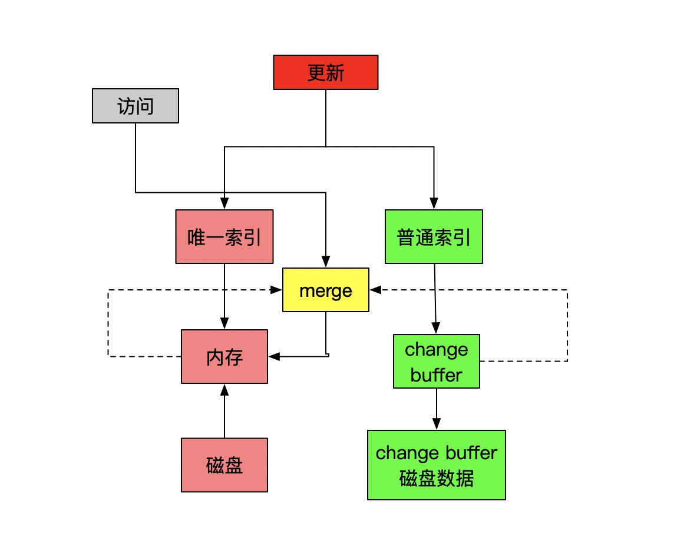

# 普通索引和唯一索引
#### InnoDB读取数据
* InnoDB 的数据是按数据页为单位来读写的。也就是说，当需要读一条记录的时候，并不是将这个记录本身从磁盘读出来，而是以页为单位，将其整体读入内存。在 InnoDB 中，每个数据页的大小默认是 16KB。
* 因为引擎是按页读写的，所以说，当找到 k=5 的记录的时候，它所在的数据页就都在内存里了。那么，对于普通索引来说，要多做的那一次“查找和判断下一条记录”的操作，就只需要一次指针寻找和一次计算。
* 当然，如果 k=5 这个记录刚好是这个数据页的最后一个记录，那么要取下一个记录，必须读取下一个数据页，这个操作会稍微复杂一些。

#### change buffer
* change buffer 在内存中有拷贝，也会被写入到磁盘上
* 对于唯一索引来说，所有的更新操作都要先判断这个操作是否违反唯一性约束,必须要把数据页载入内存才能实现
* purge 的时候是真正进行数据更新的时刻，而 change buffer 的主要目的就是将记录的变更动作缓存下来，所以在一个数据页做 purge 之前，change buffer 记录的变更越多（也就是这个页面上要更新的次数越多），收益就越大。
* 访问这个数据页会触发 purge 外，系统有后台线程会定期 purge。在数据库正常关闭（shutdown）的过程中，也会执行 purge 操作。
* 更新后紧跟着这个记录的查询，change buffer应该关闭，其他情况下应该打开
* 操作流程

#### redo log 和 binlog的区别
* redo log 是 InnoDB 引擎特有的；binlog 是 MySQL 的 Server 层实现的，所有引擎都可以使用。
* redo log 是物理日志，记录的是修改；binlog 是逻辑日志，记录的是这个语句的原始操作逻辑
* redo log 是循环写的，空间固定会用完；binlog 是可以追加写入的。“追加写”是指 binlog 文件写到一定大小后会切换到下一个，并不会覆盖以前的日志。

#### redo log 和change buffer
* redo log 主要节省的是随机写磁盘的 IO 消耗（转成顺序写）
* 而 change buffer 主要节省的则是随机读磁盘的 IO 消耗。

#### change buffer的merge的流程
* 从磁盘读入数据页到内存（老版本的数据页）；
* 从 change buffer 里找出这个数据页的 change buffer 记录 (可能有多个），依次应用，得到新版数据页；
* 写 redo log。这个 redo log 包含了数据的变更和 change buffer 的变更。
* 数据页和内存的数据需要线程定时刷新回磁盘
* 