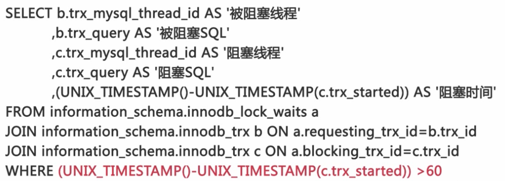
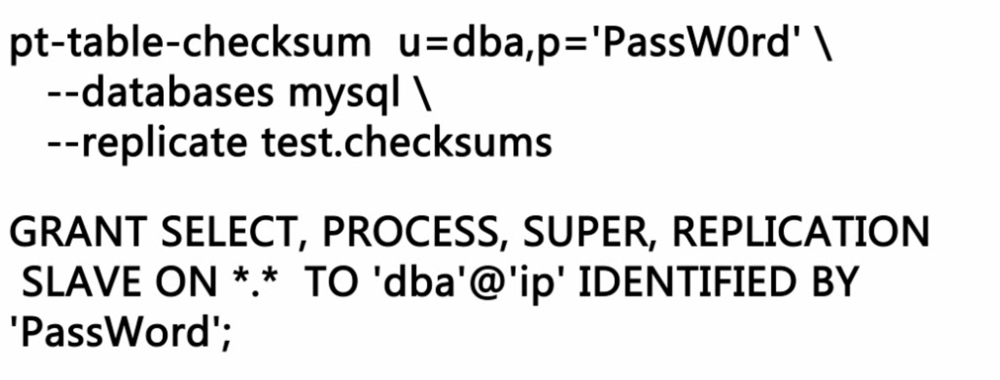

# Mysql监控

* MySQL 数据库我们都要监控什么
* 怎么对这些要监控的资源进行监控

#### 监控可用性
* 对数据库服务可用性进行监控

##### 如何确认数据库是否可以通过网络连接

```
mysqladmin-umonitor_user-p h ping
telnet ip port
应用程序通过网络建立数据库连接
```
* 可以连接到数据库不代表可用

##### 如何确认数据库是否可读写
* 检査数据库的 read_only 参数是否为 off 
* 建立监控表并对表中数据进行更行执行简单的查询
* select@@ version

##### 如何监控数据库的连接数
* 时刻关注数据库连接数量的变化

```
show variables like 'max connections 
show global status like 'Threads_connected'
threads connected/max connections 0.8
```

#### 对数据库性能进行监控
* 记录性能监控过程中所采集到的数据库的状态

##### 如何计算QPS和TPS
```
* QPS=(Queries2-Queries1)(差值)/
(Uptime_since_flush_status2- Uptime_since_flush_status1）(时间间隔)
* TPS=((Com_insert+Com_update2+Com_delete
 (Com_insert1+Com_update1+Com_deletel))/
 (Uptimesince_flushStatus2-uptime_since_flush_statusi)
```
##### 如何监控数据库的并发请求数量
```
show global status like 'Threads_running'
```
* 数据库系统的性能会随着并发处理请求数量的增加而下降

##### 如何监控Innodb阻塞

* information_schema.innodb_lock_waits
* information_schema.innodb_trx

```
select connection_id() 查看连接ID
```

#### 对主从复制进行监控 

##### 主从复制链路状态的监控
* Slave_IO_Running: Yes
* Slave_SQL_Running: Yes


##### 主从复制延迟的监控
* show slave status
* Seconds_Behind_Master 0
* 这个方法需要使用多线程的程序同时对于主从服务器的状态来进行检查

##### 定期的确认主从复制的数据是否一致



#### 服务器资源的监控
* 磁盘空间
* CPU 的使用情况，内存的使用情况，Swap 分区的使用情况以及网络 IO 的情况等