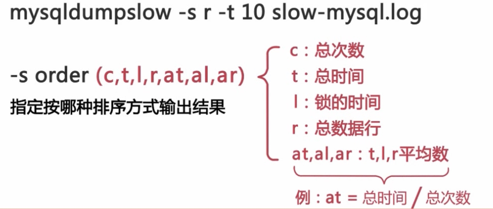
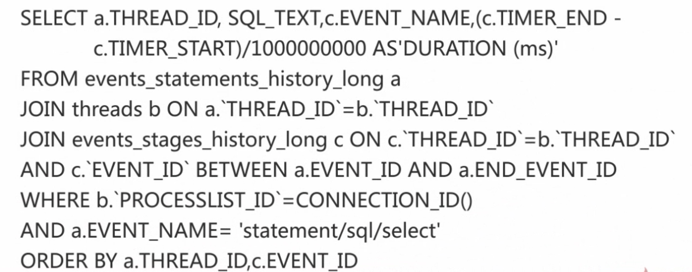
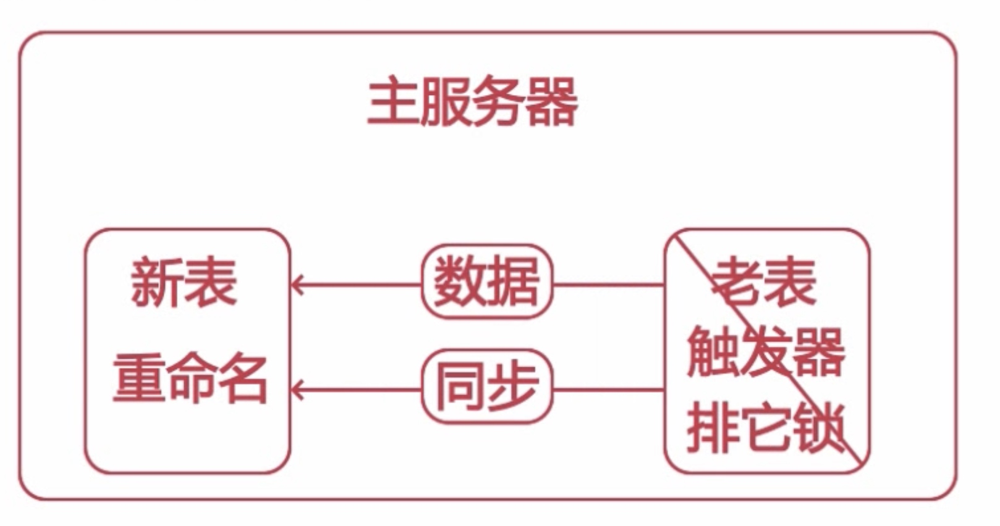
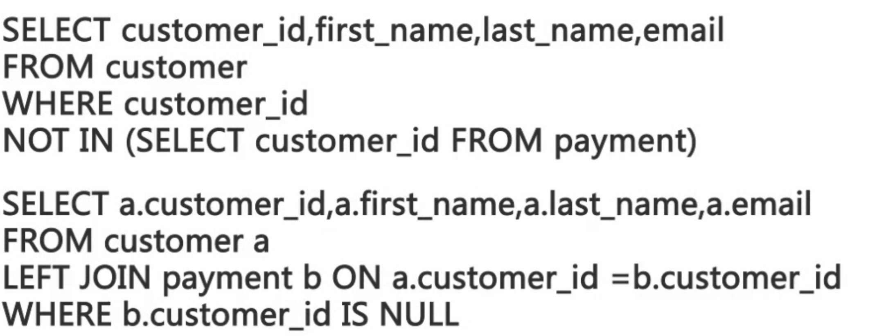
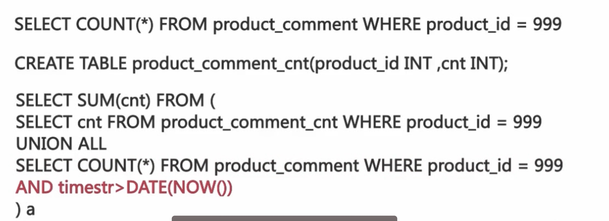

# SQL查询优化

#### 优化
* 查询优化，库表优化，索引优化

#### 获取有性能问题的SQL
* 通过用户反馈获取存在性能问题的
* SQL通过慢查日志获取存在性问题的SQL
* 实时获取存在性能问题的SQL

#### 慢查日志获取存在性问题的SQL
* slow_query_log 启动停止记录慢查询日志
* slow_query_log_file 指定慢查日志的存储路径及文件
* long_query_time 指定记录慢查日志SQL执行时间的阀值
 
* 1ms比较合适
* log_ queries_ not_using_indexes 是否记录未使用索引的SQL

##### 常用工具
* mysqldumpslow


```
pt-query-digest --explain -h -u slow-mysql.log
```

#### 实时获取有性能问题SQL
```
SELECT `id`,`user`,`host`,DB,command,`time`,state,Info
FROM information_schema.PROCESSLIST WHERE TIME>=60
```

#### 执行流程
* 客户端发送 SQL 请求给服务器 
* 服务器检查是否可以在査询绶存中命中该 SQL
* 服务器端进行 SQL 解析，预处理，再由优化器生成对应的执行计划
* 跟据执行计划，调用存储引擎 AI 来查询数据
* 将结果返回给客户端

##### 查询缓存
* query_cache_type 设置查询绶存是否可用 OFF
* query_ cache_size 设置査询缓存的内存大小 0
* query_cache_ limit 设置查询缓存可用存储的最大值
* query_cache lock invalidate 设置数据表被锁后是否返回绶存中的数据
* query_cache_ min_res_unit 设置查询缓存分配的内存块最小单位

#### 解析阶段
* MYSQL依照这个执行计划和存储引擎进行交互这个阶段包括了多个子过程
* 检查查询中所涉及的表和数据列是否存在及名字或别名是否存在歧义等等
* 语法检查全都通过了，查询优化器就可以生成查询计划了

##### 生成错误的执行计划的原因
* 统计信息不准确
* 执行计划中的成本估算不等同于实际的执行计划的成本
* MYSQL优化器所认为的最优可能与你所认为的最优不一样
* MYSQL 从不考虑其他并发的査询，这可能会影响当前查询的速度
* MySQL 有时候也会基于一些固定的规则来生成执行计划 
* MySQL 不会考虑不受其控制的成本 自定义函数

##### 可优化的类型
* 重新定义表的关联顺序
* 将外连接转化成内连接
* 使用等价变换规则
* 优化count()min()max()
* select tables optimized away
* 优化器已经从执行计划中移除了该表，并以一个常数取而代之
* 将一个表达式转化为常数表达式
* 使用等价变换规则
* 子查询优化
* 提前终止查询
* in条件优化，先排序，然后通过二分查找的方式

#### 确定查询处理各个阶段所消耗的时间
* 实用profile
* set profiling=1;
* show profiles;
* show profile for query N;
* show profile cpu for query 1;
* performance_shema

```
UPDATE `setup_instruments` SET enabled='YES', TIMED='YES' WHERE NAME LIKE 'stage%';
UPDATE setup_consumers SET enabled='yes' WHERE NAME LIKE 'events%';


SELECT a.THREAD_ID,SQL_TEXT,c.EVENT_NAME,(c.TIMER_END-c.TIMER_START)/1000000000 AS 'DURATION (ms)' FROM events_ statements_history_long a JOIN threads b ON a.`THREAD_ID`=b.`THREAD_ID` JOIN events_stages_history_long c ON c.`THREAD_ID`=b.`THREAD_ID` AND c.`EVENT_ID` BETWEEN a.EVENT_ID AND a.END_EVENT_ID WHERE b.`PROCESSLIST_ID`=CONNECTION_ID() AND a.EVENT_NAME='statement/sql/select' ORDER BY a.THREAD_ID,c.EVENT_ID;
```


#### 特定mysql的查询优化
* 分批处理 暂停一段时间

##### 修改大表结构


```
pt-online-schema-change --alter="modify c1 varchar(40) not null default '' " --user=root --password=L19880901c- D=crn2,t=t charset=utf8 --execute;
```

##### 优化not in && <>查询


##### 使用汇总表查询优化

