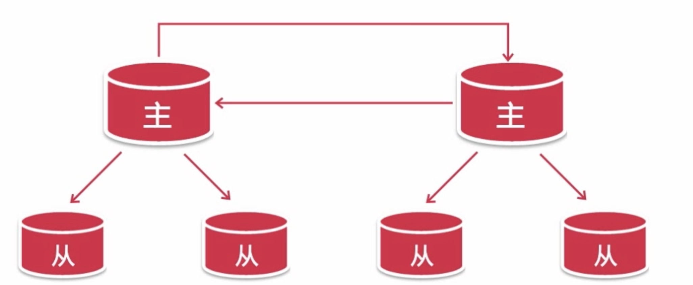
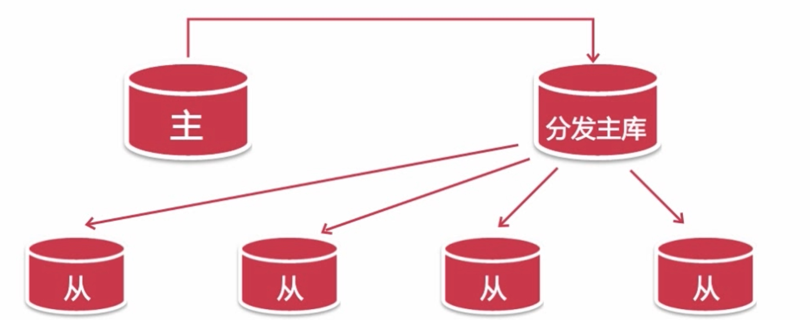
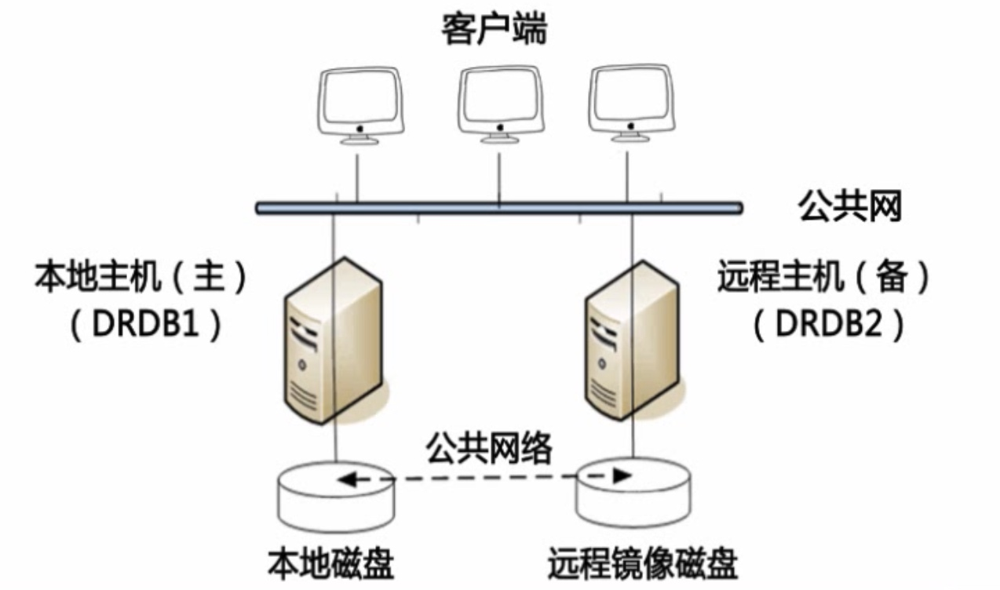
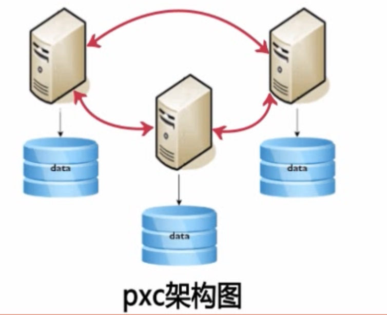
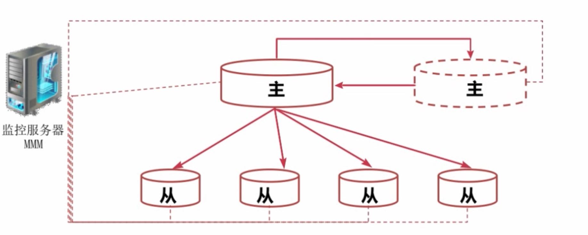
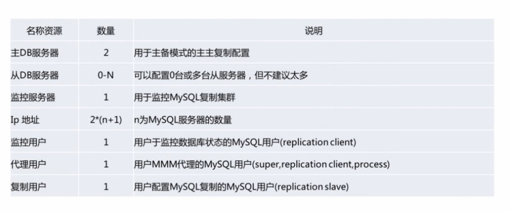
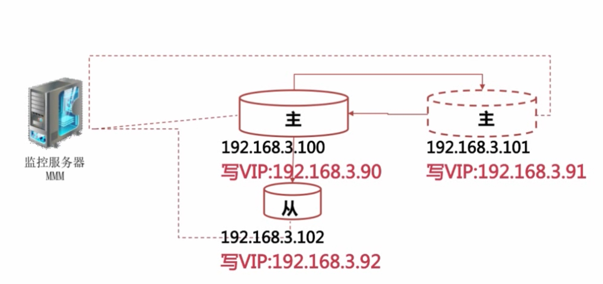
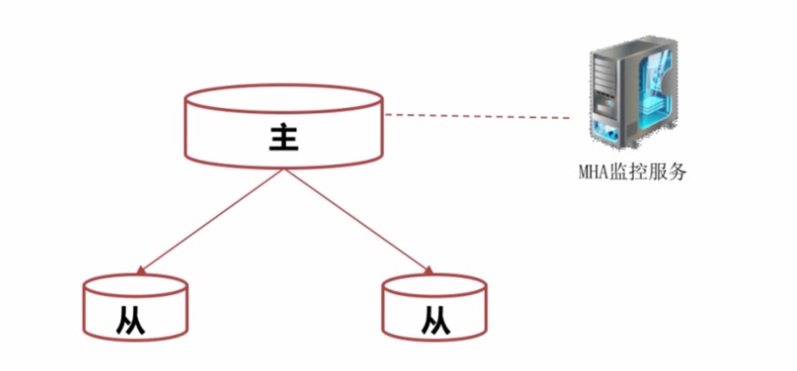
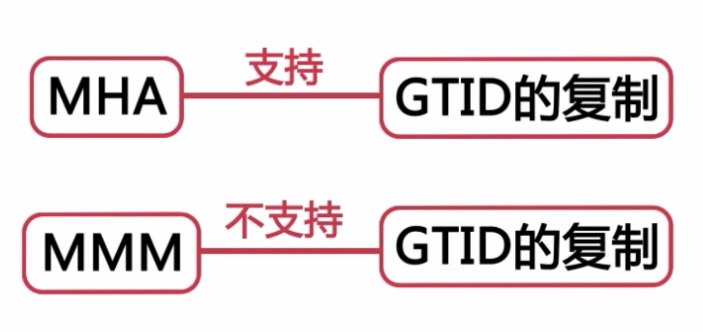
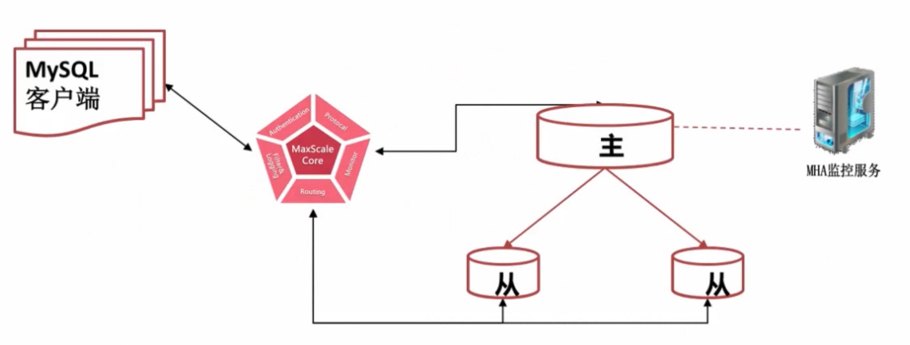

# mysql高可用架构设计

#### 复制
* 实现在不同服务器上的数据分布
* 实现数据读取的负载均衡
* 增强了数据安全性
* 实现数据库高可用和故障切换
* 实现数据库在线升级

#### binlog

##### statement
* 基于段的格式


##### row
* 基于行的格式
* 同-SQL 语句修改了 10000 条数据的情况下基于段的日志格式只会记录这个 SQL 语句
* 基于行的日志会有 10000 条记录分别记录每行的数据修改
* 使Mysql主从复制更加安全
* 对每一行数据的修改比基于段的复制高效
* 误操作可以通过反向处理
* 缺点
* 记录日志量较大binlog_row_image=full|minimal记录列|noblog
* full：在before和after影像中，记录所有的列值；
* minimal：在before和after影像中，仅仅记录被更改的以及能够唯一识别数据行的列值；
* noblob：在before和after影像中，记录所有的列值，但是BLOB 与 TEXT列除外（如未更改）。

##### mixed
* 根据SQL语句由系统决定在基于段和基于行的日志格式中进行选择

##### 建议
* row
* minimal

##### 复制总结

##### 基于SQL语句的复制（SBR)
* 二进制日志格式使用的是 statement 
* 缺点
* 对于非确定性事件，无法保证主从复制数据的一致性
* 对于存储过程，触法器，自定义函数进行的修改也可能造成数据不一致
* 相比于基于行的复制方式在从上执行时需要更多的行锁

##### 基于行的复制（RBR)
* 二进制日志格式使用的是基于行的日志格式
* 优点
* 可以应用于任何 SQL 的复制包括非确定函数，存储过程等
* 可以减少数据库锁的使用
* 缺点
* 要求主从数据庳的表结构相同，否则可能会中断复制
* 无法在从服务器上单独执行触法器

#### 复制工作方式
* 主将变更写入二进制日志
* 从读取主的二进制日志变更并写入到 Relay_log 中
* 在从上重放 relay_log 中的日志
* 基于 SQL 段的日志是在从库上重新执行记录的 SQL 基王行的日赤则是在从库上直接应用对数据库行的修改

#### 主配置
```
bin_log=mysql-bin
server_id=100
```

#### 从服务器配置
```
bin_log=mysql-bin
server_id=100
relay_log=mysql-relay-bin
log_slave_update=on //链路配置
read_only=on //防止错误配置
```

#### GTID
* GTID 即全局事务 ID，其保证为每一个在主上提交的事务在复制集群中可以生成一个唯一的 ID
* source_id:transaction_id
* Create table. Select
 在事务中使用 Create temporary table 建立临时表使用关联更新事务表和非事务表都是会报错的
 

#### 从服务器
```
Log-slave-updates = on read_only=on【建议】
master info_ repository= TABLE【建议】
relay_log_info_ repository= TABLE【建议】
gtid_mode =on
enforce-gtid-consistency
```
* 查询授权

```
select user,host  from user;
show grants for shui@'192.168.31.%'
```

#### GTID复制的优缺点
* 优点
* 可以很方便的进行故障转移从库不会丢失主库上的任何修改
* 缺点
* 故障处理比较复杂
* 对执行的 SQL 有一定的限制

#### 选择复制模式要考虑的问题
* 所使用的MYSQL版本
* 复制架构及主从切换的方式
* 所使用的高可用管理组件

#### 复制拓扑
* MYSQL5.7 之前，一个从库只能有一个主库
* MYSQL5.7 之后支持一从多主架构

#### 一主多从
* 为不同业务使用不同的从库
* 将一台从库放到远程 IDC，用作灾备恢复
* 分担主库的读负载，由于要复制主库的写，所以不能分担写负载

#### 主主复制拓扑

##### 主主模式
* 产生数据冲突而造成复制链路的中断
* 耗费大量的时间
* 造成数据丟失
* 注意事项
* 两个主中所操作的表最好能够分开使用下面两个参数控制自增 ID 的生成
* auto increment increment= 2
* auto_increment_offset=12

#### 主备
* 只有一台主服务器对外提供服务
* 一台服务器处于只读状态并且只作为热备使用在对外提供服务的主库出现故障或是计划性的维护时才会进行切换
* 使原来的备库成为主库，而原来的主库会成为新的备库并处理只读或是下线状态，待维护完成后重新上线
* 注意事项
* 确保两台服务器上的初始数据相同
* 确保两台服务器上已经启动 biolog 并且有不同的 server id
* 在两台服务器上启用 log_ slave_ updates 参数在初始的备库上启用 read_only

#### 拓扑结构

* 级联复制


#### 复制优化
* 控制主库的事务大小分割大事务,大表修改无法分割
* 二进制日志传输时间 mixed，row->set binlog_row_image=minimal;
* 默认情况下从只有一个 SQ인L 线程，主上并发的修改在从上变成了串行
* 在 MYSQL5.7 中可以按照逻辑时钟的方式来分配 SQL 线程

```
stop slave;
set global slave_parallel_type='logical_clock';
set global slave_parallel_workers=4; 
start slave;
```

#### 复制常见问题
* 主库或从库意外宕机引起的错误
* 使用跳过二进制日志事件
* 注入空事务的方式先恢复中断的复制链路
* 再使用其它方法来对比主从服务器上的数据
* 主库的二进制日志损坏
* 备库的中继日志
* 在从库上进行数据修改造成的主从复制错误
* 不唯一的 server id 或 server_uuid
* max_allow_packeti 设置引起的主从复制错

#### 复制解决不了的问题
* 分担主数据库的写负载
* 自动进行故障转移及主从切换
* 提供读写分离功能

#### 高可用


##### 避免导致系统不可用的因素，减少系统不可用的时间
* 建立完善的监控及报警系统
* 对备份数据进行恢复测试
* 正确配置数据库环境
* 对不需要的数据进行归档和清理

##### 增加系统冗余，保证发生系统不可用时可以尽快恢复
* 避免存在单点故障
* 利用SUN共享存储或DRDB磁盘复制解决MYSQL单点故障

* 利用多写集群或NDB集群来解决Mysql单点故障

* 利用MySQL主从复制来解决MySQL单点故障
* 问题
* 主服务器切换后如何通知应用新的主服务器的 IP 地址
* 如何检查 MYSQL 主服务器是否可用
* 如何处理从服务器和新主服务器之间的那种复制关系
* 主从切换及故障转移

#### MMM
* 监控和管理 MYSQL 的主主复制拓扑，并在当前的主服务器失效时，进行主和主备服务器之间的主从切换和故障转移等工作
* MMM监控 MySQL 主从复制健康情况
* 在主库出现宕机时进行故障转移并自动配置其它从对新主的复制
* 

* 提供了主，写虚拟 IP，在主从服务器出现问题时可以自动迁移虚拟 IP


##### 需要资源


##### 部署步骤
* 配置主主复制及主从同步集群
* 安装主从节点所需要的支持包
* 安装及配置 MMM 工具集
* 运行 MMM 监控服务测试

* 

##### 优点
* 使用 PerI 脚本语言开发及完全开源
* 提供了读写 VIP（虚拟 IP），使服务器角色的变更对前端应用透明
* 在从服务器出现大量的主从延迟，主从链路中断时可以把这台从服务器上的读的虚拟 IP，漂移到集群中其它正常的服务器上。
* MMM 提供了从服务器的延迟监控
* MMM 提供了主数据库故障转移后从服务器对新主的重新同步功能
* 很容易对发生故障的主数据库重新上线

##### 缺点
* 发布时间比较早不支持 MYSQLI 新的复制功能
* 不支持多线程复制功能
* 没有读负载均衡的功能
* 在进行主从切换时，容易造成数据丟失，重复递交事务
* MMM 监控服务存在单点故障

#### MHA
* 30秒内完成切换
* 监控主数据库服务器是否可用
* 当主 DB 不可用时，从多个从服务器中选举出新的主数据库服务器
* 提供了主从切换和故障转移功能

##### 主从切换流程
* 尝试从出现故障的主数据库保存二进制日志
* 从多个备选从服务器中选举出新的备选主服务器
* 在备选主服务器和其它从服务器之间同步差异二进制数据
* 应用从原主 DB 服器上保存的二进制日志
* 迁移集群中的其它从 DB 作为新的主 DB 的从服务器

##### MHA架构

* 

##### 配置步骤
* 建立主从复制集群
* 配制 MHA 管理节点
* 使用 masterha_ check_ssh 和 masterha_ check_repl 对配置进行检验
* 启动并测试 MHA 服务

#### MHA的优点和缺点

##### 优点
* 同样是由 Per 语言开发的开源工具
* 可以支持基于 GTD 的复制模式
* MHA 在进行故障转移时更不易产生数据丟失
* 同一个监控节点可以监控多个集群

##### 缺点
* 需要编写脚本或利用第三方工具来实现 Vip 的配置
* MHA 启动后只会对主数据库进行监控，不能排查从服务器故障
* 需要基于 SSH 兔认证配置，存在一定的安全隐患
* 没有提供从服务器的读负载均衡功能

#### 负载均衡

#### 读写分离


##### 程序实现读写分离
* 优点
* 由开发人员控制什么样查询在从库中执行，因此比较灵活
* 由程序直接连接数据库，所以性能损耗比较少
* 缺点
* 增加了开发的工作量，使程序代码更加复杂
* 人为控制，容易出现错误

##### 中间件来实现读写分离
* mysql-proxy
* maxScale
* 优点
* 由中间件根据查询语法分析，自动完成读写分离
* 对程序透明，对于已有程序不用做任何调整
* 缺点
* 由于增加了中间层，所以对查询效率有损耗 消耗50%

##### 总结
* 读写分离要解决的是如何在复制集群的不同角色上，去执行不同的 SQL 语句。
* 读的负载均衡主要解决的是具有相同角色的数据库，如何共同分担相同的负载。

#### MaxScale
* Authentication 认证插件
* Protocal 协议插件
* Router 路由插件 readconnroute readwritesplit
* Monitor 监控插件
* Filter&Logging 日志和过滤插件

#### 高可用架构

