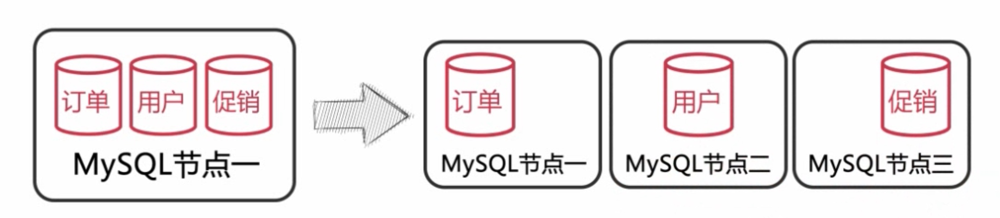
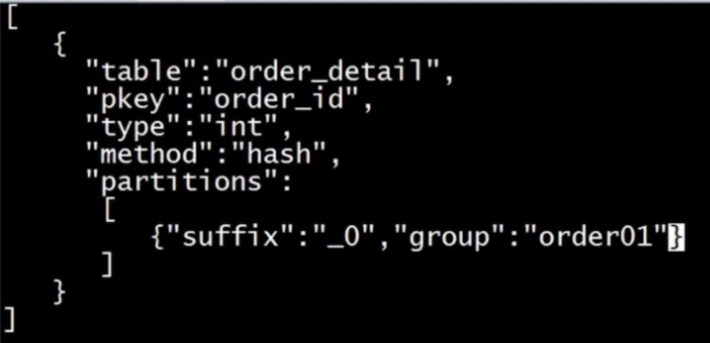
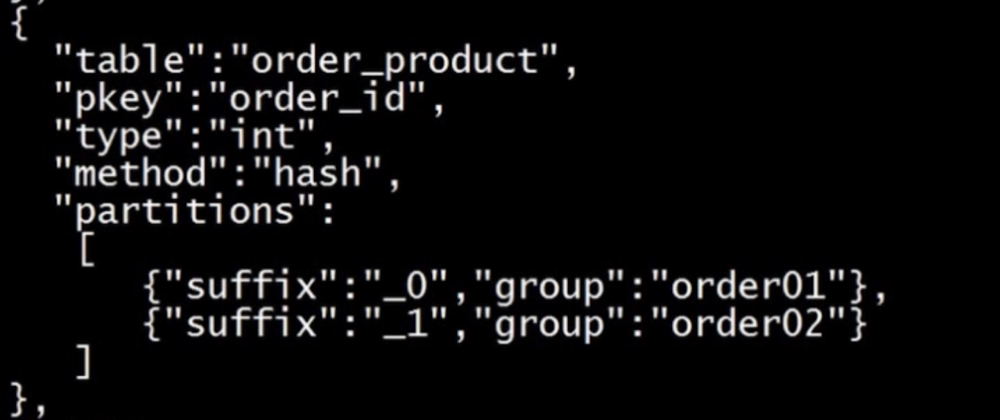
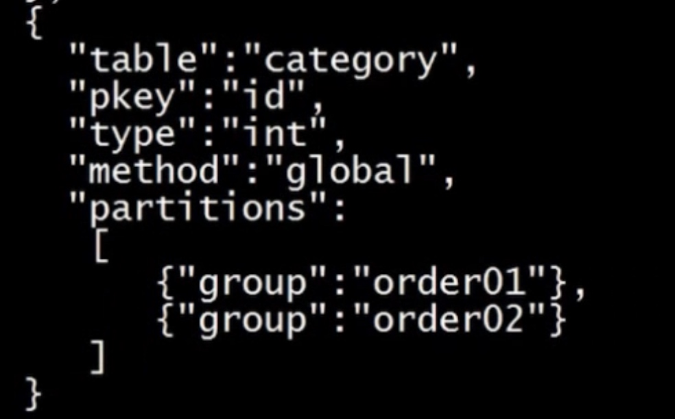
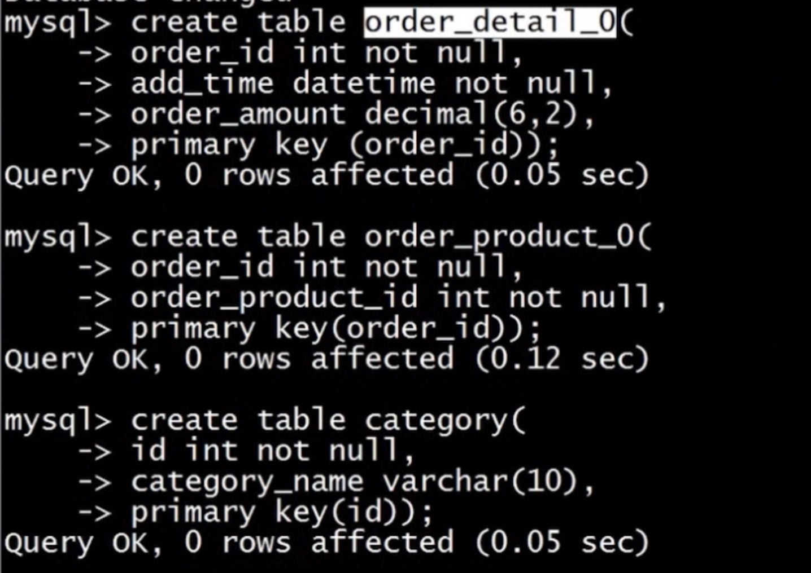
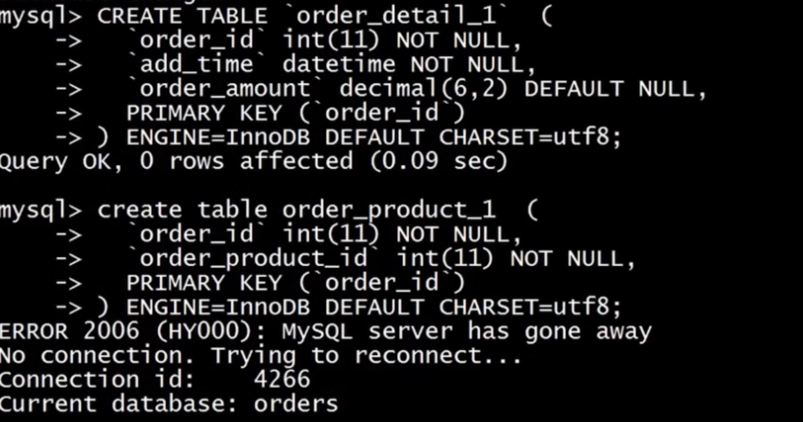
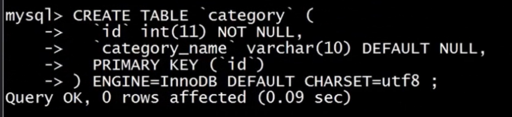
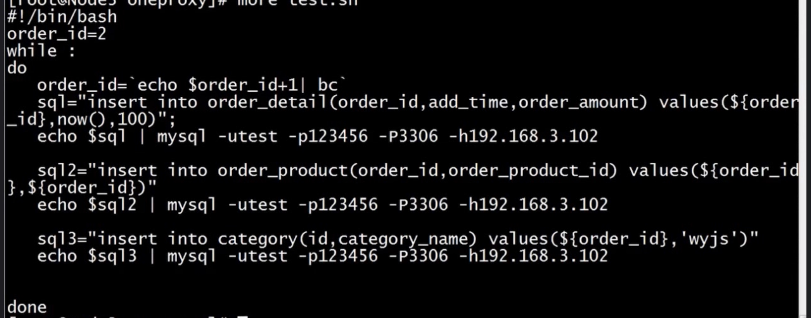

# 分库分表

#### 集中方式
* 把一个实例中的多个数据库拆分到不同的实例

* 把一个库中的表分离到不同的数据库中
* 根据写压力来拆分，缓解写负载

#### 数据库分片
* 对一个库中的相关表进行水平拆分到不同实例的数据库中

##### 选择分区键
* 分区键要能尽量避兔跨分片查询的发生
* 分区键要能尽量使各个分片中的数据平均

##### 如何存储无需分片的表
* 每个分片中存储一份相同的数据
* 使用额外的节点统一存储

##### 如何在节点上部署分片
* 每个分片使用单一数据库，并且数据库名也相同
* 将多个分片表存储在一个数据库中，并在表名上加入分片号后缀
* 在一个节点中部署多个数据库，每个数据库包含一个分片

##### 如何分配分片中的数据
* 按分区键的 Hash 值取模来分配分片数据
* 按分区键的范围来分配分片数据
* 利用分区键和分片的映射表来分配分片数据//表放在缓存中

##### 如何生成全局唯一ID
* 使用 auto_increment_increment 和 auto_increment_offset 参数跟分片数目相同
* 使用全局节点来生成 ID
* 在Redis等绶存服务器中创建全局ID

#### 演示
* oneProxyp
* 
* 
* 
* 节点一
* 
* 节点二
* 
* 
* 全局ID
* 

