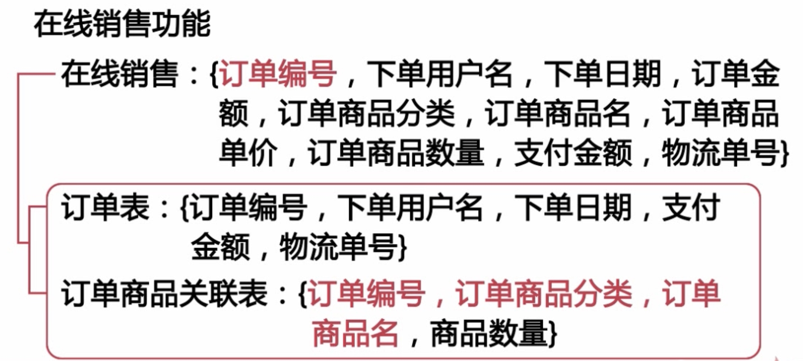
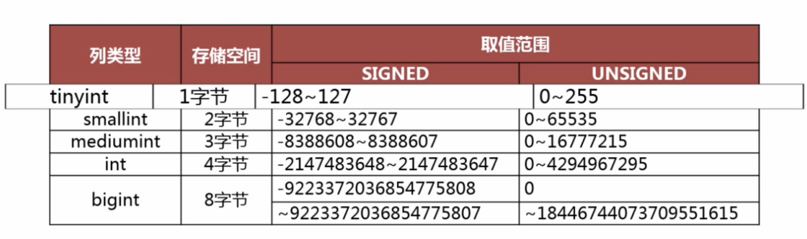
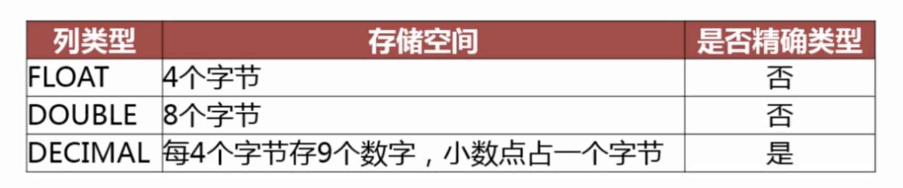

# 数据库结构优化
* 

#### 优化目的
* 减少数据冗余
* 尽量避免数据维护中出现更新，插入和删除异常
* 插入异常：如果表中的某个实体随着另一个实体而存在
* 更新异常：如果更改表中的某个实体的单独属性时，需要对多行进行更新
* 删除异常：如果删除表中的某一实体则会导致其他实体的消失
* 节约数据存储空间
* 提高查询效率

#### 设计步骤

##### 需求分析
* 全面了解产品设计的存储需求
* 存储需求
* 数据处理需求
* 数据的安全性和完整性

##### 逻辑设计
* 设计数据的逻辑存储结构
* 数据实体之间的逻辑关系，解决数据冗余和数据维护异常

##### 物理设计
* 跟据所使用的数据库特点进行表结构设计

##### 维护优化
* 跟据实际情況对索引、存储结构等进行优化

#### 设计范式

##### 第一范式
* 数据库表中的所有字段都只具有单一属性
* 单一属性的列是由基本的数据类型所构成的
* 设计出来的表都是简单的二维表

##### 第二范式
* 要求一个表中只具有一个业务主键，也就是说符合第二范式的表中不能存在非主键列对只对部分主键的依赖关系

##### 第三范式
* 指每一个非主属性既不部分依赖于也不传递依赖于业务主键，也就是在第二范式的基础上消除了非主属性对主键的传递依赖

#### 需求说明
* 设计电子商务网站

* 商品信息依赖于分类信息，所以需要拆分

* 在线销售功能

#### 范式化设计的优缺点

##### 优点
* 可以尽量的减少数据冗余
* 数据表更新快体积小
* 范式化的更新操作比反范式化更快范式化的表通常比反范式化更小

##### 缺点
* 对于查询需要对多个表进行关联
* 更难进行索引优化

#### 物理设计
* 整数类型
 
* int(2)宽度没有任何意义
* 实数类型
 
* DECIMAL可以保证精度

#### varchar和char类型

##### 宽度是以字符长度为准
* Varchar 用于存储变长字符串，只占用必要的存储空间列的最大长度小于 255 则只占用一个额外字节用于记录字符串长度
* 列的最大长度大于 255 则要占用两个额外字节用于记录字符串长度

##### 长度选择问题
* 使用最小的符合需求的长度，修改宽度需要锁表
* varchar(5)和varchar(200)存储'Mysql'字符串性能不同，内存临时表是固定长度。最小可以减少内存消耗

##### 适用场景
* 字符串列的最大长度比平均长度大很多
* 字符串列很少被更新
* 使用了多字节字符集存储字符串

#### Char类型
* CHAR 类型是定长的
* 字符串存储在 CHAR 类型的列中会删除末尾的空格
* CHAR 类型的最大宽度为255

##### 适用场景
* CHAR 类型适合存储所长度近似的值
* CHAR 类型适合存储短字符串
* CHAR 类型适合存储经常更新的字符串列

#### 日期数据
* date time
 

##### TIMESTAMP
* 4个字节
* 时间范围 1970-01-01 到 2038-01-19
* 依赖时区
* 在行的数据修改时可以自动修改timestamp 列的值

#### date类型和time类型
* Date 类型和 time 类型 date 类型的优点占用的字节数比使用字符串、datetime、int 存储要少，使用 date 类型只需要 3 个字节
* 使用 Date 类型还可以利用日期时间函数进行日期之间的计算

#### 注意事项

##### 不要使用字符串类型来存储日期时数据
* 日期时间类型通常比字符串占用的存储空间小
* 日期时间类型在进行查找过滤时可以利用日期来进行对比
* 日期时间类型还有着丰富的处理函数，可以方便的对时期类型进行日期计算

##### 使用Int存储日期时间不如使用Timestamp类型

#### 物理设计

* 为表中的每个列选择合适的类型

##### 如何选择表的主键
* 主键应该尽可能的小
* 主键应该是顺序增长的
* Innodb 的主键和业务主键可以不同
