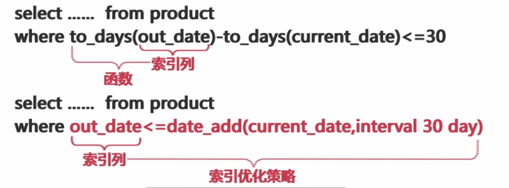
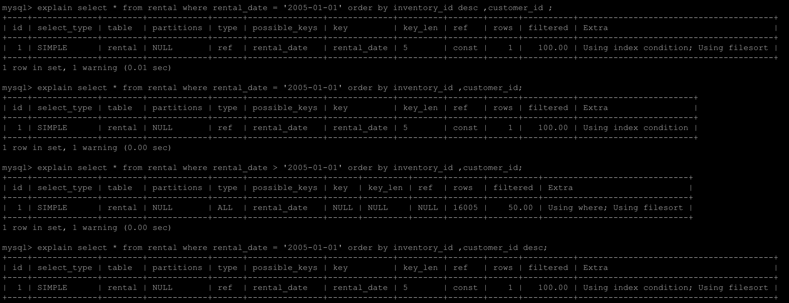

# 索引性能优化

#### 索引类型

#### B+tree索引
* B-tree 过引以 B+树的结构存储数据
* Innodb通过主键。Myisam通过物理位置引用物理行
* B-tree 索引能够加快数据的查询速度
* B-tree 索引更适合进行范围查找

##### 能够使用索引的场景
* 全值匹配的查询
* 匹配最左前缀的查询
* 匹配列前缀查询 orders_sn like '9876%'
* 匹配范围值的查询 
* 精确匹配左前列并范围匹配另外一列
* 只访问索引的查询 覆盖索引

##### 使用限制
* 如果不是按照索引最左列开始查找，则无法使用索引
* 使用索引时不能跳过索引中的列
* Not in和<>无法使用
* 如果査询中有某个列的范围查询，则其右边所有列都无法使用索引

#### Hash索引
* 只能等值查询
* Hash 索引是基于 Hash 表实现的，只有查询条件精确匹配 Hash 索引中的所有列时，才能够使用到 hash 索引。
* 对于 Hash 索引中的所有列，存储引擎都会为每一行计算一个 Hash 码，Hash 索引中存储的就是 Hash 码。
* Hash 索引必须进行二次查找
* Hash 索引无法用于排序
* Hash 索引不支持部分索引查找也不支持范闺查找
* Hash 索引中 Hash 码的计算可能存在 Hash冲突

#### 为什么使用索引
* 索引大大減少了存储引孳需要扫描的数据量
* 索引可以帮助我们进行排序以避免使用临时表
* 索引可以把随机I/O変为顺序I/O

####  索引是不是越多越好
* 索引会增加写操作的成本
* 太多的索引会增加查询优化器的选择时间

#### 索引优化策略

##### 索引列上不能使用表达式或函数


##### 前缀索引和索引列的选择性

* 索引的选择性是不重复的索引值和表的记录数的比值


##### 联合索引
* 经常会被使用到的列优先
* 选择高的列优先
* 宽度小的列优先

##### 覆盖索引
* 可以优化缓存，减少磁盘IO操作
* 可以减少随机 IO，変随机 IO 操作变为 O 操作
* 可以避免对 Innodb 主键索引的二次査询
* 可以避免MYISAM 表进行系统调用
* 无法使用的情况
* 存储引擎不支持覆盖索引
* 査询中使用了太多的列
* 使用了双%号的 like 查询

#### 适用索引来优化查询

##### 通过排序操作
* innodb索引顺序和主键顺序是一致的
* 索引的列顺序和 Order By 子句的顺序完全一致
* 索引中所有列的方向升序降序和 Order by 子句完全致 Order by 中的字段全部在关联表中的第一张表中


##### 按照索引顺序扫描数据

#### 模拟hash索引
* 只能处理键值的全值匹配查找
* 所使用的 Hash 函数决定着索引键的大小

#### 索引效果
* 减少锁定的行数
* 加快锁的释放，增加并发

#### 索引的维护和优化
* 删除重复和冗余的索引
* 使用工具pt-duplicat-key-checker h = 127.0.0.1
* 查找未被使用过的索引

```
select object_schema,object_name,index_name,b.`TABLE_ROWS` FROM  
performance_schema.table_io_waits_summary_by_index_usage a 
JOIN information_schema.tables b ON
a.`OBJECT_SCHEMA`=b.`TABLE_SCHEMA` AND
a.`OBJECT_NAME`=b.`TABLE_NAME`
WHERE index_name IS NOT NULL
AND count_star = 0
ORDER BY object_schema,object_name;
```
* 更新索引统计信息较少索引碎片
* analysz table table_name
* optimize table table_name
* 

