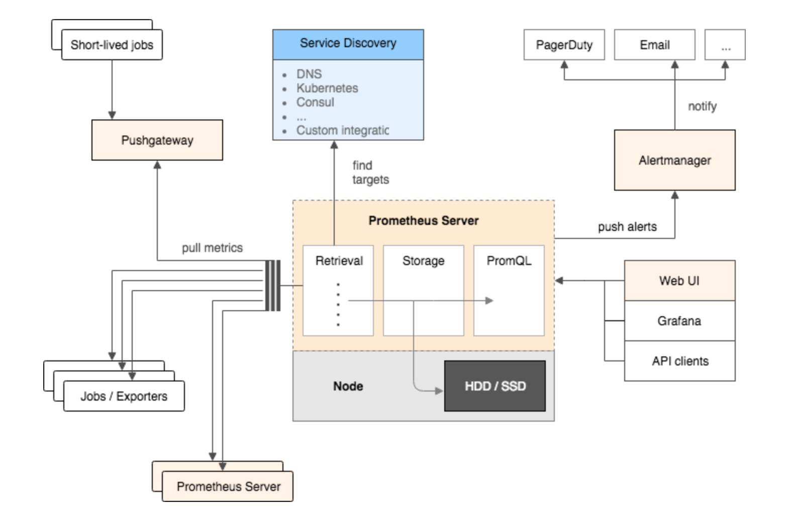
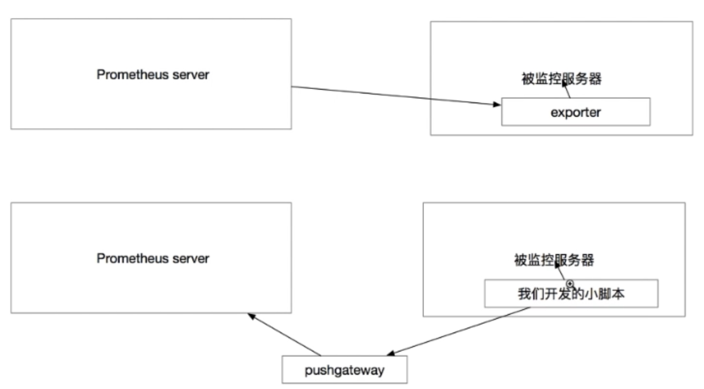

# 监控分类

#### 类别
* 业务监控 可以包含 用户访问QPS，DAU日活，访问状态(http code)， 业务接入(登陆，注 册，聊天，上传，留言，短信，搜索)，产品转化率，充值额度，用户投诉 等等这些很宏观的概 念(上层)
* 系统监控 主要是跟操作系统相关的 基本监控项 CPU/ 内存 / 硬盘 / IO / TCP链接 / 流量 等等 (Nagios - plugins, prometheus)
* 网络监控 (IDC)对网络状态的监控(交换机，路由器，防火墙，VPN) 互联网公司必不可 少 但是很多时候又被忽略 例如:内网之间(物理内网，逻辑内网 可用区 创建虚拟机 内网IP ) 外网丢包率 延迟 等等
* 日志监控 监控中的重头戏(Splunk,ELK)，往往单独设计和搭建， 全部种类的日志都有需要采 集 (syslog, soft, 网络设备，用户行为)
* 程序监控 一般需要和开发人员配合，程序中嵌入各种接又 直接获取数据 或者特质的日志格式

#### 采取
* 自带图形调试
* 精细数据采样到s级

#### 不足
* 不支持集群
* 被监控集群过大，性能有一定瓶颈
* 偶尔发生数据丢失

#### promethus
* prometheus本身是一个以进程方式启动,之后以多进程和多线程实现监敬据收集计算查询更新存储的这样一个C/S模型远行模式
* 

#### 数据存储
* Prometheus 采用的是 tme- series（时间序列）的方式以一种自定义的格式存储在本地硬盘上
* prometheus 的本地 T-S (ime- senes）数据库以毎两小时为间隔来分 block（块）存储，每一个块中又分为
* 多个 chunk 文件（我们以后会介绍 chunk 的概念）, chunk 文件是用来存放采集过来的数据的 TS 数据，metadata 和引文件（index 
* index 文件是对 metrics (prometheus 中一突 KV 采集数据叫做一个 metric）和 labels（标签）进行素引之后存在 chunk 中 chunk 是作为存储的基本单位，index and metadata 是作为子集
* prometheus 平时是将采集过来的数据先都存放在内存之中（prometheus 对内存的消耗还是不小的）以类似缓存的方式用于加快授索和访问当出现当机时，prometheus？有一种保折机叫做 WAL 可以讲数据定期存入硬盘中以 chunk 来表示，并在重新启动时用以恢复进入内存

#### 数据采集
* pull
* push 指的是在客户（或者服务端）安装这个官方提供的 pushgateway 插件
然后，使用我们运维自行开发的各种脚本把监控数据组织成 k 的形式 metrics？形式发送给 pushgateway 之后 pushgateway 会再推送给 prometheus

#### prometheus metrics
* Gauges
* 最简单的度量指标，只有一个简单的返回值，或者叫瞬时状态
* Counters
* Counter就是计数器，从数据量 0 开始累积计算在理想状态下只能是永远的增长不会降低
* Histograms
* Histograms 统计数据的分布情况。比如最小值，最大值，中间值，还有中位数，75 百分位，90 百分位，95 百分位，98 百分位，99 百分位，和 99.9 百分位的值

#### 数据格式
* key value
* Push 的形式是把 pushgateway 安装在客户端或者服务（其实装那里都无俗谓）pushgateway，本身也是一个http服务器
* Exporters 虽然采集类型已经很丰高了，但是我们依然需要很多自制的监控敬据非规则化的自定制的
* exporter 由于数据类型采集量大其实很多据或者说大部分数据其实我们监控中真的用不到用 pushgateway 是定义一项数据就采集着一种节省资源
* 一个新的自定义的 pushgatewaye 脚本开发远远比开发一个全新的 exporter 简单快速的多的多的多！(exporter 的开发需要使用真正的缩程语言，shel 这种快速本是不行的而且需要了解很多 prometheus 自定的编程格式才能开始制作工作量很大）
* exporter 虽然已经很丰富了，但是依然有很多的我们需要的采集形式，exporter：无法提供，或者说现有的 poter 还不支持，但是如果使用 pushgatewayg 的形式就可以任意灵活想做什么都可以做到而且极快
* 
