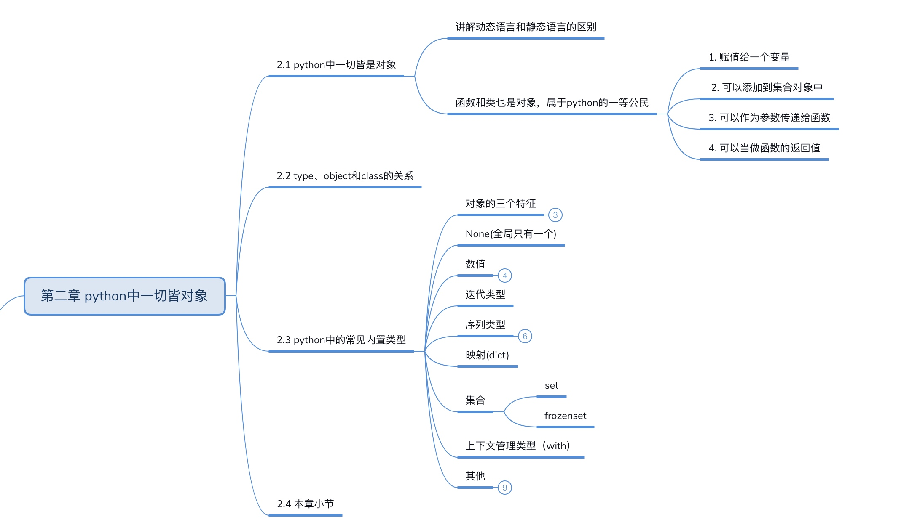
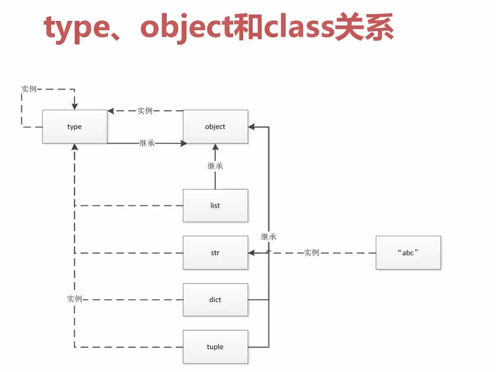
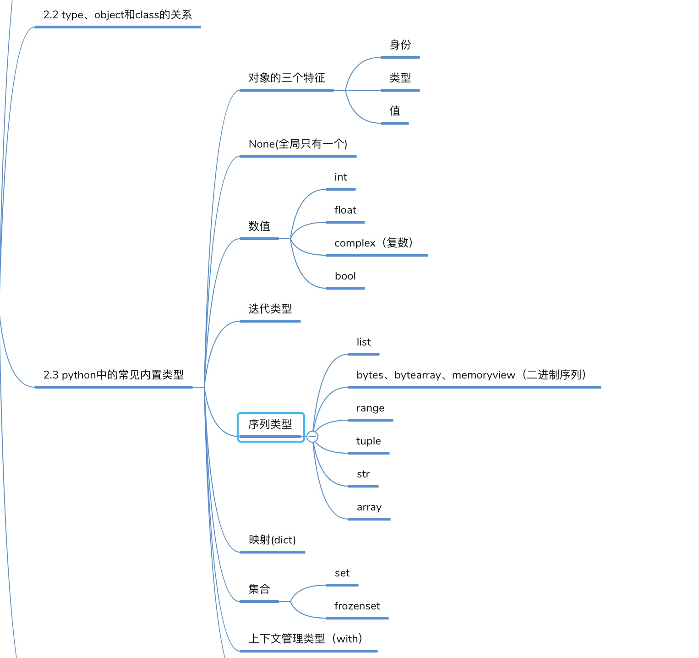

# python对象

#### 结构图
* 

#### type&object&class关系
```python
type->int->1
type->class->obj
a = 1
type(int)
```
* object最顶层基类
* type是一个类，也是一个对象

#### 结构关系图
* 

#### 对象三个特征
* 身份
* 值
* 类型

#### 内置类型
* 
* None
* 


