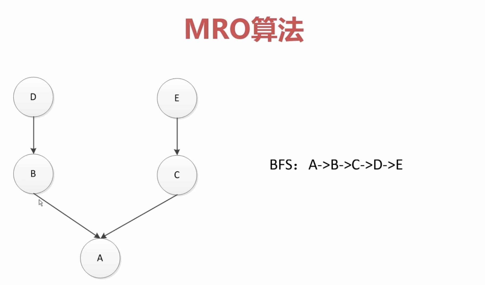

# 抽象基类

#### 作用
* 类型判断
* 接口实现

#### 类对象数组
```python
class Cat(object):
    def say(self):
        print("i am a cat")


class Dog(object):
    def say(self):
        print("i am a dog")


class Duck(object):
    def say(self):
        print("i am a duck")


anaimal_list = [Cat, Dog, Duck]
for anaimal in anaimal_list:
    anaimal().say()
```

#### 扩展类
* 只要继承了魔法函数getitem就可以

```python
class Company(object):
    def __init__(self, employee_list):
        self.employee = employee_list

    def __getitem__(self, item):
        return self.employee[item]

    def __len__(self):
        return len(self.employee)


com = Company(['tom', 'jack', 'jsdon'])
a = ['b1', 'b2']
b = ['b2', 'b3']
name_tuple = ['b3', 'b4']
name_set = set()
name_set.add('b5')
name_set.add('b6')
a.extend(com)
print(a)
```

#### 强制子类必须实现接口
```python
class CacheBase(metaclass=abc.ABCMeta):
    @abc.abstractmethod
    def get(self, key):
        pass

    @abc.abstractmethod
    def set(self, key, value):
        pass

class RedisCache(CacheBase):
    def set(self, key, value):
        print("hello")

    def get(self, key):
        print('hello')
```

#### instance&type
* is是判断类别
* ==是判断值

```python
class A:
    pass

class B(A):
    pass

b = B()

print(isinstance(b, B))
print(isinstance(b, A))

print(type(b) is B)
print(type(b) is A) #二者的ID不想等
print(id(b))
print(id(B))
```

#### Mro算法
* 
* C3算法